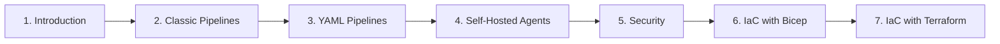

# Azure DevOps Blueprint

A **beginner-friendly, Python-focused** field guide to **Azure DevOps** — from your first organization and repository, through automated CI/CD pipelines, all the way to provisioning the cloud infrastructure itself as code with **Bicep** and **Terraform**.

[](https://github.com/CagriCatik/devops-blueprint/actions/workflows/docs.yml)
[](https://zensical.org/)
[](https://www.python.org/)

📖 **Read it online:** **<https://cagricatik.github.io/devops-blueprint/>**

> Every example builds, tests, and deploys the **same** small Flask app — `shopping-frontend` — and every IaC chapter provisions the **same** Azure footprint behind it. You learn the tooling, not a new app each chapter.

---

## Why this guide

Most Azure DevOps tutorials assume you already know CI/CD. This one doesn't. It starts at *"what is it and why should I care?"* and ends with you running automated pipelines **and** standing up the infrastructure they deploy to — all version-controlled, reviewable, and reproducible.

- **No prior CI/CD experience assumed** — concepts are introduced before they're used.
- **One sample app throughout** — `shopping-frontend`, a tiny Flask web app, keeps the focus on the tools.
- **Two IaC tools, side by side** — learn **Bicep** *and* **Terraform** and choose the right one per project.
- **Security woven in** — least-privilege permissions, not an afterthought.

## What's inside

**7 modules · 69 chapters** of hands-on, copy-paste-ready material:

| # | Module | What you'll learn |
|---|---|---|
| **1** | [Introduction](docs/1-Introduction/1-Introduction.md) | What Azure DevOps is, billing, org/project/repo setup, local tooling, the sample Python app, a Git cheatsheet |
| **2** | [Classic Pipelines](docs/2-Azure-Classic-Pipelines/1-Python-Classic-Build-Pipeline.md) | CI/CD with the visual editor: build, test + coverage, App Service, Linux VM (Nginx + Gunicorn), Docker/ACR, AKS |
| **3** | [YAML Pipelines](docs/3-Azure-Yaml-Pipelines/1-Basic-Yaml-Pipeline-Syntax.md) | Pipeline-as-code: syntax, stages/jobs, variables, templates, environments, caching, a Python CI template, end-to-end AKS lab |
| **4** | [Self-Hosted Agents](docs/4-Self-Hosted-Agents/1-Azure-Pipelines-Agent-in-Windows-Vm.md) | Run your own agents on a VM, Docker, and Kubernetes; KEDA autoscaling; a full Windows-agent reference |
| **5** | [Security](docs/5-Security-in-Azure-DevOps/1-Security-Groups-in-Azure-DevOps.md) | Least-privilege permissions for projects, pipelines, environments, service connections, and repos |
| **6** | [IaC with Bicep](docs/6-Infrastructure-as-Code-with-Bicep/1-What-is-IaC-and-Bicep.md) | Azure-native IaC: modules, transpiling to ARM, provisioning Log Analytics + Data Factory from a YAML pipeline |
| **7** | [IaC with Terraform](docs/7-Infrastructure-as-Code-with-Terraform/1-What-is-Terraform.md) | Cloud-agnostic IaC: providers, remote state, modules, compute/networking, the `azuread` & `azapi` providers |

## Who this is for

- **Python developers** who want to ship their apps with proper CI/CD.
- **Beginners** to Azure DevOps or Infrastructure as Code.
- **Engineers** comparing **Bicep vs Terraform** for Azure, or learning both.

## Recommended learning path



> **Short on time?** Do **Introduction → YAML Pipelines** and deploy to **Azure App Service** — that's the fastest path to a working pipeline. Add an IaC module when you're ready to own the infrastructure too.

## The sample app

A deliberately tiny Flask app — a couple of routes and a couple of tests — so the spotlight stays on Azure DevOps. See [The Sample Python Application](docs/1-Introduction/7-Sample-Python-Application.md).

```text
shopping-frontend/
├── app/main.py            # Flask app: / and /health routes
├── tests/test_main.py     # pytest unit tests
├── requirements.txt       # Flask, gunicorn
├── Dockerfile             # for the container / Kubernetes chapters
└── azure-pipelines.yml    # the CI/CD pipeline
```

## Build & preview locally

The site is built with [Zensical](https://zensical.org/). You need **Python 3.x**.

```bash
# 1. Clone
git clone https://github.com/CagriCatik/devops-blueprint.git
cd devops-blueprint

# 2. Create and activate a virtual environment
python -m venv .venv
source .venv/bin/activate          # macOS / Linux
# .venv\Scripts\Activate.ps1        # Windows (PowerShell)

# 3. Install the build tool
pip install -r requirements.txt

# 4. Live preview with auto-reload at http://localhost:8000
zensical serve

# 5. Build the static site into ./site
zensical build --clean
```
