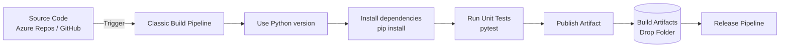

# Python Classic Build Pipeline

A **Classic Build Pipeline** in Azure DevOps is a GUI-based, visual-editor pipeline that installs dependencies, tests, and packages your application without writing any YAML. While Microsoft now recommends [YAML pipelines](../3-Azure-Yaml-Pipelines/1-Basic-Yaml-Pipeline-Syntax.md) for new projects, the Classic editor is a friendly place for **beginners** to *see* the moving parts of CI before learning the syntax.

!!! note

    We use the [sample Flask app](../1-Introduction/7-Sample-Python-Application.md) (`shopping-frontend`) here. Remember: Python is **interpreted**, so there is no "compile" step — the "build" of a Python app is really *install dependencies → check quality → run tests → package*.

## Architecture Overview



## Pipeline Steps Explained

In the Classic editor you add **tasks** from a searchable catalog. Here are the tasks that make up a Python CI build, in order.

### 1. Use Python Version

Tells the agent which Python interpreter to use, so your build is predictable.

```text
Task: UsePythonVersion@0
Version spec: 3.12
```

### 2. Install Dependencies

The Python equivalent of "restore". Installs everything your app and tests need. We use a **script** task (Bash or PowerShell) for simple `pip` commands.

```bash
python -m pip install --upgrade pip
pip install -r requirements-dev.txt
```

### 3. Lint (the closest thing to a "build")

Since there is nothing to compile, we run a linter to catch syntax errors and obvious mistakes early. This is the quality gate that "fails fast".

```bash
flake8 .
```

### 4. Test

Runs all unit tests and produces machine-readable reports that Azure DevOps can display.

```bash
pytest --junitxml=junit/test-results.xml --cov=app --cov-report=xml
```

- `--junitxml=...` writes test results in **JUnit** format (Azure DevOps understands this).
- `--cov=app --cov-report=xml` measures **code coverage** and writes `coverage.xml` in Cobertura format.

### 5. Publish Test Results

Surfaces pass/fail counts on the run summary so you do not have to read raw logs.

```text
Task: PublishTestResults@2
Test result format: JUnit
Test results files: junit/test-results.xml
```

### 6. Archive & Publish Artifact

Python is not compiled, so "publishing" simply means **zipping the source** (the files needed to run the app) and uploading it for the Release pipeline to deploy.

```text
Task: ArchiveFiles@2
Root folder to archive: $(System.DefaultWorkingDirectory)
Archive file: $(Build.ArtifactStagingDirectory)/shopping-frontend.zip

Task: PublishBuildArtifacts@1
Path to publish: $(Build.ArtifactStagingDirectory)
Artifact name: drop
```

## Key Predefined Variables

| Variable | Description |
|---|---|
| `$(Build.ArtifactStagingDirectory)` | Temporary folder for build outputs |
| `$(Build.BuildId)` | Unique ID for the build run |
| `$(Build.SourceBranch)` | The triggering branch (e.g., `refs/heads/main`) |
| `$(Build.Repository.Name)` | Name of the repository |

!!! tip

    Prefer the **Microsoft-hosted `ubuntu-latest`** agent for Python builds — it is faster and Python tooling "just works" on Linux.

!!! tip

    **References:**

    - [Build Python apps in Azure Pipelines (Microsoft)](https://learn.microsoft.com/en-us/azure/devops/pipelines/ecosystems/python)
    - [Publish and download artifacts in Azure Pipelines (Microsoft)](https://learn.microsoft.com/en-us/azure/devops/pipelines/artifacts/pipeline-artifacts)
