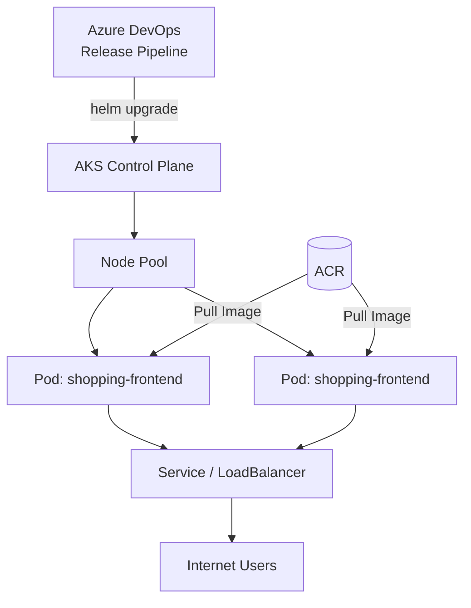

# AKS Kubernetes Cluster & HelmChart

**Azure Kubernetes Service (AKS)** is a managed Kubernetes cluster on Azure. **Helm** is the de-facto package manager for Kubernetes applications, analogous to `apt` or `npm`.

## Kubernetes Architecture on AKS



## Creating an AKS Cluster

```bash
az aks create \
  --resource-group my-rg \
  --name my-aks-cluster \
  --node-count 2 \
  --node-vm-size Standard_B2s \
  --enable-managed-identity \
  --attach-acr myacr \
  --generate-ssh-keys
```

The `--attach-acr` flag grants the AKS cluster's managed identity permission to pull images from your ACR — no credentials needed.

## Understanding Helm Charts

A Helm chart is a collection of templated Kubernetes YAML files packaged together. A typical chart structure:

```
my-app/
  Chart.yaml         # Chart metadata (name, version)
  values.yaml        # Default configurable values
  templates/
    deployment.yaml  # Kubernetes Deployment template
    service.yaml     # Kubernetes Service template
    ingress.yaml     # Optional Ingress template
```

### Key `values.yaml` Entries
```yaml
image:
  repository: myacr.azurecr.io/shopping-frontend
  tag: "latest"
  pullPolicy: IfNotPresent

replicaCount: 2

service:
  type: LoadBalancer
  port: 80
```

## Deploying with Helm
```bash
helm upgrade --install shopping-frontend ./charts/shopping-frontend \
  --set image.tag=$(Build.BuildId) \
  --namespace production
```

!!! tip

    **References:**

    - [Azure Kubernetes Service (AKS) documentation (Microsoft)](https://learn.microsoft.com/en-us/azure/aks/)
    - [Helm documentation](https://helm.sh/docs/)
