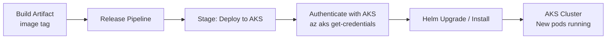

# Release Pipeline to Deploy to AKS Cluster

This chapter covers configuring a Classic Release Pipeline that deploys a containerized application to AKS using Helm.

## Release Pipeline Architecture



## Step 1: Add the AKS Service Connection
1. Go to **Project Settings → Service connections**.
2. Add a new **Kubernetes** service connection.
3. Select **Azure Subscription**, choose your AKS cluster and namespace.

## Step 2: Configure the Release Stage
In the release stage, add tasks in this order:

### Task 1: Helm Installer
Ensure Helm is available on the build agent.
```
Task: HelmInstaller@1
Helm version: latest
```

### Task 2: Helm Upgrade
```
Task: HelmDeploy@0
Connection type: Kubernetes Service Connection
Command: upgrade
Chart type: File path
Chart path: $(System.DefaultWorkingDirectory)/charts/shopping-frontend
Release name: shopping-frontend
Namespace: production
Override values: image.tag=$(Build.BuildId)
Install if release not found: true
```

## Step 3: Verifying the Deployment
After the pipeline completes, verify the rollout:
```bash
kubectl rollout status deployment/shopping-frontend -n production
kubectl get pods -n production
```

!!! tip

    **References:**

    - [Deploy to AKS using Helm (Microsoft)](https://learn.microsoft.com/en-us/azure/devops/pipelines/tasks/reference/helm-deploy-v0)
