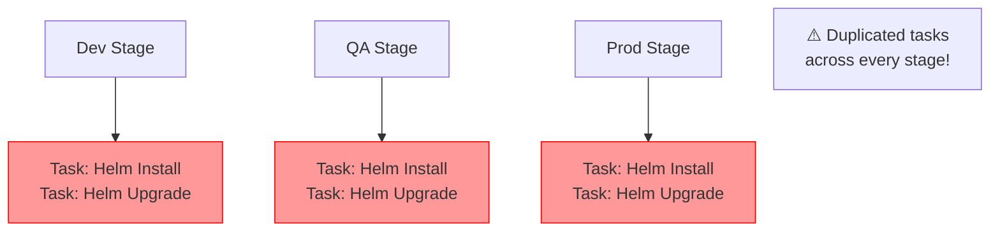
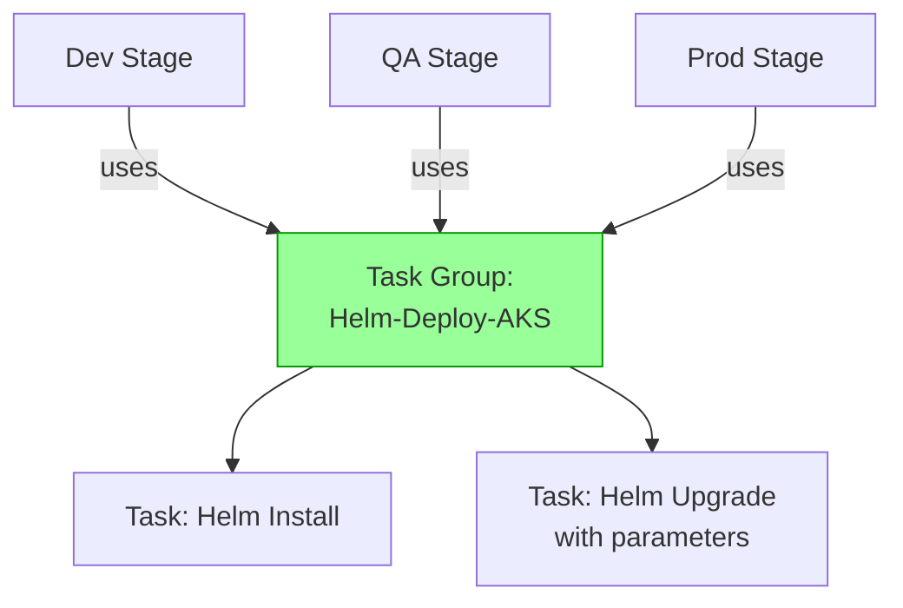

# Task Groups for AKS Multi-Stage Release Pipeline

A **Task Group** is a reusable collection of tasks that you can share across multiple pipelines and stages in classic pipelines — equivalent to templates in YAML pipelines.

## Problem Without Task Groups

## Solution With Task Groups

## Creating a Task Group
1. In the Classic Pipeline editor, select multiple tasks you want to group (Ctrl+click).
2. Right-click and choose **Create task group**.
3. Name it (e.g., `Helm-Deploy-AKS`) and define **parameters** for values that vary per stage (like `namespace` or `imageTag`).

### Defining Task Group Parameters
During creation, Azure DevOps automatically detects variables that differ per usage and converts them to **parameters**. You can also add parameters manually in the Task Group editor.

| Parameter | Description | Default |
|---|---|---|
| `namespace` | Kubernetes namespace | `production` |
| `imageTag` | Docker image tag | `$(Build.BuildId)` |
| `releaseName` | Helm release name | `shopping-frontend` |

## Using the Task Group in Multi-Stage Pipelines
When you add the Task Group to a release stage, you fill in the parameter values specific to that environment:

- Dev Stage → `namespace: dev`, `releaseName: shopping-frontend-dev`
- QA Stage → `namespace: qa`, `releaseName: shopping-frontend-qa`
- Prod Stage → `namespace: production`, `releaseName: shopping-frontend`

!!! note

    The YAML equivalent of Task Groups is **Step Templates** or **Job Templates**. For new pipelines, YAML templates are preferred as they are version-controlled alongside your code.

!!! tip

    **References:**

    - [Group, approve, and deploy releases (Microsoft)](https://learn.microsoft.com/en-us/azure/devops/pipelines/release/define-multistage-release-process)
