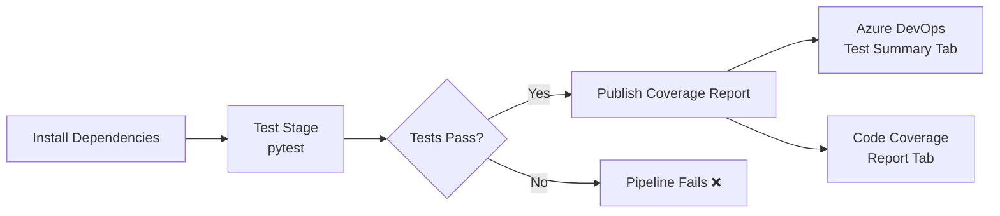

# Adding Unit Tests & Code Coverage Reports

Integrating unit tests and code coverage into your Classic Build Pipeline is a DevOps best practice that enforces quality gates and gives instant visibility into test health. For our [sample Flask app](../1-Introduction/7-Sample-Python-Application.md) we use **pytest** to run tests and **pytest-cov** to measure coverage.

## Architecture Overview



## Why test reports need a special format

`pytest` normally prints results to the console. Azure DevOps cannot read console text into its nice **Tests** and **Code Coverage** tabs — it needs **machine-readable files**:

| Report | Format Azure DevOps wants | How pytest produces it |
|---|---|---|
| Test results | JUnit XML | `--junitxml=junit/test-results.xml` |
| Code coverage | Cobertura XML | `pytest-cov` with `--cov-report=xml` |

## Configuring the Test Step

In the Classic Build Pipeline editor, add a **Command line** (or **Bash**) task that runs pytest:

| Setting | Value |
|---|---|
| Display name | `Run tests with coverage` |
| Script | `pytest --junitxml=junit/test-results.xml --cov=app --cov-report=xml --cov-report=html` |

```bash
# What that command does, broken down:
pytest \
  --junitxml=junit/test-results.xml \  # test results for the Tests tab
  --cov=app \                          # measure coverage of the 'app' package
  --cov-report=xml \                   # coverage.xml for the Code Coverage tab
  --cov-report=html                    # human-readable HTML report (optional)
```

!!! info "Important"

    Make sure the **Install dependencies** step ran first and installed `pytest` and `pytest-cov` (they live in `requirements-dev.txt`). A common beginner error is "pytest: command not found" — that means dependencies were not installed on the agent.

## Publishing Test Results

Add a **Publish Test Results** task so pass/fail counts appear on the run summary:

```text
Task: PublishTestResults@2
Test result format: JUnit
Test results files: junit/test-results.xml
```

## Publishing Code Coverage

After the test task, add a **Publish Code Coverage Results** task:

```text
Task: PublishCodeCoverageResults@2
Code coverage tool: Cobertura
Summary file: $(System.DefaultWorkingDirectory)/coverage.xml
```

This parses the generated XML and renders an interactive coverage report in the **Code Coverage** tab of the pipeline run.

## Enforcing a Minimum Coverage (Optional Quality Gate)

You can make the pipeline **fail** if coverage drops below a threshold — a great habit on real projects:

```bash
pytest --cov=app --cov-report=xml --cov-fail-under=80
```

If coverage is below 80%, pytest exits with an error and the pipeline turns red.

## Viewing Results in Azure DevOps

After a successful run, you can find:

- **Tests tab:** passed/failed tests, duration per test, failure messages.
- **Code Coverage tab:** line and branch coverage percentages, drill-down per file.

!!! tip

    **References:**

    - [Build and test Python apps (Microsoft)](https://learn.microsoft.com/en-us/azure/devops/pipelines/ecosystems/python)
    - [Review code coverage results (Microsoft)](https://learn.microsoft.com/en-us/azure/devops/pipelines/test/review-code-coverage-results)
    - [pytest-cov documentation](https://pytest-cov.readthedocs.io/)
