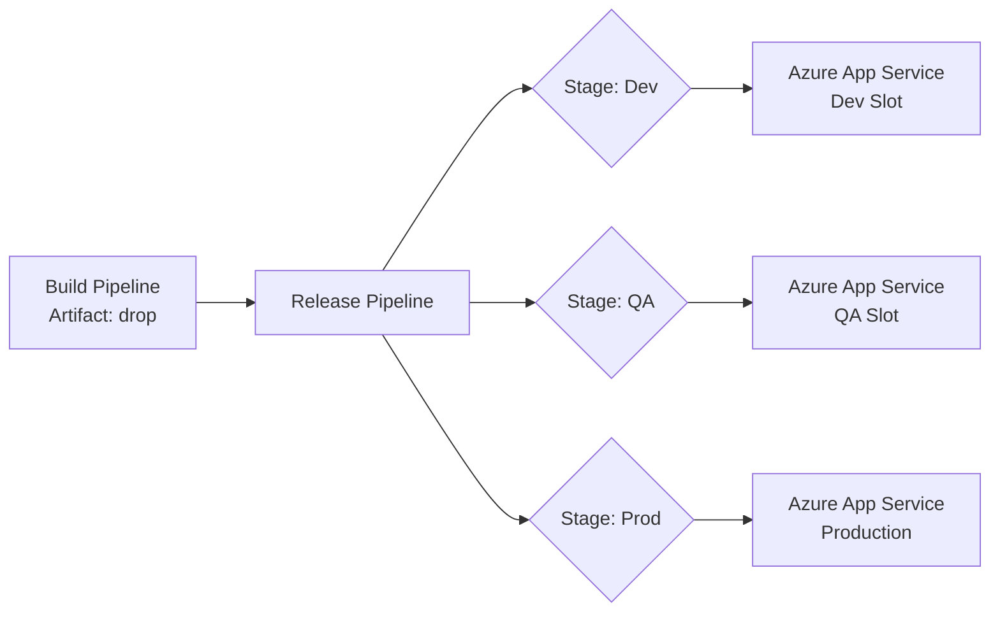

# Azure App Service Release Pipeline

A Classic **Release Pipeline** picks up the artifact published by the Build pipeline and deploys it to one or more Azure environments — in this case, **Azure App Service** running our [Python (Flask) app](../1-Introduction/7-Sample-Python-Application.md).

!!! note

    **Azure App Service** is the easiest way to host a Python web app — it is a fully managed platform, so you do not manage servers, patching, or scaling yourself. For Python, always choose a **Linux** App Service plan.

## Architecture Overview



## Creating the Release Pipeline

### Step 1: Create the Pipeline

Navigate to **Pipelines → Releases → New pipeline** and select the **Azure App Service deployment** template.

### Step 2: Add the Build Artifact

- Click **Add an artifact**.
- Select **Build** as the source type.
- Choose your build pipeline and select **Latest** as the default version.

### Step 3: Configure the Deployment Stage

In the stage tasks, configure the **Azure App Service Deploy** task for a Python app:

| Field | Value |
|---|---|
| Azure subscription | Your service connection |
| App Service type | **Web App on Linux** |
| App Service name | Your App Service resource |
| Package or folder | `$(System.DefaultWorkingDirectory)/**/*.zip` |
| Runtime stack | `PYTHON\|3.12` |
| Startup command | `gunicorn --bind=0.0.0.0 --workers=2 app.main:app` |

!!! info "Important"

    The **Startup command** is the part beginners most often miss. App Service does not know how to start your Flask app on its own — you must tell it to launch **gunicorn** and point it at `app.main:app` (the `app` object inside `app/main.py`).

### Step 4: Enable Continuous Deployment Trigger

Click the lightning bolt (⚡) on the artifact to enable the **Continuous Deployment trigger**. This automatically creates a new release whenever the linked build pipeline completes successfully.

## How App Service builds Python dependencies

When you deploy a zip, App Service can run **Oryx**, its build engine, to `pip install` your `requirements.txt` on the server. Enable it by setting the app setting:

```text
SCM_DO_BUILD_DURING_DEPLOYMENT = true
```

!!! tip

    Make sure your `requirements.txt` is in the **root of the zip** — Oryx looks for it there to know it is a Python app and install your dependencies.

## Service Connection

The release pipeline needs an **Azure Resource Manager Service Connection** to authenticate with your Azure subscription. You create this under **Project Settings → Service connections**.

!!! tip

    **References:**

    - [Deploy Python to Azure App Service (Microsoft)](https://learn.microsoft.com/en-us/azure/app-service/quickstart-python)
    - [Configure a Linux Python app for App Service (Microsoft)](https://learn.microsoft.com/en-us/azure/app-service/configure-language-python)
