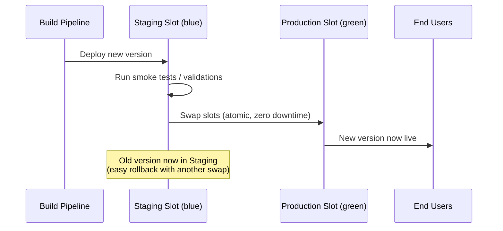

# Multi-Stage Release Pipeline & Azure App Service Slots

**Deployment Slots** are live endpoints for your Azure App Service that allow zero-downtime deployments using a **swap** operation. A multi-stage release pipeline uses slots to validate a new version before exposing it to production traffic.

## Blue-Green Deployment Flow

## Release Pipeline Stages

### Stage 1: Deploy to Staging Slot
Configure the **Azure App Service Deploy** task to target the staging slot:

| Field | Value |
|---|---|
| App Service name | `my-app-service` |
| Deploy to slot or App Service Environment | ✅ Enabled |
| Resource group | `my-resource-group` |
| Slot | `staging` |

### Stage 2: Swap Slots (Production)
After validating the staging deployment, add an **Azure App Service Manage** task:

| Field | Value |
|---|---|
| Action | Swap Slots |
| App Service name | `my-app-service` |
| Resource Group | `my-resource-group` |
| Source Slot | `staging` |

!!! tip

    This is where our app's **`/health` endpoint** earns its keep. Before swapping, add a script step that curls `https://<app>-staging.azurewebsites.net/health` and fails the stage if it does not return `{"status": "ok"}`. That way a broken deployment never reaches production.

### Stage Gates & Approvals
Add a **pre-deployment approval** on the Swap stage. A designated approver must manually verify the staging slot before production traffic is swapped over.

!!! tip

    **References:**

    - [Set up staging environments in Azure App Service (Microsoft)](https://learn.microsoft.com/en-us/azure/app-service/deploy-staging-slots)
    - [Approve deployments in release pipelines (Microsoft)](https://learn.microsoft.com/en-us/azure/devops/pipelines/release/approvals/approvals)
