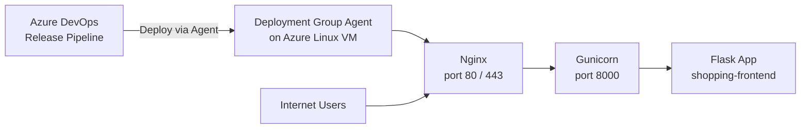

# Creating an Azure Linux VM & Installing Nginx + Gunicorn

Sometimes you want to deploy to a plain **virtual machine** instead of a managed service like App Service — for full control, or to learn how hosting really works under the hood. For Python web apps, the standard production setup on a Linux VM is **Nginx + Gunicorn**.

!!! note

    **Who does what?**

    - **Gunicorn** is the *application server* — it runs your Python/Flask code.
    - **Nginx** is the *web server / reverse proxy* — it faces the internet, handles HTTPS, serves static files, and forwards requests to Gunicorn.

    This two-layer setup is the Python equivalent of "IIS hosting an ASP.NET app" — but on Linux, which is the natural home for Python.

## Provisioning the Azure VM

1. In the Azure Portal, search for **Virtual Machines** and click **Create**.
2. Choose **Ubuntu Server 24.04 LTS** as the image.
3. Select a VM size (e.g., `Standard_B2s` for dev/test).
4. Choose **SSH public key** authentication (more secure than passwords).
5. Configure networking — open port **80** (HTTP), **443** (HTTPS), and **22** (SSH) in the Network Security Group (NSG).

## Connecting to the VM

```bash
ssh azureuser@<VM-Public-IP>
```

## Installing Python, Nginx, and Gunicorn

Run these commands on the VM:

```bash
# Update packages and install Python + Nginx
sudo apt-get update
sudo apt-get install -y python3 python3-venv python3-pip nginx

# Create a folder for the app and a virtual environment
sudo mkdir -p /opt/shopping-frontend
cd /opt/shopping-frontend
python3 -m venv .venv
source .venv/bin/activate

# Install the app's runtime dependencies + gunicorn
pip install -r requirements.txt   # requirements.txt includes gunicorn
```

## Running the App as a Service (systemd)

So the app starts on boot and restarts if it crashes, create a **systemd** service. Save this as `/etc/systemd/system/shopping-frontend.service`:

```ini
[Unit]
Description=Shopping Frontend (Gunicorn)
After=network.target

[Service]
User=azureuser
WorkingDirectory=/opt/shopping-frontend
ExecStart=/opt/shopping-frontend/.venv/bin/gunicorn --workers 3 --bind 127.0.0.1:8000 app.main:app
Restart=always

[Install]
WantedBy=multi-user.target
```

Enable and start it:

```bash
sudo systemctl daemon-reload
sudo systemctl enable --now shopping-frontend
sudo systemctl status shopping-frontend   # should show "active (running)"
```

## Configuring Nginx as a Reverse Proxy

Tell Nginx to forward public traffic on port 80 to Gunicorn on port 8000. Create `/etc/nginx/sites-available/shopping-frontend`:

```nginx
server {
    listen 80;
    server_name _;

    location / {
        proxy_pass http://127.0.0.1:8000;
        proxy_set_header Host $host;
        proxy_set_header X-Real-IP $remote_addr;
    }
}
```

Enable the site and reload Nginx:

```bash
sudo ln -s /etc/nginx/sites-available/shopping-frontend /etc/nginx/sites-enabled/
sudo nginx -t           # test the config
sudo systemctl reload nginx
```

## Verifying

Browse to `http://<VM-Public-IP>` — you should see **"Welcome to the Shopping Frontend!"**.

## VM Architecture for Deployment



!!! tip

    For real production, add **HTTPS** with a free Let's Encrypt certificate using `certbot` — Nginx makes this a one-command setup.

!!! tip

    **References:**

    - [Quickstart: create a Linux VM in the Azure portal (Microsoft)](https://learn.microsoft.com/en-us/azure/virtual-machines/linux/quick-create-portal)
    - [Deploy Flask with Gunicorn and Nginx (Gunicorn docs)](https://docs.gunicorn.org/en/stable/deploy.html)
