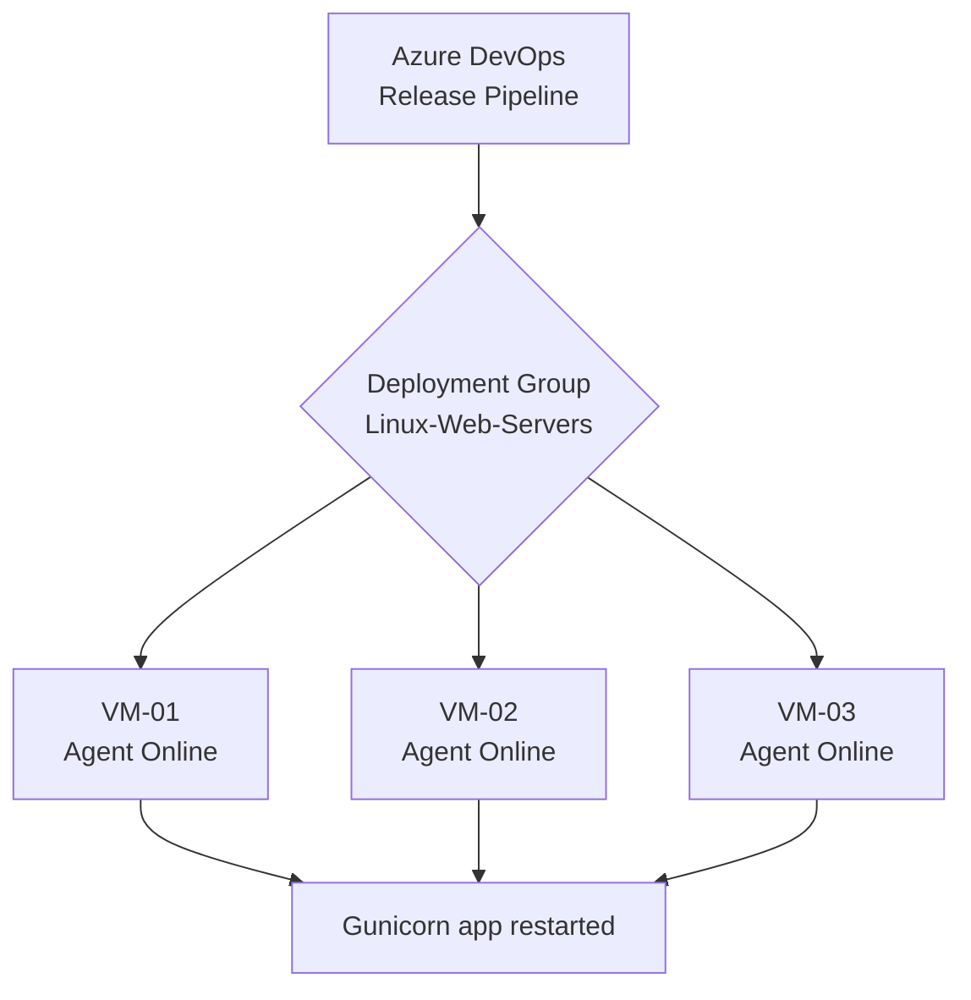

# Deployment Groups & Azure VM Release Pipeline

A **Deployment Group** is a pool of target machines registered with Azure DevOps. Classic Release Pipelines can target a Deployment Group to deploy your application directly to one or many servers simultaneously — for example, the [Linux VM running Nginx + Gunicorn](6-Creating-Azure-Linux-VM-and-Installing-Nginx-Gunicorn.md) from the previous chapter.

## How Deployment Groups Work



## Step 1: Create the Deployment Group
1. Navigate to **Pipelines → Deployment groups → New**.
2. Name it (e.g., `Linux-Web-Servers`).
3. Choose **Linux** as the target type.
4. Copy the generated **registration script** (a Bash one-liner).

## Step 2: Register the Target VM
SSH into your Ubuntu VM and paste the registration script. This installs the Azure Pipelines agent and registers the machine with the deployment group:

```bash
# The generated script downloads the agent, then runs (simplified):
./config.sh --deploymentgroup \
  --deploymentgroupname "Linux-Web-Servers" \
  --agent $(hostname) \
  --runasservice
```

!!! note

    "Run as a service" means the agent keeps running in the background and restarts automatically if the VM reboots — so deployments keep working without you logging in.

## Step 3: Configure the Release Pipeline Stage
1. In the release pipeline, change the **job type** to **Deployment group job**.
2. Select your Deployment Group (`Linux-Web-Servers`).
3. Add steps that deploy the new code and restart the app. A simple **Bash** task works well:

```bash
# Copy the new code from the downloaded artifact into the app folder
sudo rsync -a --delete $(System.DefaultWorkingDirectory)/drop/ /opt/shopping-frontend/

# Install any new/updated dependencies
/opt/shopping-frontend/.venv/bin/pip install -r /opt/shopping-frontend/requirements.txt

# Restart the Gunicorn service to pick up the new code
sudo systemctl restart shopping-frontend
```

!!! tip

    Hitting the `/health` endpoint after the restart (`curl -f http://localhost:8000/health`) is a quick way to fail the deployment if the new version did not start correctly.

!!! note

    Deployment Groups are a **Classic-only** feature. The YAML equivalent is using [**Environments**](../3-Azure-Yaml-Pipelines/15-Environments-and-Pre-Deployment-Approvals.md) with virtual machine resources.

!!! tip

    **References:**

    - [Deployment Groups (Microsoft)](https://learn.microsoft.com/en-us/azure/devops/pipelines/release/deployment-groups/)
