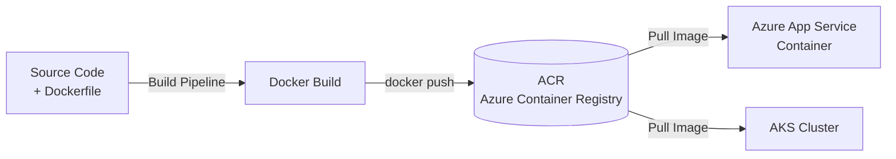

# Creating a Dockerfile & Azure Container Registry (ACR)

**Azure Container Registry (ACR)** is a private container image registry hosted in Azure. Your build pipeline builds a Docker image from your application and pushes it to ACR, making it available for deployment to any container runtime.

## High-Level Flow



## Creating a Dockerfile for our Python App

```dockerfile
# Start from a small official Python image
FROM python:3.12-slim

# Don't write .pyc files; show logs immediately (good defaults for containers)
ENV PYTHONDONTWRITEBYTECODE=1 \
    PYTHONUNBUFFERED=1

WORKDIR /app

# Install dependencies first (this layer is cached unless requirements change)
COPY requirements.txt .
RUN pip install --no-cache-dir -r requirements.txt

# Now copy the application code
COPY app/ ./app/

# Gunicorn serves the Flask app on port 8000
EXPOSE 8000
CMD ["gunicorn", "--bind", "0.0.0.0:8000", "--workers", "2", "app.main:app"]
```

!!! tip

    **Copy `requirements.txt` before the rest of the code.** Docker caches each layer, so as long as your dependencies do not change, `pip install` is skipped on future builds — making them much faster. This is the #1 Dockerfile trick for Python.

!!! note

    We use `python:3.12-slim` (not the full image) to keep the final image small. For even smaller images, advanced users can use a multi-stage build with `python:3.12-slim` as the runtime stage.

## Creating the Azure Container Registry
```bash
az acr create --resource-group my-rg --name myacr --sku Basic --admin-enabled true
```

## Classic Pipeline: Build & Push
In the Classic Build Pipeline, add a **Docker** task:

| Setting | Value |
|---|---|
| Container registry | Your ACR service connection |
| Container repository | `shopping-frontend` |
| Command | `buildAndPush` |
| Dockerfile | `**/Dockerfile` |
| Tags | `$(Build.BuildId)` |

!!! tip

    **References:**

    - [Azure Container Registry documentation (Microsoft)](https://learn.microsoft.com/en-us/azure/container-registry/)
    - [Build and push Docker images to ACR (Microsoft)](https://learn.microsoft.com/en-us/azure/devops/pipelines/tasks/reference/docker-v2)
