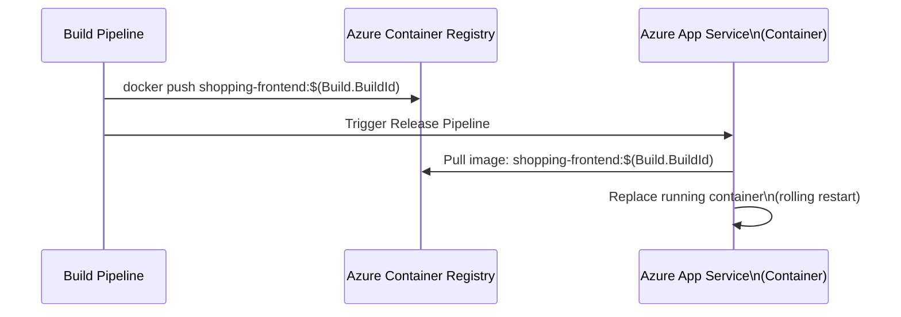

# Container App Service & Release Pipeline

**Azure App Service for Containers** lets you deploy a Docker image directly to a managed web hosting environment without managing the underlying infrastructure.

## Deployment Flow



## Configuring the App Service for Containers

In the Azure Portal or CLI, create an App Service with a Docker container source:

```bash
az webapp create \
  --resource-group my-rg \
  --plan my-asp \
  --name my-container-app \
  --deployment-container-image-name myacr.azurecr.io/shopping-frontend:latest
```

## Classic Release Pipeline Setup

### Add the Build Artifact

Link the build pipeline artifact (the one that published the image tag).

### Stage: Deploy Container

Add an **Azure Web App for Containers** task:

| Field | Value |
|---|---|
| Azure subscription | Your service connection |
| App name | `my-container-app` |
| Image name | `myacr.azurecr.io/shopping-frontend:$(Build.BuildId)` |

!!! tip

    Pass the `Build.BuildId` as a release variable from the build artifact metadata to ensure the exact image tag that was built and tested is deployed.

!!! tip

    **References:**

    - [Deploy a custom container to App Service (Microsoft)](https://learn.microsoft.com/en-us/azure/app-service/deploy-ci-cd-custom-container)
