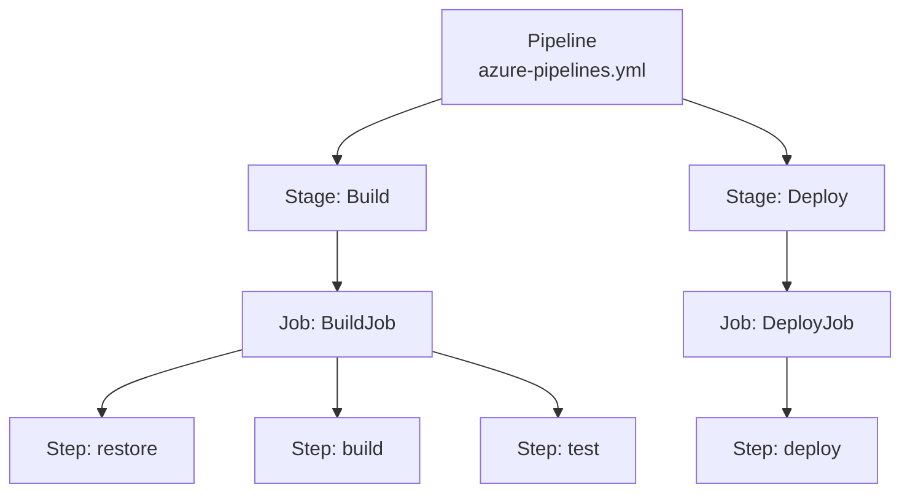

# Basic YAML Pipeline Syntax

An Azure Pipelines YAML file defines your entire CI/CD process as code, stored in your repository alongside your application source.

## Pipeline Hierarchy



## Minimal Pipeline Example

This is a complete CI pipeline for our [sample Flask app](../1-Introduction/7-Sample-Python-Application.md) — it picks a Python version, installs dependencies, and runs the tests on every push to `main`.

```yaml
# azure-pipelines.yml
trigger:
  - main

pool:
  vmImage: ubuntu-latest

variables:
  pythonVersion: '3.12'

steps:
  - task: UsePythonVersion@0
    displayName: Use Python $(pythonVersion)
    inputs:
      versionSpec: $(pythonVersion)

  - script: |
      python -m pip install --upgrade pip
      pip install -r requirements-dev.txt
    displayName: Install dependencies

  - script: flake8 .
    displayName: Lint

  - script: pytest --junitxml=junit/test-results.xml --cov=app --cov-report=xml
    displayName: Run tests
```

!!! tip

    Most Python pipeline steps are just shell commands, so we use the lightweight `- script:` shortcut instead of a heavyweight task. `- script:` runs on Bash (Linux/macOS) or cmd (Windows).

## Expression Syntax Cheatsheet

| Syntax | Used For | Example |
|---|---|---|
| `$(variable)` | Runtime variable expansion | `$(buildConfiguration)` |
| `${{ expression }}` | Compile-time template expression | `${{ parameters.env }}` |
| `$[expression]` | Runtime expression | `$[variables['myVar']]` |

!!! tip

    **References:**

    - [YAML schema reference (Microsoft)](https://learn.microsoft.com/en-us/azure/devops/pipelines/yaml-schema/)
    - [Key concepts for new Azure Pipelines users (Microsoft)](https://learn.microsoft.com/en-us/azure/devops/pipelines/get-started/key-pipelines-concepts)
