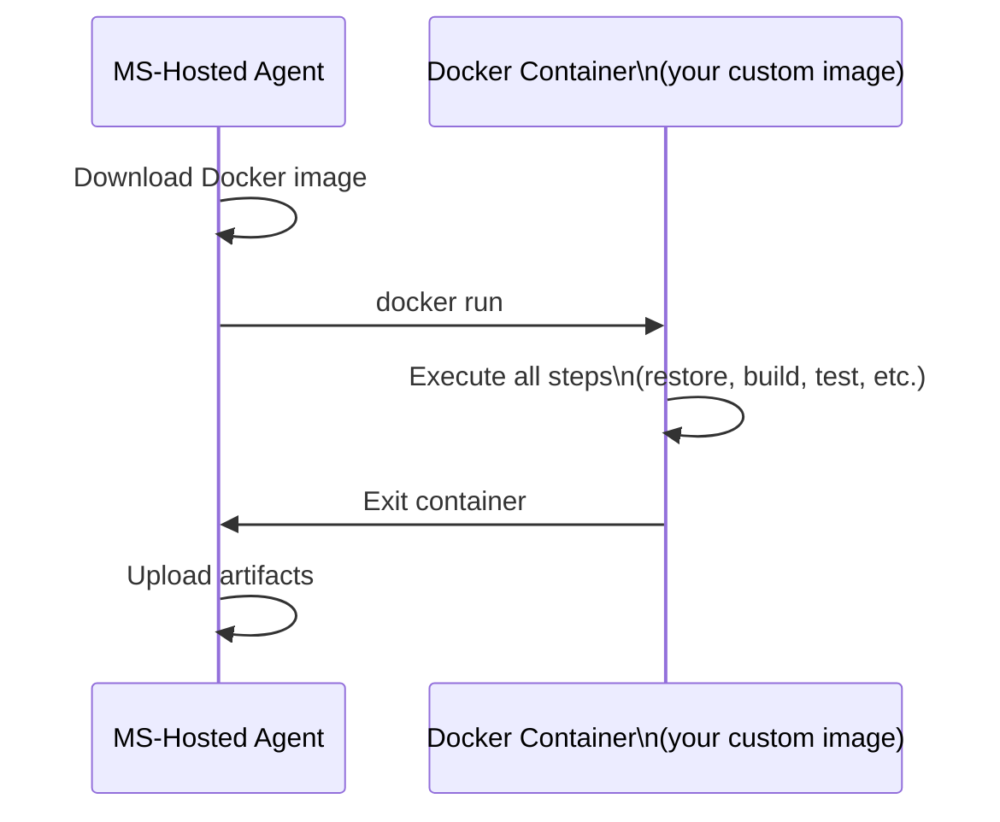

# Container Jobs

A **Container Job** runs your pipeline job inside a Docker container on the Microsoft-hosted agent, rather than directly on the agent machine. This gives you full control over the build environment.

## How Container Jobs Work



## Basic Container Job

```yaml
jobs:
  - job: TestInContainer
    container:
      image: python:3.12-slim
      options: --user 0  # Run as root if needed

    steps:
      - script: pip install -r requirements-dev.txt
      - script: pytest
```

!!! tip

    Using `python:3.12-slim` as a container job guarantees the *exact* Python version and base OS — the same image you would run in production. No "works on my machine" surprises.

## Using a Custom Image from ACR

```yaml
resources:
  containers:
    - container: my-custom-build-env
      image: myacr.azurecr.io/build-tools:latest
      endpoint: MyACRServiceConnection

jobs:
  - job: Build
    container: my-custom-build-env
    steps:
      - script: my-custom-build-tool --compile
```

## Benefits of Container Jobs

| Benefit | Description |
|---|---|
| **Reproducibility** | Identical environment every run |
| **Isolation** | Tools don't interfere with the host agent |
| **Custom tooling** | Pre-install exactly the tools your project needs |
| **Portability** | Same image works locally and in CI |

!!! note

    Container jobs are a **YAML-only** feature. Classic pipelines do not support them.

!!! tip

    **References:**

    - [Container Jobs in Azure Pipelines (Microsoft)](https://learn.microsoft.com/en-us/azure/devops/pipelines/process/container-phases)
