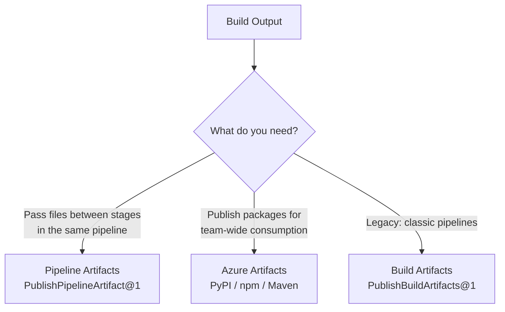

# Build Artifacts vs. Pipeline Artifacts vs. Azure Artifacts

Understanding when to use each artifact type is critical for designing efficient pipelines.

## Comparison Overview



## Pipeline Artifacts (Recommended)

Fast, deduplicated storage for passing files between jobs and stages **within a pipeline**.

```yaml
# Publish
- task: PublishPipelineArtifact@1
  inputs:
    targetPath: $(Build.ArtifactStagingDirectory)
    artifact: drop
    publishLocation: pipeline

# Download in a later stage/job
- task: DownloadPipelineArtifact@2
  inputs:
    artifact: drop
    path: $(Pipeline.Workspace)/drop
```

## Azure Artifacts

A package feed (Python/PyPI, npm, Maven, NuGet, Universal Packages) for **sharing libraries** across projects and teams. For Python, this is how you host a **private package** that other repos can `pip install`.

```yaml
# Authenticate pip to your private Azure Artifacts feed
- task: PipAuthenticate@1
  inputs:
    artifactFeeds: 'my-project/my-feed'

# Now pip can install packages from that feed
- script: pip install my-internal-library
  displayName: Install private package
```

!!! note

    You can also **publish** your own package to the feed with `twine upload` after building a wheel (`python -m build`). This is the Python equivalent of publishing a NuGet/npm package.

## When to Use Each

| Scenario | Recommendation |
|---|---|
| Pass a zip of your app from Build to Deploy stage | **Pipeline Artifacts** |
| Publish a private Python package for other teams | **Azure Artifacts** |
| Legacy classic pipeline compatibility | **Build Artifacts** |

!!! tip

    **References:**

    - [Publish and download Pipeline Artifacts (Microsoft)](https://learn.microsoft.com/en-us/azure/devops/pipelines/artifacts/pipeline-artifacts)
    - [What is Azure Artifacts? (Microsoft)](https://learn.microsoft.com/en-us/azure/devops/artifacts/start-using-azure-artifacts)
