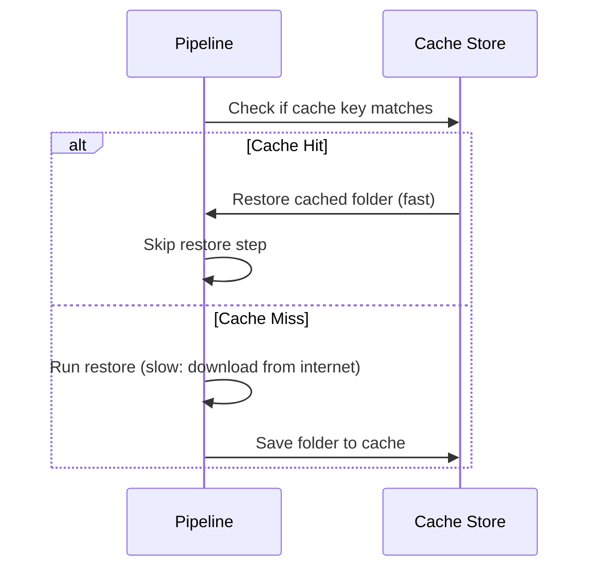

# Caching in YAML Pipelines

**Pipeline caching** stores dependency folders between pipeline runs, significantly reducing the time spent installing packages with `pip` (or npm, Maven, etc.).

## How Caching Works



## pip Cache Example

This caches pip's download folder, keyed on your `requirements*.txt`. When the requirements do not change, the next run reuses the cache instead of re-downloading every package from PyPI.

```yaml
variables:
  PIP_CACHE_DIR: $(Pipeline.Workspace)/.pip

steps:
  - task: Cache@2
    displayName: Cache pip packages
    inputs:
      key: 'pip | "$(Agent.OS)" | requirements-dev.txt'
      restoreKeys: |
        pip | "$(Agent.OS)"
      path: $(PIP_CACHE_DIR)

  - script: pip install -r requirements-dev.txt
    displayName: Install dependencies (uses cache)
```

!!! tip

    You do not need a `condition` to skip the install — `pip` automatically reuses anything already in its cache directory, so just always run the install step.

## Cache Key Best Practices

The cache key should be a hash of the files that define your dependencies (e.g., `packages.lock.json`, `package-lock.json`). When dependencies change, the key changes and the cache is rebuilt.

| Package Manager | Recommended Key File |
|---|---|
| NuGet | `packages.lock.json` |
| npm | `package-lock.json` |
| pip | `requirements.txt` |
| Maven | `pom.xml` |

!!! tip

    **References:**

    - [Pipeline caching (Microsoft)](https://learn.microsoft.com/en-us/azure/devops/pipelines/release/caching)
