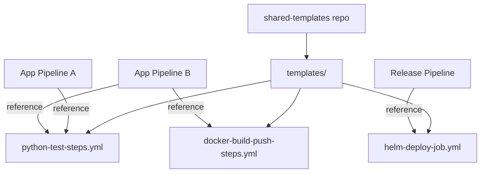

# Templates in YAML Pipelines

**Templates** allow you to define reusable pipeline logic (steps, jobs, stages, or variables) in separate YAML files and reference them from multiple pipelines. This is the YAML equivalent of Task Groups.

## Template Types

| Template Type | Purpose | Keyword |
|---|---|---|
| **Step template** | Reusable list of steps | `steps:` |
| **Job template** | Reusable job definition | `jobs:` |
| **Stage template** | Reusable stage definition | `stages:` |
| **Variable template** | Reusable variable definitions | `variables:` |

## Step Template Example

**`templates/python-test-steps.yml`** (in a shared templates repo):
```yaml
parameters:
  - name: pythonVersion
    type: string
    default: '3.12'

steps:
  - task: UsePythonVersion@0
    displayName: Use Python ${{ parameters.pythonVersion }}
    inputs:
      versionSpec: ${{ parameters.pythonVersion }}

  - script: pip install -r requirements-dev.txt
    displayName: Install dependencies

  - script: flake8 .
    displayName: Lint

  - script: pytest --cov=app
    displayName: Test
```

**`azure-pipelines.yml`** (consuming the template):
```yaml
resources:
  repositories:
    - repository: templates
      type: git
      name: MyProject/shared-templates

stages:
  - stage: Build
    jobs:
      - job: Build
        pool:
          vmImage: ubuntu-latest
        steps:
          - template: templates/python-test-steps.yml@templates
            parameters:
              pythonVersion: '3.12'
```

## Organizing Templates



!!! tip

    **References:**

    - [Template references (Microsoft)](https://learn.microsoft.com/en-us/azure/devops/pipelines/process/templates)
