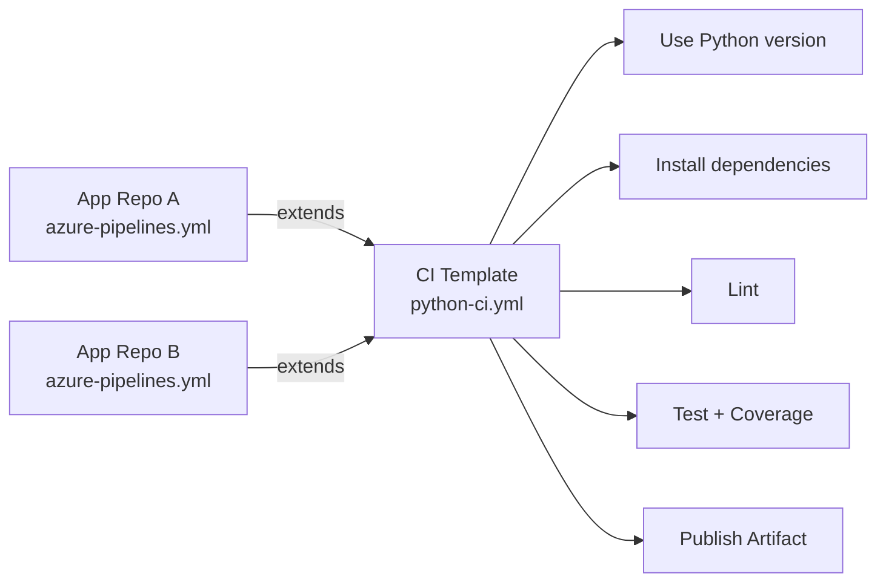

# Creating a Python CI Template

A CI (Continuous Integration) template bundles all the install, lint, test, and package steps for a Python application into one reusable file that any pipeline in your organization can consume. Write it once, reuse it everywhere.

## Template Architecture



## Template File: `templates/python-ci-template.yml`

```yaml
parameters:
  - name: pythonVersion
    type: string
    default: '3.12'
  - name: sourceDir
    type: string
    default: 'app'
  - name: artifactName
    type: string
    default: drop

jobs:
  - job: CI
    pool:
      vmImage: ubuntu-latest
    steps:
      - task: UsePythonVersion@0
        displayName: Use Python ${{ parameters.pythonVersion }}
        inputs:
          versionSpec: ${{ parameters.pythonVersion }}

      - script: |
          python -m pip install --upgrade pip
          pip install -r requirements-dev.txt
        displayName: Install dependencies

      - script: flake8 ${{ parameters.sourceDir }}
        displayName: Lint

      - script: pytest --junitxml=junit/test-results.xml --cov=${{ parameters.sourceDir }} --cov-report=xml
        displayName: Test with coverage

      - task: PublishTestResults@2
        displayName: Publish test results
        condition: succeededOrFailed()
        inputs:
          testResultsFormat: JUnit
          testResultsFiles: junit/test-results.xml

      - task: PublishCodeCoverageResults@2
        displayName: Publish code coverage
        inputs:
          codeCoverageTool: Cobertura
          summaryFileLocation: '$(System.DefaultWorkingDirectory)/coverage.xml'

      - task: ArchiveFiles@2
        displayName: Package app
        inputs:
          rootFolderOrFile: $(System.DefaultWorkingDirectory)
          includeRootFolder: false
          archiveType: zip
          archiveFile: $(Build.ArtifactStagingDirectory)/app.zip

      - task: PublishPipelineArtifact@1
        displayName: Upload artifact
        inputs:
          targetPath: $(Build.ArtifactStagingDirectory)
          artifact: ${{ parameters.artifactName }}
```

!!! note

    `condition: succeededOrFailed()` on **Publish test results** means results are uploaded even when tests fail — so you can see *which* tests failed instead of just a red X.

## Consuming the Template

```yaml
# azure-pipelines.yml in your application repository
trigger:
  - main

resources:
  repositories:
    - repository: templates
      type: git
      name: MyOrg/shared-templates

jobs:
  - template: templates/python-ci-template.yml@templates
    parameters:
      pythonVersion: '3.12'
      sourceDir: 'app'
      artifactName: shopping-frontend-drop
```

!!! tip

    Storing this template in a central `shared-templates` repo means every Python team gets the *same* tested CI process — and when you improve the template, every consumer benefits automatically.

!!! tip

    **References:**

    - [Template parameters (Microsoft)](https://learn.microsoft.com/en-us/azure/devops/pipelines/process/template-parameters)
    - [Build Python apps in Azure Pipelines (Microsoft)](https://learn.microsoft.com/en-us/azure/devops/pipelines/ecosystems/python)
