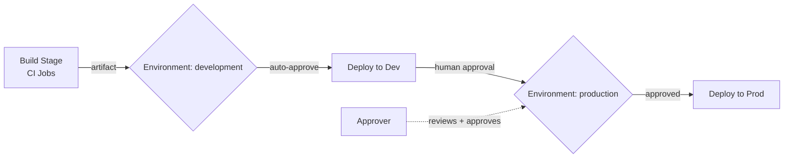

# Environments & Pre-Deployment Approvals

An **Environment** in YAML Pipelines is a collection of deployment targets (Kubernetes namespaces, VMs, or abstract groups) that pipelines deploy to. Environments act as governance checkpoints with built-in approval gates, audit trails, and deployment history.

## Environment Architecture



## Creating an Environment
1. Go to **Pipelines → Environments → New environment**.
2. Name it (e.g., `production`).
3. Select the resource type: **None** (abstract), **Kubernetes**, or **Virtual machines**.

## Configuring Approval Gates
1. Open the environment → click **...** → **Approvals and checks**.
2. Add **Approvals**: designate one or more people who must approve before deployment proceeds.
3. Add **Branch control**: only allow deployments from specific branches (e.g., `main`).

## Using Environments in YAML

```yaml
stages:
  - stage: Build
    jobs:
      - job: Build
        steps:
          - task: UsePythonVersion@0
            inputs:
              versionSpec: '3.12'
          - script: pip install -r requirements-dev.txt && pytest
            displayName: Install and test
          - publish: $(System.DefaultWorkingDirectory)
            artifact: drop

  - stage: Deploy_Dev
    dependsOn: Build
    jobs:
      - deployment: DeployDev
        environment: development   # No approval required
        strategy:
          runOnce:
            deploy:
              steps:
                - download: current
                  artifact: drop
                - script: echo "Deploying to development..."

  - stage: Deploy_Prod
    dependsOn: Deploy_Dev
    jobs:
      - deployment: DeployProd
        environment: production    # Approval gate enforced here
        strategy:
          runOnce:
            deploy:
              steps:
                - download: current
                  artifact: drop
                - script: echo "Deploying to production..."
```

## Deployment Strategies

| Strategy | Description |
|---|---|
| `runOnce` | Deploy once; simple and common |
| `rolling` | Deploy to targets in batches; reduce downtime |
| `canary` | Deploy to a small percentage first |

!!! tip

    **References:**

    - [Create and target environments (Microsoft)](https://learn.microsoft.com/en-us/azure/devops/pipelines/process/environments)
    - [Deployment jobs (Microsoft)](https://learn.microsoft.com/en-us/azure/devops/pipelines/process/deployment-jobs)
