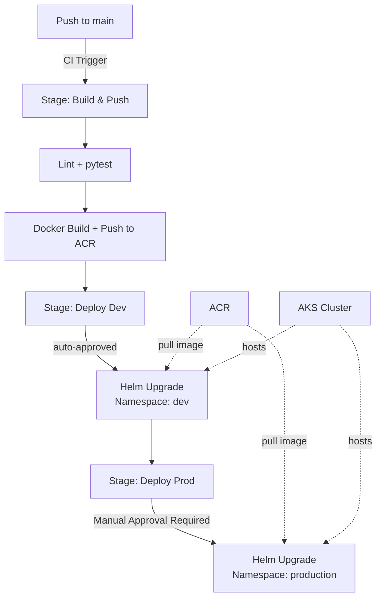

# AKS Cluster Environment Lab: Multi-Stage YAML Pipeline to AKS

This lab brings together all YAML pipeline concepts into a complete end-to-end CI/CD pipeline that tests our [Python (Flask) app](../1-Introduction/7-Sample-Python-Application.md), containerizes it, and deploys to multiple AKS namespaces via Environments and Helm.

## Complete Pipeline Architecture



## Full Pipeline YAML

```yaml
trigger:
  branches:
    include:
      - main

variables:
  - group: acr-credentials
  - name: imageRepository
    value: shopping-frontend
  - name: dockerfilePath
    value: Dockerfile

stages:
  # ─────────────────────────────────────────────
  # Stage 1: Build, Test, and Push Docker image
  # ─────────────────────────────────────────────
  - stage: Build
    displayName: Build and Push
    jobs:
      - job: BuildJob
        pool:
          vmImage: ubuntu-latest
        steps:
          - task: UsePythonVersion@0
            inputs:
              versionSpec: '3.12'

          - script: |
              pip install -r requirements-dev.txt
              flake8 app
              pytest --cov=app
            displayName: Lint & Test

          - task: Docker@2
            displayName: Build and Push to ACR
            inputs:
              command: buildAndPush
              containerRegistry: $(acrServiceConnection)
              repository: $(imageRepository)
              dockerfile: $(dockerfilePath)
              tags: $(Build.BuildId)

  # ─────────────────────────────────────────────
  # Stage 2: Deploy to Dev (auto-approved)
  # ─────────────────────────────────────────────
  - stage: Deploy_Dev
    displayName: Deploy to Development
    dependsOn: Build
    jobs:
      - deployment: DeployDev
        environment: development
        strategy:
          runOnce:
            deploy:
              steps:
                - task: HelmDeploy@0
                  inputs:
                    command: upgrade
                    chartType: filePath
                    chartPath: charts/shopping-frontend
                    releaseName: shopping-frontend-dev
                    namespace: development
                    overrideValues: image.tag=$(Build.BuildId)
                    install: true

  # ─────────────────────────────────────────────
  # Stage 3: Deploy to Production (approval gate)
  # ─────────────────────────────────────────────
  - stage: Deploy_Prod
    displayName: Deploy to Production
    dependsOn: Deploy_Dev
    jobs:
      - deployment: DeployProd
        environment: production
        strategy:
          runOnce:
            deploy:
              steps:
                - task: HelmDeploy@0
                  inputs:
                    command: upgrade
                    chartType: filePath
                    chartPath: charts/shopping-frontend
                    releaseName: shopping-frontend
                    namespace: production
                    overrideValues: image.tag=$(Build.BuildId)
                    install: true
```

!!! tip

    **References:**

    - [Deploy to AKS using YAML (Microsoft)](https://learn.microsoft.com/en-us/azure/devops/pipelines/targets/aks)
    - [Kubernetes Environment resource (Microsoft)](https://learn.microsoft.com/en-us/azure/devops/pipelines/process/environments-kubernetes)
