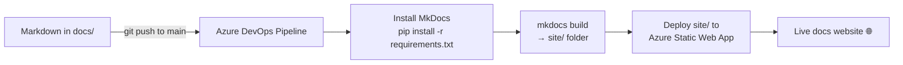

# Publishing Docs with MkDocs to Azure Static Web Apps

This lab is a complete, real-world example of everything in this module: a YAML pipeline that **builds a Python site and deploys it** — automatically, on every push to `main`. The site is built with **MkDocs**, a Python tool that turns a folder of Markdown files (like this very guide!) into a polished static website.

!!! note

    This is "meta": you are using an Azure DevOps Python pipeline to publish the documentation *about* Azure DevOps Python pipelines. The exact same pattern works for any static site.

## What you're building (mental model first)



- **MkDocs** takes your `docs/` folder and generates a `site/` folder of plain HTML/CSS/JS.
- An **Azure Static Web App (SWA)** hosts that static `site/`.
- **Azure Pipelines** runs the whole thing: checkout → install → `mkdocs build` → deploy.

That is the entire machine.

## Prerequisites

| Where | What you need |
|---|---|
| **Your machine** | Git, Python 3.x (`python --version`, `pip --version`, `git --version`) |
| **Azure** | A subscription with permission to create **Static Web Apps** and **Resource Groups** |
| **Azure DevOps** | An organization + project, with permission to create a **Repo**, a **Pipeline**, and a **Variable Group** |

## Step 1 — Create and clone the repo

1. **Azure DevOps → Repos → New repository**, name it e.g. `mkdocs-docs`.
2. Clone it locally:

```bash
git clone <your-azure-devops-repo-url>
cd mkdocs-docs
```

## Step 2 — Scaffold the MkDocs project

Install MkDocs locally (only needed on your machine for this step — the pipeline installs it too):

```bash
pip install mkdocs
mkdocs new .          # creates mkdocs.yml and a docs/ folder with index.md
mkdocs serve          # preview at http://127.0.0.1:8000
```

Once it looks right, commit the baseline:

```bash
git add .
git commit -m "Initial MkDocs scaffold"
git push
```

!!! tip

    `mkdocs serve` gives you a live-reloading local preview. Always check your changes here before pushing — it is far faster than waiting for the pipeline.

## Step 3 — Create the Azure Static Web App

In the **Azure Portal**:

1. Search **Static Web Apps → Create**.
2. Fill in **Subscription**, **Resource Group**, a unique **Name**, and a **Region**.
3. Under **Deployment details**, set **Source = Azure DevOps** and pick your Organization, Project, Repository, and Branch (`main`).
4. Under build settings, set **App location** to `site` (the folder MkDocs generates).

Create the SWA. Azure will then **add a pipeline YAML file to your repo** and **create a Variable Group** holding a secret deployment token.

## Step 4 — Why the first pipeline run fails (and how to fix it)

!!! warning

    The first run **fails on purpose** — and that is expected. The generated pipeline tries to deploy the `site/` folder, but `site/` does not exist in your repo yet. It is only created **after** `mkdocs build` runs. The fix is to add a build step *before* the deploy step.

## Step 5 — Add the MkDocs build step

Pull the pipeline file Azure generated, then edit it:

```bash
git pull        # downloads the generated azure-pipelines.yml
```

Add a build step **before** the Static Web Apps deploy task:

```yaml
- task: UsePythonVersion@0
  displayName: Use Python 3.12
  inputs:
    versionSpec: '3.12'

- script: |
    python -m pip install --upgrade pip
    pip install -r requirements.txt
    mkdocs build --clean
  displayName: Install MkDocs and build site
```

The golden rule: **build first, deploy second.** The `--clean` flag removes leftovers from previous builds so `site/` is always fresh.

Commit and push to trigger the pipeline:

```bash
git add .
git commit -m "Build MkDocs in pipeline before deploying"
git push
```

## Step 6 — Pin your dependencies (do this early!)

Unpinned tools break silently when a new version ships. Create a `requirements.txt` so every build is reproducible:

```text
mkdocs==1.6.*
mkdocs-material==9.5.*
mkdocs-callouts==1.* # renders GitHub-style > [!TIP] admonitions in Material
awesome-pages==2.*   # auto-builds nav from numbered files/folders
```

!!! info "Important"

    This guide's pages use **GitHub-style admonitions** like `> [!TIP]` and `> [!NOTE]`. The Material theme does **not** render those on its own — you need the **`mkdocs-callouts`** plugin (above). Without it, those blocks appear as plain quotes with a literal `[!TIP]`.

## Step 7 — Configure `mkdocs.yml`

A solid starting configuration that matches this course's structure (numbered folders, Material theme, GitHub-style callouts):

```yaml
site_name: "Azure DevOps Blueprint"

theme:
  name: material
  features:
    - navigation.sections
    - navigation.top
    - content.code.copy

markdown_extensions:
  - admonition
  - pymdownx.details
  - pymdownx.superfences      # required for mermaid + nested code blocks
  - toc:
      permalink: true

plugins:
  - search
  - callouts                  # turns > [!TIP] into Material admonitions
  - awesome-pages             # builds nav from the folder tree automatically
```

!!! tip

    With the **`awesome-pages`** plugin, you do **not** maintain a `nav:` list. Just name files with numeric prefixes (`1-Introduction/`, `8-Git-and-Azure-Repos-Cheatsheet.md`) and they appear in order automatically. Every new page is integrated the moment you add it.

    If you prefer full control instead, replace the plugin with an explicit `nav:` block:

    ```yaml
    nav:
      - Home: index.md
      - Introduction:
          - Overview: 1-Introduction/1-Introduction.md
          - Git Cheatsheet: 1-Introduction/8-Git-and-Azure-Repos-Cheatsheet.md
    ```

## Step 8 — Rendering mermaid diagrams

This guide uses mermaid diagrams. To make them render in the Material theme, add this to `mkdocs.yml`:

```yaml
markdown_extensions:
  - pymdownx.superfences:
      custom_fences:
        - name: mermaid
          class: mermaid
          format: !!python/name:pymdownx.superfences.fence_code_format
```

## Step 9 — Confirm the site is live

In **Azure DevOps → Pipelines**, open the run. You should see logs for `pip install`, `mkdocs build`, then the SWA deploy uploading `site/`. When it is green, open your **Static Web App** URL — your docs are live.

## Step 10 — Adopt a real team workflow

Treat docs like code (this is exactly what the rest of this module teaches):

```bash
git switch -c add-new-page
# ...edit Markdown, mkdocs serve to preview...
git add .
git commit -m "Add new page"
git push -u origin add-new-page
```

Then open a Pull Request (Repos → Pull Requests → New). See the [Git & Azure Repos Cheatsheet](../1-Introduction/8-Git-and-Azure-Repos-Cheatsheet.md) for the commands.

!!! note

    The deploy pipeline is triggered by **commits to `main`**, not by opening a PR. So the site updates only once the PR is **merged**.

### Add a PR-validation build (catch broken docs before merge)

Add a second, deploy-free pipeline that just *builds* the docs on every PR. If `mkdocs build` fails (broken nav, bad link), the PR is blocked:

```yaml
# pr-validation.yml
trigger: none          # don't run on push to main
pr:
  - main               # run on PRs targeting main

pool:
  vmImage: ubuntu-latest

steps:
  - task: UsePythonVersion@0
    inputs:
      versionSpec: '3.12'
  - script: |
      pip install -r requirements.txt
      mkdocs build --strict    # --strict turns warnings (e.g. broken links) into errors
    displayName: Validate docs build
```

Then make it a **required check** via [branch policies](../5-Security-in-Azure-DevOps/4-Azure-Repos-Permissions-and-Policies.md) on `main`.

## Step 11 — Lock down access (optional)

By default a Static Web App is public. For internal-only docs, open the SWA's **Authentication / Authorization** settings and enable **Microsoft Entra ID** login, then control access via user/group assignments. Visitors must then sign in before viewing.

## Recommended project layout

```text
mkdocs-docs/
  docs/                      # all your Markdown content
    index.md
    1-Introduction/
    ...
  mkdocs.yml                 # site config
  requirements.txt          # pinned mkdocs + theme + plugins
  azure-pipelines.yml       # build + deploy on main
  pr-validation.yml         # build-only check on PRs
```

## Common mistakes

| Symptom | Cause & fix |
|---|---|
| "Directory `site` is invalid" | `site/` was not generated — ensure `mkdocs build` runs **before** the SWA deploy. |
| `[!TIP]` shows as literal text | Material needs the **`mkdocs-callouts`** plugin to render GitHub-style admonitions. |
| Mermaid diagrams show as raw code | Add the `pymdownx.superfences` custom fence for mermaid (Step 8). |
| Navigation isn't nested as expected | Use `awesome-pages` (numeric prefixes) or define `nav:` explicitly. |
| Builds break randomly over time | Pin versions in `requirements.txt` (Step 6). |
| Links don't work | Markdown needs full URLs: ✅ `https://example.com`, not ❌ `example.com`. |

!!! tip

    **References:**

    - [MkDocs documentation](https://www.mkdocs.org/)
    - [Material for MkDocs](https://squidfunk.github.io/mkdocs-material/)
    - [Deploy to Azure Static Web Apps with Azure DevOps (Microsoft)](https://learn.microsoft.com/en-us/azure/static-web-apps/publish-azure-devops)
    - [mkdocs-callouts plugin](https://github.com/sondregronas/mkdocs-callouts)
