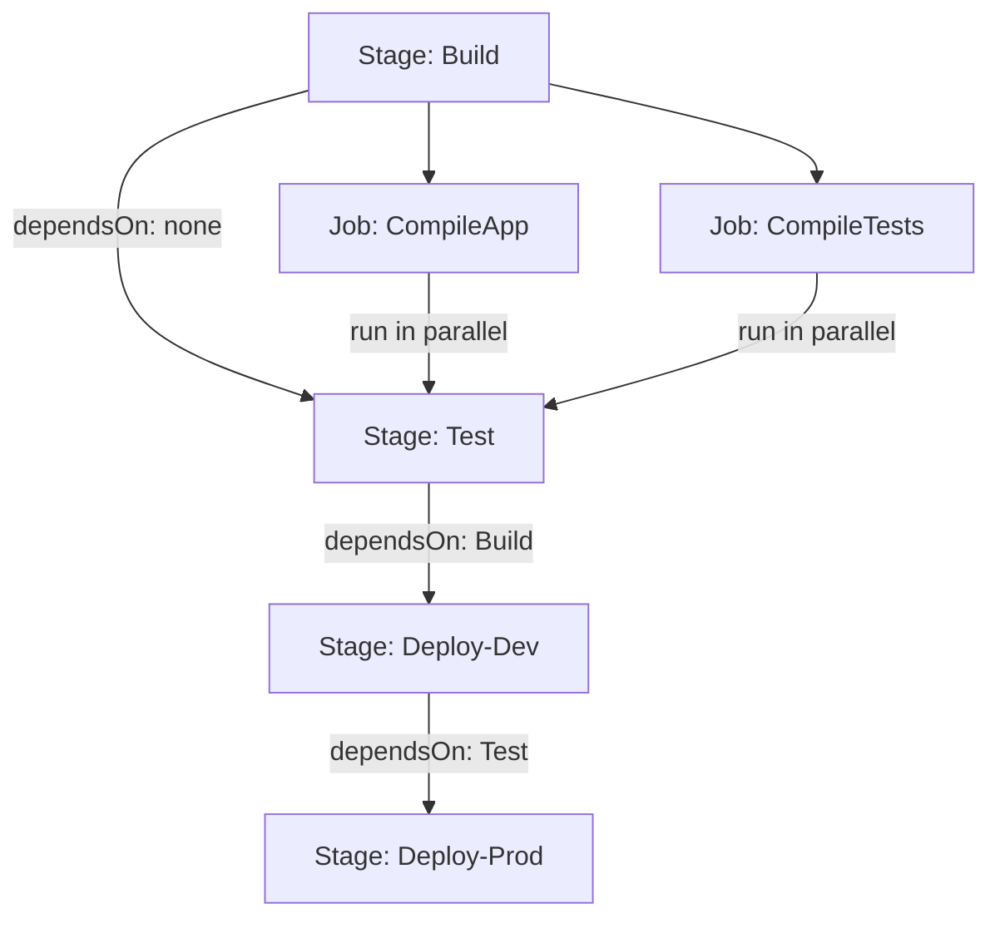

# Stages vs. Jobs in YAML Pipelines

Understanding the difference between **Stages** and **Jobs** is fundamental to designing effective YAML pipelines.

## Key Concepts

| Concept | Description | Runs On |
|---|---|---|
| **Stage** | A logical boundary (e.g., Build, Test, Deploy) | N/A — groups jobs |
| **Job** | A unit of work that runs on one agent | Single agent |
| **Step** | Individual task or script within a job | Same agent as the job |

## Execution Model



## Example: Multi-Stage Pipeline

```yaml
stages:
  - stage: Build
    displayName: 'Build Stage'
    jobs:
      - job: BuildApp
        pool:
          vmImage: ubuntu-latest
        steps:
          - task: UsePythonVersion@0
            inputs:
              versionSpec: '3.12'
          - script: pip install -r requirements-dev.txt && pytest
            displayName: Install and test
          - publish: $(System.DefaultWorkingDirectory)
            artifact: drop

  - stage: Deploy
    displayName: 'Deploy to Dev'
    dependsOn: Build
    jobs:
      - deployment: DeployDev
        environment: development
        strategy:
          runOnce:
            deploy:
              steps:
                - download: current
                  artifact: drop
                - script: echo "Deploying to dev..."
```

## Jobs Running in Parallel

Within a single stage, multiple jobs run **in parallel** by default. This is useful for running tests on multiple OS environments simultaneously.

```yaml
jobs:
  - job: TestOnLinux
    pool:
      vmImage: ubuntu-latest
    steps:
      - script: pip install -r requirements-dev.txt && pytest

  - job: TestOnWindows
    pool:
      vmImage: windows-latest
    steps:
      - script: pip install -r requirements-dev.txt && pytest
```

!!! tip

    **References:**

    - [Stages in Azure Pipelines (Microsoft)](https://learn.microsoft.com/en-us/azure/devops/pipelines/process/stages)
    - [Jobs in YAML pipelines (Microsoft)](https://learn.microsoft.com/en-us/azure/devops/pipelines/process/phases)
