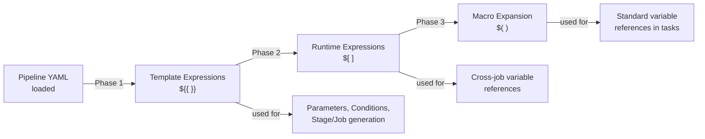

# Compile-time vs. Runtime Expressions

Azure Pipelines uses three distinct expression syntaxes, each evaluated at a different phase of the pipeline lifecycle.

## Expression Types at a Glance



## 1. Template Expressions `${{ }}`

Evaluated at **compile time** (when the YAML is first parsed). Used to conditionally include steps and loop over objects.

```yaml
# Conditionally include a step at compile time
- ${{ if eq(parameters.runTests, true) }}:
  - script: pytest
    displayName: Run tests
```

## 2. Runtime Expressions `$[ ]`

Evaluated at **runtime** but before the step/job executes. Used mainly to read the **output variables** from a previous job.

```yaml
variables:
  deployVersion: $[ dependencies.Build.outputs['BuildStep.version'] ]
```

## 3. Macro Expansion `$( )`

The most common syntax. Expanded at **job execution time** when a task or script is actually running.

```yaml
- script: pytest --cov=app --cov-fail-under=$(minCoverage)
```

## When Each Syntax Applies

| Situation | Use |
|---|---|
| Conditional stage/job generation | `${{ if ... }}` |
| Loop over parameter list to create stages | `${{ each ... }}` |
| Reference output from previous job | `$[ dependencies.X.outputs['...'] ]` |
| Reference any variable in a script | `$(variableName)` |
| Reference a parameter inside a template | `${{ parameters.paramName }}` |

!!! warning

    You cannot use `$( )` macro syntax in `trigger:` or `pool:` blocks. Use `${{ }}` template expressions there instead.

!!! tip

    **References:**

    - [Expressions (Microsoft)](https://learn.microsoft.com/en-us/azure/devops/pipelines/process/expressions)
