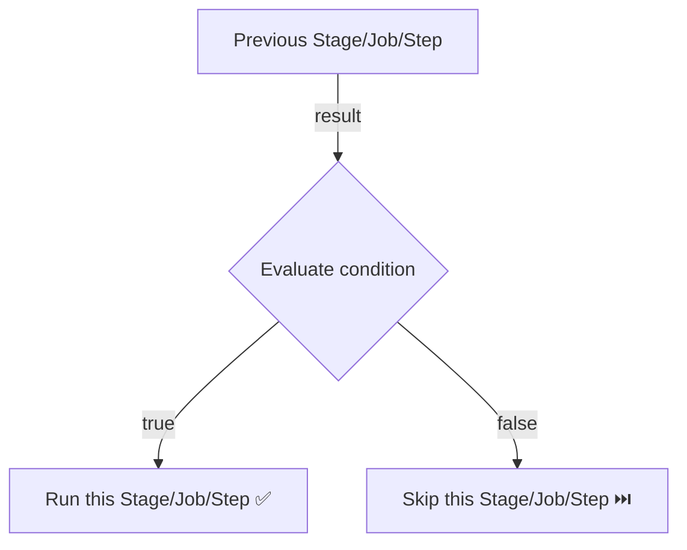

# Conditioning in YAML Pipelines

**Conditions** allow you to control whether a stage, job, or step runs based on the result of previous work or the value of variables.

## Condition Evaluation Flow



## Default Behavior

By default, a stage or job runs only if all previous stages/jobs **succeeded**. This is equivalent to:
```yaml
condition: succeeded()
```

## Common Condition Patterns

### Always run (e.g., cleanup)
```yaml
- job: Cleanup
  condition: always()
  steps:
    - script: echo "Cleaning up resources..."
```

### Run only on main branch
```yaml
- stage: Deploy
  condition: and(succeeded(), eq(variables['Build.SourceBranch'], 'refs/heads/main'))
```

### Run only on PR builds
```yaml
- stage: PRValidation
  condition: eq(variables['Build.Reason'], 'PullRequest')
```

### Skip if a variable is set
```yaml
- step: script: echo "Running integration tests"
  condition: ne(variables['SKIP_INTEGRATION'], 'true')
```

## Conditions at Different Levels

```yaml
stages:
  - stage: Build
    condition: succeeded()         # Stage condition

    jobs:
      - job: UnitTest
        condition: succeeded()     # Job condition

        steps:
          - script: pytest
            condition: and(succeeded(), ne(variables['SKIP_TESTS'], 'true'))  # Step condition
```

!!! tip

    **References:**

    - [Specify conditions (Microsoft)](https://learn.microsoft.com/en-us/azure/devops/pipelines/process/conditions)
