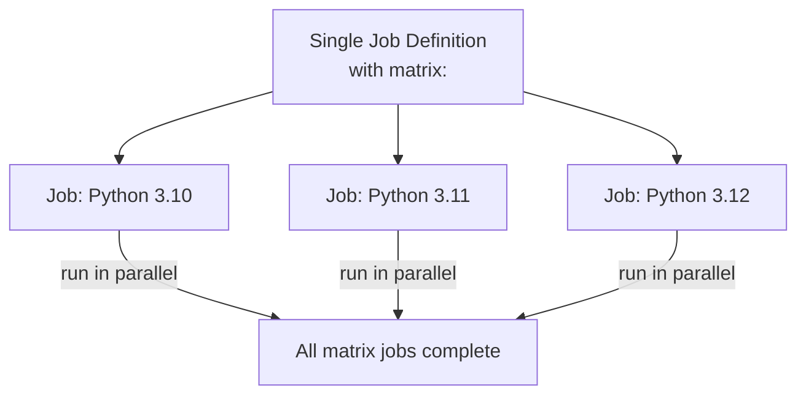

# Looping & Matrix Strategy

**Matrix strategy** generates multiple parallel jobs from a single job definition by iterating over a set of variable combinations. For Python, the classic use case is **testing your code against several Python versions at once** — so you know your app works on 3.10, 3.11, and 3.12.

## How Matrix Works



## Basic Matrix Example: Test Across Python Versions

```yaml
jobs:
  - job: Test
    pool:
      vmImage: ubuntu-latest
    strategy:
      matrix:
        Python310:
          pythonVersion: '3.10'
        Python311:
          pythonVersion: '3.11'
        Python312:
          pythonVersion: '3.12'
      maxParallel: 3   # Run all three at once

    steps:
      - task: UsePythonVersion@0
        inputs:
          versionSpec: $(pythonVersion)
      - script: |
          pip install -r requirements-dev.txt
          pytest
        displayName: 'Test on Python $(pythonVersion)'
```

!!! tip

    Each matrix job gets its own `$(pythonVersion)` value. Azure DevOps creates one parallel job per entry — a huge time-saver compared to testing each version one after another.

## Looping Over Parameters with `${{ each }}`

Use compile-time loops to dynamically generate stages or jobs from a parameter list:

```yaml
parameters:
  - name: environments
    type: object
    default:
      - name: dev
        namespace: development
      - name: prod
        namespace: production

stages:
  - ${{ each env in parameters.environments }}:
    - stage: Deploy_${{ env.name }}
      jobs:
        - job: Deploy
          steps:
            - script: |
                helm upgrade --install my-app ./charts \
                  --namespace ${{ env.namespace }}
```

!!! tip

    **References:**

    - [Matrix strategy (Microsoft)](https://learn.microsoft.com/en-us/azure/devops/pipelines/yaml-schema/jobs-job-strategy)
    - [Template expressions each keyword (Microsoft)](https://learn.microsoft.com/en-us/azure/devops/pipelines/process/template-expressions)
