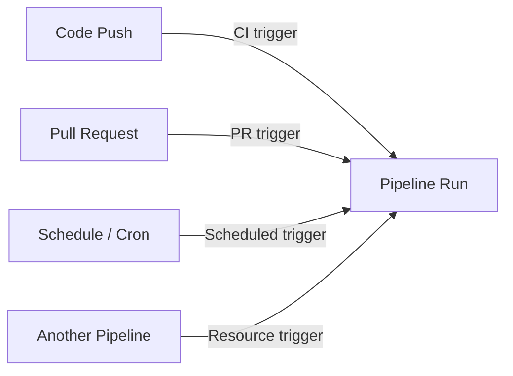

# Triggers & Resources

**Triggers** determine when a pipeline runs automatically. **Resources** define external inputs your pipeline consumes, such as other pipelines, repositories, or container images.

## Trigger Types



## CI (Push) Triggers

```yaml
trigger:
  branches:
    include:
      - main
      - release/*
    exclude:
      - feature/experimental
  paths:
    include:
      - src/
    exclude:
      - docs/
```

!!! note

    Setting `trigger: none` disables CI triggers, making the pipeline manual-only.

## Pull Request Triggers

```yaml
pr:
  branches:
    include:
      - main
  paths:
    include:
      - src/
```

## Scheduled Triggers (Cron)

```yaml
schedules:
  - cron: "0 2 * * 1-5"   # 2 AM every weekday
    displayName: Nightly Build
    branches:
      include:
        - main
    always: true   # Run even if no code changes
```

## Pipeline Resources (Triggering from Another Pipeline)

```yaml
resources:
  pipelines:
    - pipeline: BuildPipeline        # Alias
      source: My-Build-Pipeline      # Name of the upstream pipeline
      trigger:
        branches:
          include:
            - main
```

## Repository Resources

```yaml
resources:
  repositories:
    - repository: templates
      type: git
      name: MyProject/shared-templates
      ref: refs/heads/main
```

!!! tip

    **References:**

    - [Triggers in Azure Pipelines (Microsoft)](https://learn.microsoft.com/en-us/azure/devops/pipelines/build/triggers)
    - [Resources in YAML pipelines (Microsoft)](https://learn.microsoft.com/en-us/azure/devops/pipelines/process/resources)
