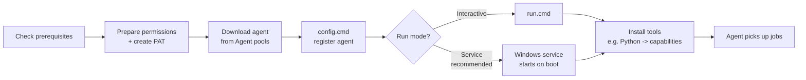

# Deploying a Self-Hosted Windows Agent

This is the in-depth companion to [Azure Pipelines Agent on a Windows VM](1-Azure-Pipelines-Agent-in-Windows-Vm.md). That chapter is a quick walkthrough; this one is the **full lifecycle reference** — prerequisites, the security model, every `config.cmd` prompt, running interactively vs. as a service, automated (unattended) setup, updating, firewall rules, and troubleshooting — adapted for a **Python** pipeline.

!!! note

    A self-hosted agent is just a machine you own that runs the Azure Pipelines agent software, so your pipelines run on *your* hardware instead of Microsoft's cloud agents. For Python work a Linux agent is often smoother (see [Docker](2-Azure-Pipelines-Agent-in-Docker-Container.md) / [Kubernetes](3-Azure-Pipelines-Agent-in-Kubernetes-Cluster.md)), but Windows agents are essential when you must build or test on Windows.

## Lifecycle at a glance



## 1. Check prerequisites

| Requirement | Detail |
|---|---|
| **Operating system** | Windows 10 (21H2/1809/1607), Windows 11 (23H2/22H2/21H2), or **Windows Server 2012 or higher** (x64). ARM64 Windows 11 is in public preview. |
| **.NET** | None needed — the agent installs its own copy of .NET. |
| **PowerShell** | 3.0 or higher. |
| **Python** | Install the Python version your pipeline needs (e.g., 3.12) so steps like `pytest`/`flake8` can run. See [Capabilities](#7-capabilities-install-python-and-tools). |
| **Optional** | Subversion client (only if building from SVN); Visual Studio Build Tools 2015+ if compiling native code. |

!!! tip

    Run agent setup **manually the first time** to learn how it works. Once you understand it, use [unattended config](#5-automated-unattended-setup) to spin up many agents quickly.

## 2. Prepare permissions (the security model)

Registering an agent is a **one-time** action that needs elevated Azure DevOps permissions — but the account that *runs* the agent day-to-day does not.

!!! warning

    The agent **executes code it downloads** (your pipeline steps), so it is a potential target for remote code execution. Treat the agent machine and its folders as sensitive:

    - Restrict the agent folder (`C:\agents`) so only **admins** and the agent's run-as identity can edit it — it holds secrets, logs, and artifacts.
    - Make the identity that **registers** the agent different from the identity that **runs** it (least privilege).

### Who can register an agent?

You need permission to **administer the agent queue**. You already have it if you are an **Organization Owner** or **Project Collection Administrator**. Otherwise an admin must grant it:

1. **Organization settings → Agent pools**.
2. Select the pool → **Security**.
3. Add your account (or have an admin add it).

!!! note

    If you try to add yourself and see *"Cannot modify the role for self identity"*, you are already an owner/admin — you can skip this; you already have permission.

### Create a Personal Access Token (PAT)

The simplest registration method is a PAT:

1. In Azure DevOps: **User settings → Personal access tokens → New Token**.
2. Set a name and expiry.
3. Scope: **Agent Pools → Read & manage**.
4. Copy the token now — you cannot see it again.

!!! tip

    The PAT is used **only at registration time**. After that, the agent communicates with Azure DevOps on its own; the token is not needed for everyday operation. Other auth options exist (device code flow, service principal) — see the references.

## 3. Download the agent

1. **Organization settings → Agent pools → Default → Agents → New agent**.
2. In the dialog choose **Windows**, then the architecture (**x64** for 64-bit Windows).
3. Click **Download** and save the `.zip`.
4. Unpack to a short, space-free path — **`C:\agents`** is recommended:

```powershell
mkdir C:\agents
# extract the downloaded zip into C:\agents
```

!!! warning

    Configure the agent from an **elevated PowerShell** window (required for service mode). Do **not** use *PowerShell ISE* or *git-bash/mintty* — they are not fully compatible with the setup script. Avoid extracting into your Downloads or user profile folder (permission issues).

## 4. Configure & run the agent

### Run `config.cmd`

```powershell
cd C:\agents
.\config.cmd
```

It asks a series of questions:

| Prompt | What to enter |
|---|---|
| **Server URL** | `https://dev.azure.com/{your-organization}` |
| **Authentication type** | Press Enter for **PAT**, then paste your token |
| **Agent pool** | e.g. `Default` (or your custom pool) |
| **Agent name** | A unique name, e.g. `WIN-PY-01` |
| **Work folder** | Press Enter for `_work` (one work folder per agent — never share) |
| **Run as service?** | `Y` (recommended) |
| **Service account** | Press Enter for `NT AUTHORITY\NETWORK SERVICE`, or supply `domain\user` |
| **SERVICE_SID_TYPE_UNRESTRICTED?** | Press Enter for `N` (default) unless you need unrestricted service SID access |

!!! tip

    If you run as a service, the **service account username should be 20 characters or fewer**. Built-in accounts like `NT AUTHORITY\NETWORK SERVICE` and Group Managed Service Accounts (gMSA) don't need a password.

### Run interactively

If you did **not** choose service mode:

```powershell
.\run.cmd
```

Press `Ctrl+C` to stop, and `run.cmd` again to restart.

**Run once** — accept a single job then exit (handy for ephemeral/containerized agents):

```powershell
.\run.cmd --once
```

### Run as a service

If you chose service mode, the agent starts automatically and on every reboot. Manage it in **`services.msc`** under a name like:

- `Azure Pipelines Agent (<agent name>)`

```text
Right-click → Restart   to restart the agent
```

!!! warning

    To change the agent's **logon account**, do **not** edit it in the Services snap-in — that breaks the agent. Instead [remove and reconfigure](#6-update-replace-remove) it.

## 5. Automated (unattended) setup

For provisioning many agents, pass `--unattended` plus all answers. Any flag can also be supplied as an environment variable by upper-casing it and prefixing `VSTS_AGENT_INPUT_` (e.g. `VSTS_AGENT_INPUT_TOKEN`).

```powershell
.\config.cmd --unattended `
  --url "https://dev.azure.com/<your-organization>" `
  --auth pat --token "<your-PAT>" `
  --pool "Default" `
  --agent "WIN-PY-01" `
  --work "_work" `
  --runAsService `
  --windowsLogonAccount "NT AUTHORITY\NETWORK SERVICE" `
  --replace
```

Useful flags:

| Flag | Purpose |
|---|---|
| `--unattended` | No prompts; everything must be on the command line |
| `--url <url>` | Organization/collection URL (**required**) |
| `--auth <type>` | `pat`, `SP`, `negotiate`, `alt`, or `integrated` (**required**) |
| `--token <pat>` | The PAT (with `--auth pat`) |
| `--pool` / `--agent` | Pool to join / agent name |
| `--work <dir>` | Work directory (default `_work`) |
| `--replace` | Replace an existing agent of the same name |
| `--runAsService` | Install as a Windows service (needs admin) |
| `--runAsAutoLogon` | Auto-logon and start the agent on boot (needs admin) |
| `--windowsLogonAccount` / `--windowsLogonPassword` | Service / auto-logon account (password not needed for gMSA or built-in accounts) |
| `--noRestart` | With `--runAsAutoLogon`, don't reboot after config |

!!! tip

    `.\config --help` always lists the current set of options for your agent version.

## 6. Update, replace, remove

=== "Update"

    Agents **auto-update** when a job needs a newer version. To update manually: **Agent pools → (your pool) → right-click → Update all agents**. Check an agent's version via the **Capabilities** tab (`Agent.Version`) against the [latest release](https://github.com/microsoft/azure-pipelines-agent/releases).

=== "Replace"

    Re-run the download + `config.cmd` steps with the **same agent name**. When prompted to replace, answer `Y`, and remove the old one to avoid conflicts.

=== "Remove / reconfigure"

    ```powershell
    .\config remove
    ```

    Then run `.\config.cmd` again to reconfigure.

## 7. Capabilities (install Python and tools)

The agent advertises **capabilities** so the pool only sends it jobs it can handle. There are two kinds:

- **System capabilities** — auto-detected (OS, environment variables, installed tools on `PATH`).
- **User-defined capabilities** — key/value pairs you add in the pool UI.

For our Python pipeline, install what the build needs and **restart the agent** so the new capability is detected:

```powershell
# Install Python (or use the installer from python.org and tick "Add to PATH")
# Then verify it is on PATH:
python --version
pip --version
# Restart the agent so it re-scans capabilities:
#   services.msc -> right-click the agent service -> Restart
```

!!! warning

    After installing new software you **must restart the agent** — capabilities (including `PATH` and environment variables) are only read at startup. A pipeline using a tool that isn't a capability will not be assigned to that agent.

!!! tip

    The Azure Pipelines `UsePythonVersion@0` task selects a Python already present in the agent's **tool cache**. On a self-hosted Windows agent you must pre-install the Python versions you need (or populate the tool cache), unlike Microsoft-hosted agents which ship many versions.

You can exclude noisy environment variables from capabilities by setting `VSO_AGENT_IGNORE` to a comma-separated list.

## 8. Firewall: URLs and IP ranges to allow

If the agent sits behind a firewall, it must be able to reach Azure DevOps. Allow these domains (for `dev.azure.com` organizations):

| Domain URL | Purpose |
|---|---|
| `https://dev.azure.com` | Core services |
| `https://*.dev.azure.com` | Org services |
| `https://login.microsoftonline.com` | Microsoft Entra sign-in |
| `https://management.core.windows.net` | Azure management APIs |
| `https://*.vssps.visualstudio.com` | Platform services |
| `https://*.vsblob.visualstudio.com` | Telemetry |
| `https://*.vstmr.visualstudio.com` | Test management |
| `https://*.blob.core.windows.net` | Azure Artifacts |
| `https://*.vsassets.io` | Azure Artifacts CDN |
| `https://download.agent.dev.azure.com` | Agent package download |

!!! warning

    The agent download CDN moved to `https://*.dev.azure.com`. If your firewall can't use wildcards, allow `https://download.agent.dev.azure.com` specifically.

If you also restrict by IP, ensure `dev.azure.com`/`*.dev.azure.com` are open and allow these **IPv4** ranges:

```text
13.107.6.0/24
13.107.9.0/24
13.107.42.0/24
13.107.43.0/24
150.171.22.0/24
150.171.23.0/24
150.171.73.0/24
150.171.74.0/24
150.171.75.0/24
150.171.76.0/24
```

!!! note

    To run the agent **behind a web proxy**, see Microsoft's [Run the agent behind a web proxy](https://learn.microsoft.com/en-us/azure/devops/pipelines/agents/proxy). Note: your pipeline tasks (e.g. `pip`) must also be configured to use the proxy.

## 9. Troubleshooting & handy knobs

- **Diagnostics:** `.\run --diagnostics` runs a self-test suite. For network issues, set the pipeline variable `Agent.Diagnostic` to `true`.
- **Per-agent environment variables:** create a `.env` file in the agent root, one `KEY=VALUE` per line, then restart the agent:

    ```text
    PIP_INDEX_URL=https://my-internal-feed/simple
    HTTPS_PROXY=http://proxy.corp:8080
    ```

- **Git version:** the agent bundles its own Git. To prefer the machine's Git, set the pipeline variable `System.PreferGitFromPath=true` (or add it to the agent's `.env`).
- **Auto-logon agent won't start after reboot:** remove the old config (`.\config.cmd remove --auth PAT --token <token>`), confirm it left the pool, then reconfigure with `--runAsAutoLogon`.

## Verify it works

In Azure DevOps, the agent should show **online** under **Agent pools → (your pool) → Agents**. Target it from a pipeline by its pool:

```yaml
pool:
  name: Default          # your self-hosted pool
  demands:
    - python             # only run on agents that have Python installed

steps:
  - script: |
      python -m pip install -r requirements-dev.txt
      pytest
    displayName: Install and test on the self-hosted agent
```

!!! tip

    The `demands:` list is how you require a capability. `demands: python` ensures the job only runs on agents where Python was installed and detected.

!!! tip

    **References:**

    - [Deploy an Azure Pipelines agent on Windows (Microsoft)](https://learn.microsoft.com/en-us/azure/devops/pipelines/agents/windows-agent)
    - [Self-hosted agent authentication options (Microsoft)](https://learn.microsoft.com/en-us/azure/devops/pipelines/agents/agent-authentication-options)
    - [Agent capabilities & demands (Microsoft)](https://learn.microsoft.com/en-us/azure/devops/pipelines/agents/agents#capabilities)
    - [Agent pool security roles (Microsoft)](https://learn.microsoft.com/en-us/azure/devops/organizations/security/about-security-roles)
