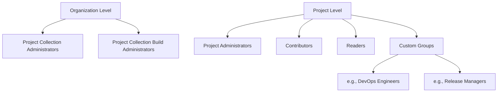

# Security Groups in Azure DevOps

**Security Groups** in Azure DevOps enable you to manage permissions at scale by assigning roles to groups of users rather than individuals.

!!! note

    **New to permissions?** Think of it like a building: instead of cutting a custom key for every person, you create a few **roles** ("Developers", "Release Managers") and decide which doors each role can open. Then you just add people to a role. That is all a security group is.

## Security Group Hierarchy

## Built-in Groups

| Group | Scope | Key Permissions |
|---|---|---|
| **Project Collection Administrators** | Organization | Full control over all projects and resources |
| **Project Administrators** | Project | Full control within the project |
| **Contributors** | Project | Create/edit work items, pipelines, repos |
| **Readers** | Project | View-only access |
| **Build Administrators** | Project | Manage pipelines and agent pools |

## Principle of Least Privilege

!!! info "Important"

    **Never** assign users to `Project Collection Administrators` unless absolutely necessary. Use **custom groups** with scoped permissions instead.

### Recommended Approach
1. Create custom security groups per role (e.g., `Release-Managers`, `Dev-Engineers`).
2. Assign the minimum permissions needed for each group.
3. Add users to groups — never assign permissions to individuals directly.
4. **Disable permission inheritance** on sensitive resources (e.g., production environments, protected branches).

## Creating a Custom Security Group
1. Go to **Project Settings → Permissions**.
2. Click **New group**.
3. Name the group and add members.
4. Navigate to the resource (pipeline, repo, environment) and grant the group specific permissions.

!!! tip

    **References:**

    - [About security roles in Azure DevOps (Microsoft)](https://learn.microsoft.com/en-us/azure/devops/organizations/security/about-permissions)
    - [Security best practices (Microsoft)](https://learn.microsoft.com/en-us/azure/devops/organizations/security/security-best-practices)
