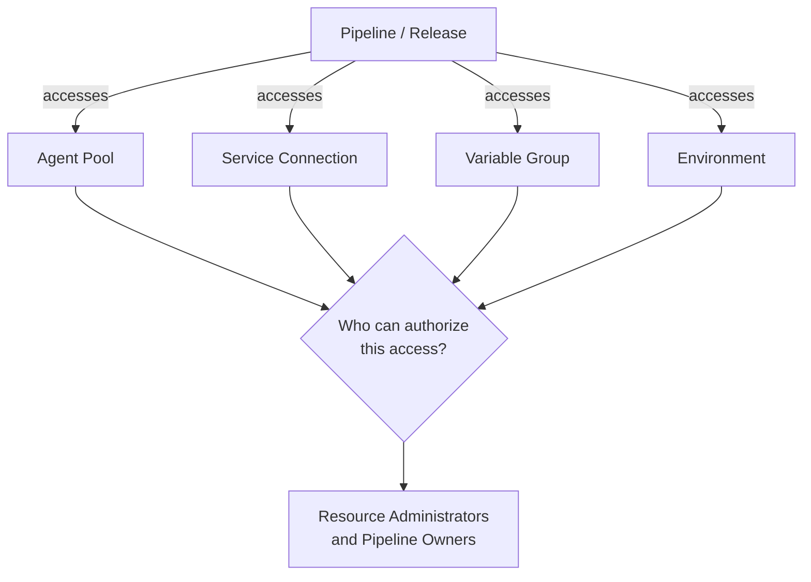

# Pipelines, Releases & Variable Groups Permissions

Securing your pipelines and the secrets they use is critical to preventing unauthorized deployments and credential exposure.

## Pipeline Permission Architecture

## Pipeline-Level Permissions

Navigate to a specific pipeline → **...** → **Security**:

| Permission | Recommended Assignment |
|---|---|
| Edit pipeline | `Build Administrators`, `Contributors` |
| Delete pipeline | `Project Administrators` only |
| Queue builds | `Contributors` |
| View builds | `Readers` |
| Manage pipeline policies | `Project Administrators` only |

## Release Pipeline Permissions

| Permission | Recommended Assignment |
|---|---|
| Create releases | `Release Managers` group |
| Deploy to production | `Release Managers` + manual approval |
| Edit release definitions | `Build Administrators` |
| Manage approvals | Designated approvers only |

## Variable Group Permissions

Variable groups containing secrets must be tightly controlled:
1. Go to **Pipelines → Library → Variable Group → Security**.
2. Assign specific groups:

| Role | Who |
|---|---|
| **Administrator** | `DevOps Leads` only |
| **Creator** | `Build Administrators` |
| **User** | Pipelines that need the group |
| **Reader** | `Contributors` (view names but not values) |

!!! danger "Caution"

    Never grant `Administrator` on a Variable Group linked to Azure Key Vault to the entire `Contributors` group. A developer could modify the group to exfiltrate secrets.

## Restricting Pipeline Access to Variable Groups
By default, variable groups can be used by "all pipelines." Restrict this:
1. In the variable group, turn off **Allow access to all pipelines**.
2. Manually add only the specific pipelines that need the group.

!!! tip

    **References:**

    - [Set pipeline permissions (Microsoft)](https://learn.microsoft.com/en-us/azure/devops/pipelines/policies/permissions)
    - [Variable group security (Microsoft)](https://learn.microsoft.com/en-us/azure/devops/pipelines/library/variable-groups)
