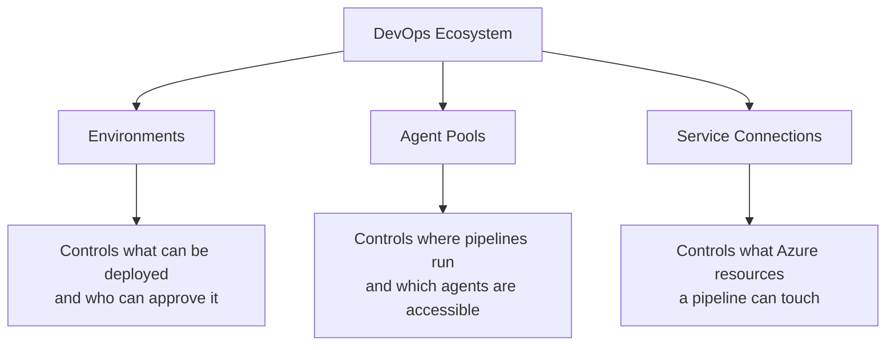

# Environments, Agent Pools & Service Connections Permissions

These three resources are high-value targets in a DevOps environment. Misconfigurations can lead to unauthorized deployments, lateral movement, or credential theft.

## Permission Layers



## Environment Permissions

| Role | Capabilities |
|---|---|
| **Administrator** | Manage environment, add checks, delete |
| **User** | Use environment in pipelines |
| **Reader** | View environment and deployment history |

**Best practice:** Only permit the `production` environment to be used by the deployment pipeline, and require a human **approval check** before any deployment proceeds.

```
Pipelines → Environments → production → Approvals and checks → + Approvals
```

## Agent Pool Permissions

| Role | Capabilities |
|---|---|
| **Administrator** | Manage agents, manage pool, delete agents |
| **User** | Can run pipelines in this pool |
| **Reader** | View agents and pool |
| **Service Account** | Internal — used by build agents |

Restrict self-hosted agent pools to only the pipelines and users that need them. Public agent pools are fine for Microsoft-hosted agents but should not be confused with self-hosted pools containing corporate credentials.

## Service Connection Permissions

A service connection stores credentials to connect to Azure, GitHub, Docker registries, and more. These are among the **most sensitive** items in your Azure DevOps organization.

| Role | Capabilities |
|---|---|
| **Administrator** | Full control, can share, edit, delete |
| **User** | Use in pipelines |
| **Creator** | Create new service connections |
| **Reader** | View connection name, not credentials |

**Security hardening steps:**
1. Set **Scope** to a specific **Resource Group**, not the entire subscription.
2. Disable **Grant access permission to all pipelines** — add only specific pipelines.
3. Prefer **Managed Identity** (Workload Identity Federation) over client secret/PAT credentials — no secrets to rotate or leak.

!!! warning

    A service connection with Subscription-level Contributor access is effectively a skeleton key to your entire Azure environment. Always scope it to the minimum required resource group.

!!! tip

    **References:**

    - [Manage service connection security (Microsoft)](https://learn.microsoft.com/en-us/azure/devops/pipelines/library/service-endpoints)
    - [Workload identity federation for service connections (Microsoft)](https://learn.microsoft.com/en-us/azure/devops/pipelines/library/connect-to-azure)
