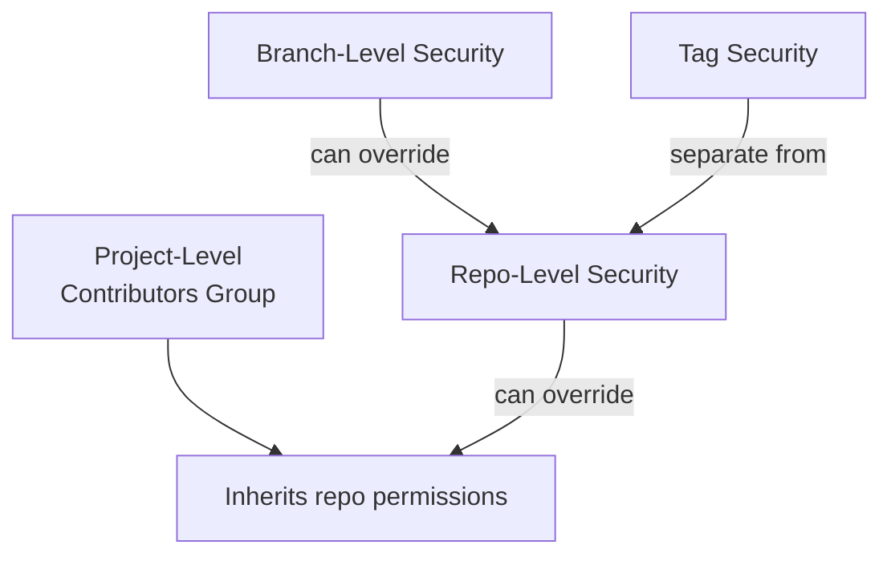
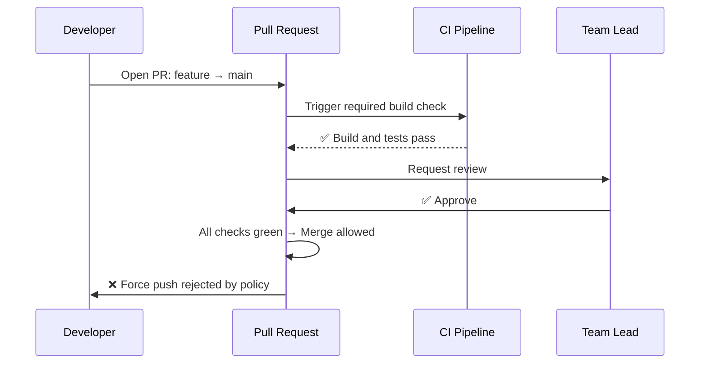

# Azure Repos Permissions & Policies

**Azure Repos** permissions control who can read, write, and manage your code. **Branch Policies** enforce quality gates before code is merged, preventing bad code from reaching your main branches.

## Repository Permission Model

## Common Repository Permissions

Navigate to **Repos → ... → Security** on a repository:

| Permission | Recommended Assignment |
|---|---|
| **Read** | `Readers`, `Contributors` |
| **Contribute** | `Contributors` |
| **Force push (rewrite history)** | `Project Administrators` only |
| **Manage permissions** | `Project Administrators` only |
| **Create branch** | `Contributors` |
| **Delete or rename branch** | `Build Administrators`, `Leads` |

!!! danger "Caution"

    Disable **Force push** on `main` for all users including administrators. Force-pushing can rewrite commit history and permanently destroy audit trails.

## Branch Policies

Branch policies add mandatory checks before a PR can be merged into a protected branch. Configure them at **Repos → Branches → ... → Branch policies**.

### Recommended Policies for `main`

| Policy | Setting |
|---|---|
| **Require a minimum number of reviewers** | Minimum 2 |
| **Allow requestors to approve their own changes** | ❌ Off |
| **When new changes are pushed, reset approval votes** | ✅ On |
| **Required status checks** | Your CI build pipeline |
| **Automatically include reviewers** | Your team leads |
| **Comment requirements** | All comments must be resolved |

## Branch Protection Example Flow

## Protecting Tags
Tags (used for releases) can be restricted so only release managers can create them:
1. Go to **Repos → Tags → Security**.
2. Deny **Create tag** for `Contributors`.
3. Allow **Create tag** only for `Release Managers`.

!!! tip

    **References:**

    - [Repository permissions (Microsoft)](https://learn.microsoft.com/en-us/azure/devops/repos/git/set-git-repository-permissions)
    - [Branch policies (Microsoft)](https://learn.microsoft.com/en-us/azure/devops/repos/git/branch-policies)
