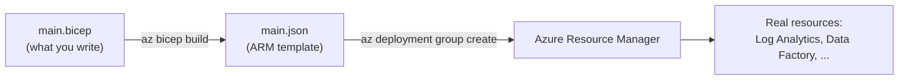
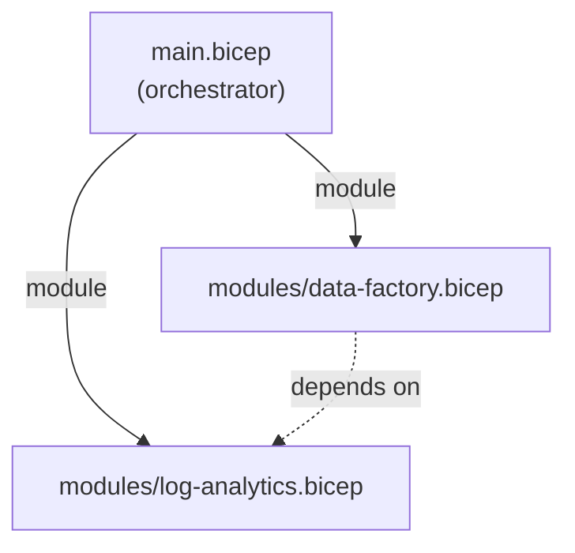

# What is Infrastructure as Code (and Bicep)?

So far this guide has used pipelines to **build, test, and deploy** the `shopping-frontend` app onto infrastructure that already existed — an App Service, a VM, an AKS cluster. This module flips that around: we use a pipeline to **create the infrastructure itself**, defined as code, so the resources are versioned, reviewable, and reproducible.

**Infrastructure as Code (IaC)** means describing your cloud resources (resource groups, monitoring workspaces, data pipelines) in text files that live in Git, instead of clicking them together by hand in the Azure Portal. The pipeline then turns those files into real Azure resources.

!!! note

    This module uses **Bicep**, Azure's native IaC language. The next module solves the same problem with **[Terraform](../7-Infrastructure-as-Code-with-Terraform/1-What-is-Terraform.md)** — the cloud-agnostic alternative. They share the same concepts; learning both lets you pick the right tool per project.

## Why bother — clicking in the portal works, doesn't it?

| Click-ops (Portal) | Infrastructure as Code |
|---|---|
| Steps live in someone's memory | Steps live in Git, reviewable in a pull request |
| "Works on my subscription" drift | Same file → same result, every environment |
| No history of *who changed what* | Full `git log` and blame |
| Rebuilding after a disaster is manual | Re-run the pipeline |
| Hard to spin up a second (staging) copy | Change one parameter, deploy again |

The same arguments that make us put `azure-pipelines.yml` in source control apply to the infrastructure that pipeline runs on.

## Where Bicep fits

Azure's native IaC format is **ARM (Azure Resource Manager) templates** — large JSON documents that the Resource Manager API understands. ARM JSON is powerful but verbose and awkward to write by hand.

**Bicep** is a friendlier *domain-specific language* that compiles down to ARM JSON. You write concise Bicep; the tooling **transpiles** it to the ARM JSON that Azure actually deploys. Nothing new runs in Azure — Bicep is a better authoring experience on top of the same engine.



### Bicep vs ARM JSON at a glance

The two snippets below create the *same* Log Analytics workspace.

```bicep
// Bicep — what you maintain
resource workspace 'Microsoft.OperationalInsights/workspaces@2022-10-01' = {
  name: 'log-shopping-frontend'
  location: resourceGroup().location
  properties: {
    sku: { name: 'PerGB2018' }
    retentionInDays: 30
  }
}
```

```json
// ARM JSON — what Bicep transpiles to (you never hand-edit this)
{
  "type": "Microsoft.OperationalInsights/workspaces",
  "apiVersion": "2022-10-01",
  "name": "log-shopping-frontend",
  "location": "[resourceGroup().location]",
  "properties": {
    "sku": { "name": "PerGB2018" },
    "retentionInDays": 30
  }
}
```

## Template vs Module — the one distinction to hold onto

This trips people up, so pin it down now because every later page relies on it:

| Term | What it is | In this module |
|---|---|---|
| **Bicep template** | Any `.bicep` file that declares resources | Every file we write |
| **Module** | A `.bicep` file *designed to be reused*, called by another `.bicep` file via the `module` keyword | `log-analytics.bicep`, `data-factory.bicep` |
| **Main (orchestrator)** | The top-level `.bicep` that wires modules together and is the deployment entry point | `main.bicep` |



Thinking in modules is what lets us build **one** Log Analytics workspace definition and reuse it, then add a Data Factory that *depends on* it — exactly the way we factored the `shopping-frontend` pipeline into reusable YAML templates earlier.

## What we will build in this module

By the end you will have a second Git repository — an **infrastructure repo** — and a YAML pipeline that provisions the Azure footprint behind `shopping-frontend`:

1. A **Resource Group** (via PowerShell, as a warm-up).
2. A **Log Analytics workspace** for monitoring, written as a reusable Bicep module.
3. A **Data Factory** that depends on that workspace.
4. A **YAML pipeline** that transpiles the Bicep and deploys it on every push.
5. **Modularized** Bicep *and* YAML templates so the whole thing stays DRY.

!!! note

    **Prerequisites already covered earlier in this guide** — we will not repeat them here:

    - An Azure DevOps organization, project, and repo — see [Introduction](../1-Introduction/1-Introduction.md).
    - The Azure CLI, Bicep, Git, and VS Code installed — see [Local Tools and Environment Setup](../1-Introduction/9-Local-Tools-and-Environment-Setup.md).
    - Build agents (Microsoft-hosted or self-hosted) — see [Self-Hosted Agents](../4-Self-Hosted-Agents/1-Azure-Pipelines-Agent-in-Windows-Vm.md).

    In particular this module needs the **Bicep CLI** — verify with `az bicep version` and install with `az bicep install` if missing.

!!! tip

    **References:**

    - [What is Bicep? (Microsoft)](https://learn.microsoft.com/en-us/azure/azure-resource-manager/bicep/overview)
    - [What is Infrastructure as Code? (Microsoft)](https://learn.microsoft.com/en-us/devops/deliver/what-is-infrastructure-as-code)
    - [Bicep vs ARM templates (Microsoft)](https://learn.microsoft.com/en-us/azure/azure-resource-manager/bicep/compare-template-syntax)
