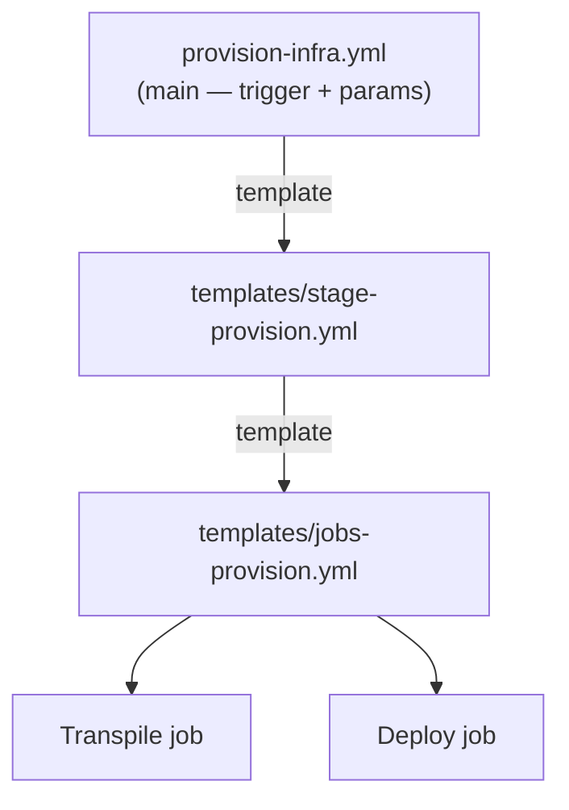
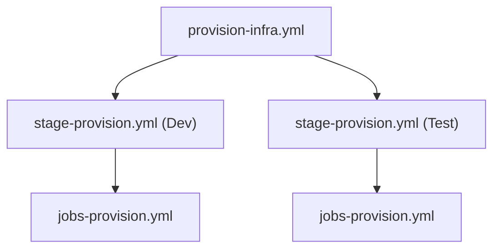

# Modularizing Bicep and YAML Templates

We have modular *Bicep*. The *YAML* is still monolithic — one `provision-infra.yml` with its stages and jobs inlined. The moment a second pipeline (a `test` environment, a teardown job) wants the same deploy logic, we'd copy-paste it. This final page extracts the pipeline's stage and jobs into **reusable YAML templates**, so the main pipeline becomes a thin caller — exactly the refactor we just did in Bicep, applied one layer up.

!!! note

    This page is the *applied IaC* companion to [Templates in YAML Pipelines](../3-Azure-Yaml-Pipelines/13-Templates-in-Yaml-Pipelines.md), which covers the template syntax and types in general. Read that first if `parameters:` / `${{ }}` template expressions are new; here we put them to work on the provisioning pipeline.

## The goal: a thin main pipeline



| File | Responsibility |
|---|---|
| `pipelines/provision-infra.yml` | Trigger, variable group, pass parameters — *what to run* |
| `pipelines/templates/stage-provision.yml` | The provisioning stage shell — *the stage* |
| `pipelines/templates/jobs-provision.yml` | The transpile + deploy jobs — *the work* |

## Step 1 — Create the jobs template

Move the two jobs (transpile, deploy) into a template, exposing the values that vary as **parameters**.

**`pipelines/templates/jobs-provision.yml`**

```yaml
parameters:
  - name: serviceConnection
    type: string
  - name: resourceGroupName
    type: string
  - name: location
    type: string
  - name: environment
    type: string

jobs:
  - job: Transpile
    displayName: Transpile Bicep to ARM
    steps:
      - task: AzureCLI@2
        inputs:
          azureSubscription: ${{ parameters.serviceConnection }}
          scriptType: pscore
          scriptLocation: scriptPath
          scriptPath: scripts/Build-Bicep.ps1
      - publish: arm
        artifact: arm-templates

  - job: Deploy
    displayName: Deploy infrastructure
    dependsOn: Transpile
    steps:
      - download: current
        artifact: arm-templates
      - task: AzureCLI@2
        displayName: Ensure resource group
        inputs:
          azureSubscription: ${{ parameters.serviceConnection }}
          scriptType: pscore
          scriptLocation: scriptPath
          scriptPath: scripts/New-ResourceGroup.ps1
          arguments: >
            -ResourceGroupName ${{ parameters.resourceGroupName }}
            -Location ${{ parameters.location }}
            -Environment ${{ parameters.environment }}
      - task: AzureCLI@2
        displayName: Deploy ARM template
        inputs:
          azureSubscription: ${{ parameters.serviceConnection }}
          scriptType: pscore
          scriptLocation: inlineScript
          inlineScript: |
            az deployment group create `
              --resource-group ${{ parameters.resourceGroupName }} `
              --template-file $(Pipeline.Workspace)/arm-templates/main.json `
              --parameters environment=${{ parameters.environment }} `
              --name "deploy-$(Build.BuildId)"
```

Everything environment-specific is now a `${{ parameters.* }}` placeholder — the template knows *how* to provision, not *where*.

## Step 2 — Create the stage template

The stage template wraps the jobs template and forwards its parameters. This extra layer lets callers either invoke the whole stage or just the jobs (e.g. inside an existing stage).

**`pipelines/templates/stage-provision.yml`**

```yaml
parameters:
  - name: stageName
    type: string
    default: Provision
  - name: serviceConnection
    type: string
  - name: resourceGroupName
    type: string
  - name: location
    type: string
  - name: environment
    type: string

stages:
  - stage: ${{ parameters.stageName }}
    displayName: Provision ${{ parameters.environment }} infrastructure
    jobs:
      - template: jobs-provision.yml
        parameters:
          serviceConnection: ${{ parameters.serviceConnection }}
          resourceGroupName: ${{ parameters.resourceGroupName }}
          location: ${{ parameters.location }}
          environment: ${{ parameters.environment }}
```

## Step 3 — Refactor the main pipeline to call the template

The main pipeline collapses to its essentials — trigger, variable group, and a single `template:` reference:

**`pipelines/provision-infra.yml`** (now the whole file):

```yaml
trigger:
  branches:
    include: [ main ]
  paths:
    include: [ bicep/**, scripts/**, pipelines/** ]

variables:
  - group: infra-dev

pool:
  vmImage: ubuntu-latest

stages:
  - template: templates/stage-provision.yml
    parameters:
      stageName: ProvisionDev
      serviceConnection: $(serviceConnection)
      resourceGroupName: $(resourceGroupName)
      location: $(location)
      environment: $(environment)
```

## Step 4 — The payoff: a second environment for free

Adding `test` is now a five-line stage, not a copied pipeline:

```yaml
stages:
  - template: templates/stage-provision.yml
    parameters:
      stageName: ProvisionDev
      serviceConnection: $(serviceConnection)
      resourceGroupName: rg-shopping-dev
      location: westeurope
      environment: dev

  - template: templates/stage-provision.yml
    parameters:
      stageName: ProvisionTest
      serviceConnection: $(serviceConnection)
      resourceGroupName: rg-shopping-test
      location: westeurope
      environment: test
```

This mirrors the Bicep modules exactly: define the *how* once, invoke it per *target*.

| Layer | "Define once" | "Invoke per target" |
|---|---|---|
| **Bicep** | `modules/log-analytics.bicep` | `main.bicep` per resource |
| **YAML** | `templates/stage-provision.yml` | main pipeline per environment |

## Step 5 — Run and confirm

Push the refactor. Functionally **nothing should change** — a refactor that alters behaviour is a bug. Confirm:

- The pipeline still shows the transpile → deploy flow (now under the `ProvisionDev` stage).
- The same `log-shopping-dev` and `adf-shopping-dev` resources are deployed, idempotently.
- If you added the `test` stage, a `rg-shopping-test` group appears with its own workspace and factory.



## Wrap-up

You have built a complete, modular Infrastructure-as-Code setup for `shopping-frontend`:

- A separate infra repo with a clean structure and a secret-free service connection.
- Reusable **Bicep modules** (Log Analytics, Data Factory) wired by outputs, orchestrated by `main.bicep`.
- An explicit **Bicep → ARM** transpile step that fails fast.
- A **YAML pipeline** that builds, deploys, and confirms — now factored into reusable **stage/jobs templates** that scale to many environments.

The same instincts you learned for application CI/CD — modularity, parameters, idempotency, fail-fast — carry straight over to the infrastructure that application runs on.

!!! tip

    **References:**

    - [Template types & usage (Microsoft)](https://learn.microsoft.com/en-us/azure/devops/pipelines/process/templates)
    - [Template parameters (Microsoft)](https://learn.microsoft.com/en-us/azure/devops/pipelines/process/template-parameters)
    - [Bicep best practices (Microsoft)](https://learn.microsoft.com/en-us/azure/azure-resource-manager/bicep/best-practices)
