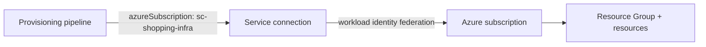

# Setup: Service Connection and the Infrastructure Repo

Before writing a line of Bicep we need two things: a way for the pipeline to **authenticate to Azure**, and a **clean repository layout** to hold the infrastructure code. We keep infrastructure in its *own* repo, separate from the `shopping-frontend` application repo, so that "change the app" and "change the cloud it runs on" are independent, independently-reviewed concerns.

## Why a separate infrastructure repo?

| Application repo (`shopping-frontend`) | Infrastructure repo (`shopping-infra`) |
|---|---|
| Flask code, tests, `Dockerfile` | Bicep modules, provisioning YAML |
| Changes on every feature | Changes rarely, with extra review |
| Deployed *to* the infrastructure | Creates the infrastructure |
| App developers own it | Platform/DevOps owns it |

!!! note

    Mono-repo is also valid — some teams keep `infra/` as a folder inside the app repo. We use a separate repo here because it makes the permission boundary (who can change production infrastructure) obvious. Everything below works the same either way; only the clone URL changes.

## Step 1 — Create the Service Connection

A **service connection** is the credential the pipeline uses to talk to your Azure subscription. We covered the security side of these in [Service Connections Permissions](../5-Security-in-Azure-DevOps/3-Environments-AgentPools-and-ServiceConnections-Permissions.md); here is the creation flow.

1. In Azure DevOps: **Project Settings → Service connections → New service connection**.
2. Choose **Azure Resource Manager**.
3. Choose **Workload identity federation (automatic)** — the modern, secret-free option. (Service principal with a secret also works if federation is unavailable.)
4. Scope it to your **subscription** (so it can create *new* resource groups), and name it clearly, e.g. `sc-shopping-infra`.
5. Grant access to the pipelines that need it — keep "Grant access to all pipelines" **off** for least privilege.

!!! tip

    Note the exact connection name (`sc-shopping-infra`). Every `AzureCLI@2` / `AzurePowerShell@5` task in this module references it through the `azureSubscription:` input.



## Step 2 — Create and clone the infrastructure repo

1. In Azure DevOps: **Repos → New repository** → name it `shopping-infra`, initialise with a README.
2. Clone it and create a working branch (the same Git flow from the [Git & Azure Repos Cheatsheet](../1-Introduction/8-Git-and-Azure-Repos-Cheatsheet.md)):

```bash
git clone https://dev.azure.com/<org>/<project>/_git/shopping-infra
cd shopping-infra
git checkout -b feature/log-analytics
```

We work on a branch and merge through a pull request — provisioning code deserves the same review gate as application code.

## Step 3 — Create the project structure

Lay out the folders now so later pages have a home for each file. From the repo root:

```text
shopping-infra/
├── bicep/
│   ├── main.bicep                 # Orchestrator (added on page 4)
│   └── modules/
│       ├── log-analytics.bicep    # Reusable module (page 4)
│       └── data-factory.bicep     # Reusable module (page 8)
├── scripts/
│   ├── New-ResourceGroup.ps1      # PowerShell provisioning (page 3)
│   └── Build-Bicep.ps1            # Transpile Bicep -> ARM (page 5)
├── pipelines/
│   ├── provision-infra.yml        # Main pipeline (page 6)
│   └── templates/                 # Reusable YAML templates (page 10)
│       ├── stage-provision.yml
│       └── jobs-provision.yml
├── arm/                           # Transpiled ARM output (page 5)
└── README.md
```

!!! note

    The `arm/` folder holds **generated** ARM JSON. Some teams `.gitignore` it (treating it as a build artifact); others commit it so every change is visible in the pull-request diff. We commit it in this module so you can *see* what Bicep produces — see [Transpiling Bicep to ARM](5-Transpiling-Bicep-to-ARM.md).

Create the skeleton in one go:

```powershell
New-Item -ItemType Directory -Force bicep/modules, scripts, pipelines/templates, arm | Out-Null
```

Commit the empty structure so the rest of the module has a clean starting point:

```bash
git add .
git commit -m "Scaffold infrastructure repo structure"
git push -u origin feature/log-analytics
```

With authentication wired up and the layout in place, the next page provisions our first real resource — a **Resource Group** — using PowerShell, before we graduate to Bicep.

!!! tip

    **References:**

    - [Connect to Microsoft Azure with a service connection (Microsoft)](https://learn.microsoft.com/en-us/azure/devops/pipelines/library/connect-to-azure)
    - [Workload identity federation for service connections (Microsoft)](https://learn.microsoft.com/en-us/azure/devops/pipelines/release/configure-workload-identity)
    - [Bicep file structure and best practices (Microsoft)](https://learn.microsoft.com/en-us/azure/azure-resource-manager/bicep/best-practices)
