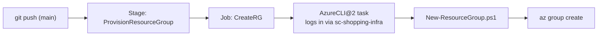

# Provisioning a Resource Group with PowerShell

Every Azure resource lives inside a **resource group** — a logical container for everything that shares a lifecycle. Before we deploy Bicep *into* a group, we need the group to exist. A resource group sits at the **subscription** scope (it is not itself created by a group-scoped Bicep deployment), so it is the natural place to start with a small **PowerShell** script and learn the pipeline plumbing — stage, job, task — on something simple.

!!! note

    **Why PowerShell here and Bicep later?** Creating the resource group is a one-liner that has to run at subscription scope, and it lets us focus on the *pipeline mechanics* first. From [Log Analytics](4-Log-Analytics-Bicep-Template-and-Module.md) onward, everything **inside** the group is declared in Bicep.

## Step 1 — Write the provisioning script

**`scripts/New-ResourceGroup.ps1`**

```powershell
[CmdletBinding()]
param(
    [Parameter(Mandatory)] [string] $ResourceGroupName,
    [Parameter(Mandatory)] [string] $Location,
    [string] $Environment = 'dev'
)

$ErrorActionPreference = 'Stop'

Write-Host "Ensuring resource group '$ResourceGroupName' in '$Location'..."

# Idempotent: create only if it does not already exist.
$existing = az group exists --name $ResourceGroupName | ConvertFrom-Json
if ($existing) {
    Write-Host "Resource group already exists — nothing to do."
}
else {
    az group create `
        --name $ResourceGroupName `
        --location $Location `
        --tags application=shopping-frontend environment=$Environment managedBy=iac `
        | Out-Null
    Write-Host "Created resource group '$ResourceGroupName'."
}
```

Two things worth calling out, because they recur throughout this module:

- **Idempotency** — the script checks `az group exists` first, so re-running the pipeline does not error. IaC should be safe to run repeatedly.
- **Tags** — `application`, `environment`, `managedBy` make it obvious in the portal which resources are owned by this pipeline. We reuse these tags on every Bicep resource later.

!!! tip

    Test the script locally before pipelining it. After `az login`:

    ```powershell
    ./scripts/New-ResourceGroup.ps1 -ResourceGroupName rg-shopping-dev -Location westeurope
    ```

## Step 2 — Add the stage and job to the YAML pipeline

Now wrap the script in a pipeline. This is the same **stage → job → steps** hierarchy from [Stages vs Jobs](../3-Azure-Yaml-Pipelines/2-Stages-vs-Jobs-in-Yaml-Pipelines.md) — we are just pointing it at infrastructure.

**`pipelines/provision-infra.yml`**

```yaml
trigger:
  branches:
    include:
      - main
  paths:
    include:
      - bicep/**
      - scripts/**
      - pipelines/**

pool:
  vmImage: ubuntu-latest

variables:
  resourceGroupName: rg-shopping-dev
  location: westeurope
  serviceConnection: sc-shopping-infra

stages:
  - stage: ProvisionResourceGroup
    displayName: Provision Resource Group
    jobs:
      - job: CreateRG
        displayName: Create the resource group
        steps:
          # (task added in the next step)
```

!!! tip

    The `paths` filter means this pipeline only runs when infrastructure files change — pushes that touch only documentation won't waste an agent. See [Triggers and Resources](../3-Azure-Yaml-Pipelines/9-Triggers-and-Resources.md).

## Step 3 — Add the PowerShell task

The script needs to run **authenticated as the service connection**. The `AzureCLI@2` task handles that login for us and can invoke a PowerShell Core script, so the `az` calls inside the script are already signed in:

```yaml
        steps:
          - task: AzureCLI@2
            displayName: Provision resource group
            inputs:
              azureSubscription: $(serviceConnection)
              scriptType: pscore
              scriptLocation: scriptPath
              scriptPath: scripts/New-ResourceGroup.ps1
              arguments: >
                -ResourceGroupName $(resourceGroupName)
                -Location $(location)
```

!!! note

    We use `AzureCLI@2` (not the bare `PowerShell@2` task) precisely because it injects the Azure login from the service connection. A plain PowerShell task would run the script unauthenticated and every `az` command would fail with "Please run az login".



## Step 4 — Validate the provisioned resource group

Run the pipeline (push to `main`, or queue it manually), then confirm the result three ways:

**In the pipeline log** — the job should print `Created resource group 'rg-shopping-dev'.`

**On the command line:**

```powershell
az group show --name rg-shopping-dev --query "{name:name, location:location, tags:tags}" -o table
```

**In the Azure Portal** — open **Resource groups**, find `rg-shopping-dev`, and confirm the `application=shopping-frontend` tag is present.

Re-run the pipeline once more and confirm the log now prints `already exists — nothing to do.` — proof the script is idempotent.

With an authenticated pipeline that can create a resource group, we are ready to declare what goes *inside* it. The next page writes our first Bicep module: a Log Analytics workspace.

!!! tip

    **References:**

    - [az group create (Microsoft)](https://learn.microsoft.com/en-us/cli/azure/group#az-group-create)
    - [AzureCLI@2 task (Microsoft)](https://learn.microsoft.com/en-us/azure/devops/pipelines/tasks/reference/azure-cli-v2)
    - [Manage resource groups (Microsoft)](https://learn.microsoft.com/en-us/azure/azure-resource-manager/management/manage-resource-groups-cli)
