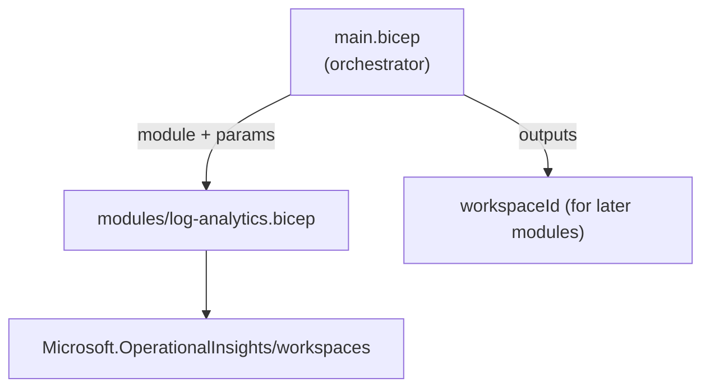
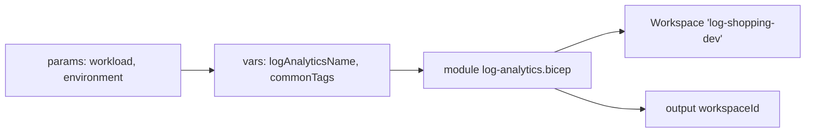

# The Log Analytics Bicep Template and Module

Now we write our first real Bicep. The goal is a **Log Analytics workspace** — the store that collects logs and metrics for `shopping-frontend` and, later, its Data Factory. We build it as a **reusable module** (`modules/log-analytics.bicep`) that a thin **orchestrator** (`main.bicep`) invokes. That split is the whole point of this page: define *once*, invoke *anywhere*.

## What we are building



| File | Role |
|---|---|
| `bicep/modules/log-analytics.bicep` | The reusable module — declares the workspace, takes parameters, returns outputs |
| `bicep/main.bicep` | The orchestrator — sets naming/tags, calls the module |

## Step 1 — The module's technical specification

Decide the contract *before* writing code. Our Log Analytics module should:

- Accept a **name**, **location**, **retention** period, **SKU**, and **tags** as parameters (no hard-coded values).
- Create exactly one workspace.
- **Output** the resource ID and name, so dependent modules (Data Factory) can wire to it.

## Step 2 — Add input parameters to the module template

**`bicep/modules/log-analytics.bicep`**

```bicep
@description('Name of the Log Analytics workspace.')
param name string

@description('Azure region. Defaults to the parent resource group location.')
param location string = resourceGroup().location

@description('Data retention in days (30–730).')
@minValue(30)
@maxValue(730)
param retentionInDays int = 30

@description('Pricing tier.')
@allowed([
  'PerGB2018'
  'Free'
  'Standalone'
])
param sku string = 'PerGB2018'

@description('Tags applied to the workspace.')
param tags object = {}
```

The decorators (`@description`, `@allowed`, `@minValue`/`@maxValue`) are Bicep's built-in validation and self-documentation — Azure rejects an out-of-range `retentionInDays` *before* deployment, and the descriptions surface in tooling.

## Step 3 — Develop the module's resource

Append the resource and outputs to the same file:

```bicep
resource workspace 'Microsoft.OperationalInsights/workspaces@2022-10-01' = {
  name: name
  location: location
  tags: tags
  properties: {
    sku: {
      name: sku
    }
    retentionInDays: retentionInDays
    features: {
      enableLogAccessUsingOnlyResourcePermissions: true
    }
  }
}

@description('Resource ID — consumed by modules that send diagnostics here.')
output workspaceId string = workspace.id

@description('Workspace name.')
output workspaceName string = workspace.name
```

The two `output` values are the module's public surface — page 8's Data Factory module consumes `workspaceId` to route its diagnostics here.

## Step 4 — Plan the main Bicep file

The orchestrator's job is *naming and wiring*, not resource detail. A good naming convention keeps environments from colliding. We compose names from a workload + environment + resource-type abbreviation:

| Variable | Example value | Purpose |
|---|---|---|
| `workload` | `shopping` | The application family |
| `environment` | `dev` | Which environment this deployment targets |
| `logAnalyticsName` | `log-shopping-dev` | Derived workspace name |

## Step 5 — Add tagging and resource-naming variables

In Bicep, computed values are `var` declarations. **`bicep/main.bicep`** (top half):

```bicep
targetScope = 'resourceGroup'

@description('Workload / application name used in resource names.')
param workload string = 'shopping'

@description('Deployment environment.')
@allowed([
  'dev'
  'test'
  'prod'
])
param environment string = 'dev'

@description('Azure region for all resources.')
param location string = resourceGroup().location

// --- Naming convention: <type>-<workload>-<env> ---
var logAnalyticsName = 'log-${workload}-${environment}'

// --- Tags applied to every resource ---
var commonTags = {
  application: 'shopping-frontend'
  environment: environment
  managedBy: 'iac'
}
```

!!! note

    `targetScope = 'resourceGroup'` states that this template deploys *into* a resource group (the one we created on the previous page) — not at subscription or management-group scope. It is the default, but declaring it makes intent explicit.

## Step 6 — Invoke the module

Finally, the orchestrator calls the module with the `module` keyword, passing the variables in and capturing the outputs:

```bicep
module logAnalytics 'modules/log-analytics.bicep' = {
  name: 'deploy-log-analytics'
  params: {
    name: logAnalyticsName
    location: location
    retentionInDays: 30
    tags: commonTags
  }
}

@description('Workspace ID surfaced for other deployments / pipelines.')
output logAnalyticsWorkspaceId string = logAnalytics.outputs.workspaceId
```

A few things to notice:

- The `module` **`name`** (`deploy-log-analytics`) is the *deployment* name shown in the portal's deployment history — not the workspace name.
- `logAnalytics.outputs.workspaceId` reaches into the module's outputs — this is exactly the wire that page 8 uses to connect Data Factory to this workspace.
- `main.bicep` stays tiny: it decides *names and tags*, the module owns *how a workspace is built*.



## Validate locally

Before pipelining, confirm the template is syntactically valid and see what it *would* deploy without touching Azure:

```powershell
# Compile-check only
az bicep build --file bicep/main.bicep --stdout > $null

# Preview the changes against the resource group (no deployment)
az deployment group what-if `
  --resource-group rg-shopping-dev `
  --template-file bicep/main.bicep
```

We now have a working, parameterised Log Analytics module invoked by a clean orchestrator. The next page looks at what `az bicep build` actually produced — the **transpiled ARM template** — and why we run that step in the pipeline.

!!! tip

    **References:**

    - [Log Analytics workspace Bicep reference (Microsoft)](https://learn.microsoft.com/en-us/azure/templates/microsoft.operationalinsights/workspaces)
    - [Use Bicep modules (Microsoft)](https://learn.microsoft.com/en-us/azure/azure-resource-manager/bicep/modules)
    - [Bicep parameters and decorators (Microsoft)](https://learn.microsoft.com/en-us/azure/azure-resource-manager/bicep/parameters)
