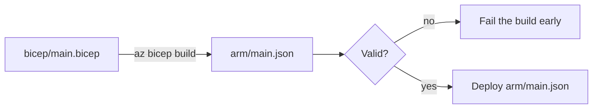

# Transpiling Bicep to ARM

Azure Resource Manager deploys **ARM JSON**. Bicep is the language we author in; **transpiling** is the step that turns our `.bicep` files into the ARM JSON that Azure actually consumes. The deploy commands we use can do this implicitly, but doing it as an *explicit* build step gives us a checkpoint — a place to validate, to inspect the diff, and to fail fast before any cloud call is made.

## Why a separate transpile step?

| Implicit (let `az deployment` compile on the fly) | Explicit (`az bicep build` as its own step) |
|---|---|
| Fewer commands | Compile errors surface *before* the deploy stage |
| No JSON artifact to inspect | ARM JSON committed → pull-request diff shows the real change |
| — | Same ARM template can be reused/scanned by other tools |



## Step 1 — The build command

A single Azure CLI command transpiles a Bicep file to ARM JSON:

```powershell
az bicep build --file bicep/main.bicep --outfile arm/main.json
```

`--outfile` writes to our `arm/` folder (created on page 2). Bicep also follows the `module` references automatically — building `main.bicep` pulls in `modules/log-analytics.bicep`, producing a single self-contained `main.json`.

## Step 2 — Wrap it in a build script

A small script keeps the pipeline tidy and lets us build locally with the same logic.

**`scripts/Build-Bicep.ps1`**

```powershell
[CmdletBinding()]
param(
    [string] $TemplateFile = 'bicep/main.bicep',
    [string] $OutputDir    = 'arm'
)

$ErrorActionPreference = 'Stop'

if (-not (Test-Path $OutputDir)) {
    New-Item -ItemType Directory -Path $OutputDir | Out-Null
}

$outFile = Join-Path $OutputDir 'main.json'

Write-Host "Transpiling $TemplateFile -> $outFile"
az bicep build --file $TemplateFile --outfile $outFile

if ($LASTEXITCODE -ne 0) {
    throw "Bicep build failed with exit code $LASTEXITCODE"
}

Write-Host "Transpile succeeded."
```

!!! note

    The explicit `$LASTEXITCODE` check matters: `az` failing does **not** by itself stop a PowerShell script. Without `throw`, a broken Bicep file would transpile-fail yet the step would report success and the pipeline would march on to a doomed deploy. This same "make failures loud" idea is the subject of the next page.

## Step 3 — Run and inspect the output

```powershell
./scripts/Build-Bicep.ps1
```

Open `arm/main.json` and you will see the verbose ARM equivalent of your concise Bicep — the workspace resource, the module embedded as a nested deployment, and an auto-generated metadata block. You never hand-edit this file; it is a build product.

!!! tip

    Commit `arm/main.json` alongside the Bicep change. In the pull request, reviewers see **both** the readable Bicep edit and exactly how it changes the deployed ARM — a much stronger review than Bicep alone. (If you would rather treat it as a throwaway artifact, add `arm/` to `.gitignore` and build it fresh in the pipeline each run — both approaches are common.)

## Step 4 — Optional: lint and validate

Transpiling catches *syntax* errors. Two more checks catch *semantic* ones before deployment:

```powershell
# Linter — style and correctness warnings
az bicep lint --file bicep/main.bicep

# Validate the template against the resource group (does a dry parameter/dependency check)
az deployment group validate `
  --resource-group rg-shopping-dev `
  --template-file bicep/main.bicep
```

We will fold this build step into the pipeline next, so every push transpiles and validates the Bicep before attempting to deploy it.

!!! tip

    **References:**

    - [az bicep build (Microsoft)](https://learn.microsoft.com/en-us/cli/azure/bicep#az-bicep-build)
    - [Deploy Bicep files with Azure CLI (Microsoft)](https://learn.microsoft.com/en-us/azure/azure-resource-manager/bicep/deploy-cli)
    - [Bicep linter (Microsoft)](https://learn.microsoft.com/en-us/azure/azure-resource-manager/bicep/linter)
