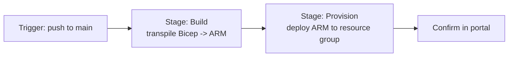
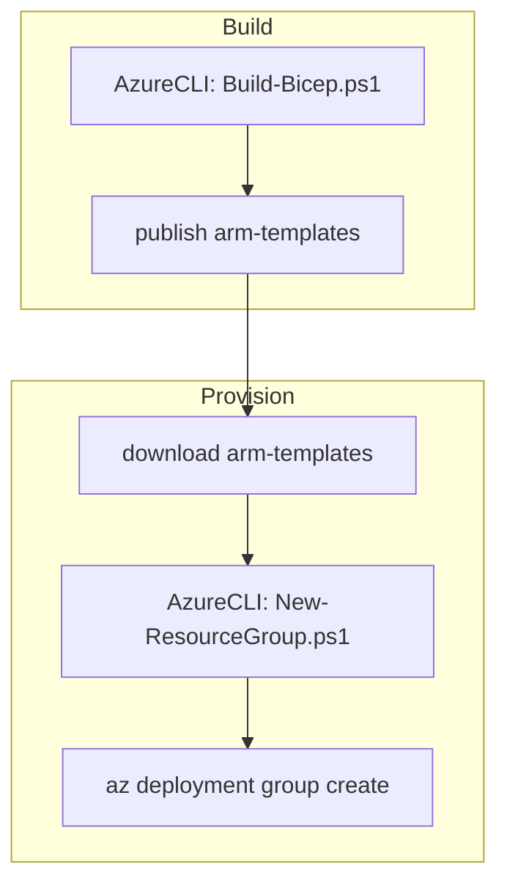

# YAML Pipeline to Provision Infrastructure

We now have all the pieces — a resource group, a Bicep module, and a transpile step. This page assembles them into the **provisioning pipeline**: a single YAML file that, on every push to `main`, builds the Bicep, then deploys it to Azure. We also introduce a **variable group** so environment-specific values (region, resource-group name) live outside the YAML.

## The plan



| Stage | Job | What it does |
|---|---|---|
| `Build` | `Transpile` | Runs `Build-Bicep.ps1`, publishes `arm/` as an artifact |
| `Provision` | `Deploy` | Creates the resource group, deploys the ARM template into it |

## Step 1 — Create the variable group

Hard-coding `rg-shopping-dev` and `westeurope` in YAML is fine for one environment; a **variable group** scales it to many and keeps the YAML clean. We touched on variable-group *permissions* in [Variable Groups Permissions](../5-Security-in-Azure-DevOps/2-Pipelines-Releases-and-Variable-Groups-Permissions.md); here we create one.

1. **Pipelines → Library → + Variable group**.
2. Name it `infra-dev`.
3. Add variables:

| Name | Value |
|---|---|
| `resourceGroupName` | `rg-shopping-dev` |
| `location` | `westeurope` |
| `environment` | `dev` |
| `serviceConnection` | `sc-shopping-infra` |

Reference it from YAML with `variables: - group: infra-dev`. To stand up a `test` or `prod` environment later, you clone the group with different values — no YAML change.

## Step 2 — Trigger, parameters, and variables

**`pipelines/provision-infra.yml`** (header):

```yaml
trigger:
  branches:
    include: [ main ]
  paths:
    include: [ bicep/**, scripts/**, pipelines/** ]

parameters:
  - name: deploy
    displayName: Deploy to Azure (uncheck for build-only)
    type: boolean
    default: true

variables:
  - group: infra-dev          # resourceGroupName, location, environment, serviceConnection

pool:
  vmImage: ubuntu-latest
```

The `deploy` **runtime parameter** (see [Runtime Parameters](../3-Azure-Yaml-Pipelines/4-Runtime-Parameters.md)) lets us run the pipeline in build-only mode to validate Bicep without touching Azure — handy for pull-request validation.

## Step 3 — The Build stage

```yaml
stages:
  - stage: Build
    displayName: Build (transpile Bicep)
    jobs:
      - job: Transpile
        steps:
          - task: AzureCLI@2
            displayName: Transpile Bicep to ARM
            inputs:
              azureSubscription: $(serviceConnection)
              scriptType: pscore
              scriptLocation: scriptPath
              scriptPath: scripts/Build-Bicep.ps1

          - publish: arm
            artifact: arm-templates
            displayName: Publish ARM artifact
```

The transpiled `arm/` folder is published as a pipeline **artifact** (see [Build vs Pipeline vs Azure Artifacts](../3-Azure-Yaml-Pipelines/11-Build-vs-Pipeline-vs-Azure-Artifacts.md)) so the deploy stage consumes the *exact* JSON that was built and reviewed — not a freshly re-compiled one.

## Step 4 — The Provision stage

The deploy task first ensures the resource group exists (reusing page 3's script), then deploys the ARM template into it:

```yaml
  - stage: Provision
    displayName: Provision infrastructure
    dependsOn: Build
    condition: and(succeeded(), eq('${{ parameters.deploy }}', true))
    jobs:
      - job: Deploy
        steps:
          - download: current
            artifact: arm-templates

          - task: AzureCLI@2
            displayName: Ensure resource group
            inputs:
              azureSubscription: $(serviceConnection)
              scriptType: pscore
              scriptLocation: scriptPath
              scriptPath: scripts/New-ResourceGroup.ps1
              arguments: >
                -ResourceGroupName $(resourceGroupName)
                -Location $(location)
                -Environment $(environment)

          - task: AzureCLI@2
            displayName: Deploy ARM template
            inputs:
              azureSubscription: $(serviceConnection)
              scriptType: pscore
              scriptLocation: inlineScript
              inlineScript: |
                az deployment group create `
                  --resource-group $(resourceGroupName) `
                  --template-file $(Pipeline.Workspace)/arm-templates/main.json `
                  --parameters environment=$(environment) `
                  --name "deploy-$(Build.BuildId)"
```

A few design choices:

- **`dependsOn: Build`** plus the artifact `download` guarantees we deploy what we built.
- **`condition`** ties the whole stage to the `deploy` parameter — unchecking it runs Build only.
- **`--name "deploy-$(Build.BuildId)"`** gives every deployment a unique, traceable name in the portal's deployment history.
- The deployment is **incremental** by default — it adds/updates resources and leaves untouched ones alone.



## Step 5 — Run the pipeline

Create the pipeline in Azure DevOps pointing at `pipelines/provision-infra.yml`, then push to `main`. Watch both stages go green. On the first run, expect the Log Analytics workspace to be created; on later runs with no Bicep changes, the deployment is a fast no-op.

## Step 6 — Confirm the deployment

```powershell
# The workspace exists
az monitor log-analytics workspace show `
  --resource-group rg-shopping-dev `
  --workspace-name log-shopping-dev `
  --query "{name:name, sku:sku.name, retention:retentionInDays}" -o table

# The deployment is recorded
az deployment group list --resource-group rg-shopping-dev `
  --query "[].{name:name, state:properties.provisioningState}" -o table
```

In the **Azure Portal**, open `rg-shopping-dev` → **Deployments** to see `deploy-<BuildId>` marked *Succeeded*, and the `log-shopping-dev` workspace listed under resources.

You now have a fully automated provisioning pipeline. Real infrastructure changes don't always go smoothly, though — the next page deliberately breaks things to show how errors surface and how to fix them.

!!! tip

    **References:**

    - [Define variable groups (Microsoft)](https://learn.microsoft.com/en-us/azure/devops/pipelines/library/variable-groups)
    - [Deploy Bicep in Azure Pipelines (Microsoft)](https://learn.microsoft.com/en-us/azure/azure-resource-manager/bicep/add-template-to-azure-pipelines)
    - [az deployment group create (Microsoft)](https://learn.microsoft.com/en-us/cli/azure/deployment/group#az-deployment-group-create)
