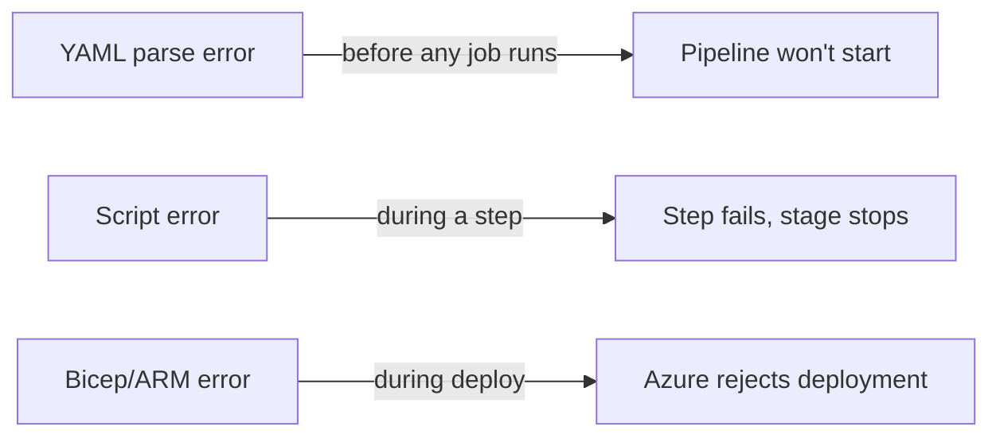

# Handling Deployment Errors

A green pipeline is reassuring, but the real test of an IaC setup is what happens when something is **wrong**. This page deliberately introduces failures — a broken shell script and a malformed YAML template — so you learn to *read* the errors and know where each class of failure shows up. The aim is a pipeline that fails **loudly and early**, never one that silently deploys something broken.

## Where failures appear in the pipeline



| Failure class | When it surfaces | Where you read it |
|---|---|---|
| **YAML template error** | At compile time, before agents start | Pipeline run summary — "template expansion" error |
| **Script error** (PowerShell/shell) | When the step runs | The failing step's log |
| **Bicep / ARM error** | During `az deployment group create` | The deploy step's log + portal deployment details |

## Step 1 — Create a deliberate script error

Open `scripts/Build-Bicep.ps1` and point it at a file that does not exist:

```powershell
# Was: param([string] $TemplateFile = 'bicep/main.bicep', ...)
param([string] $TemplateFile = 'bicep/min.bicep', ...)   # typo: min.bicep
```

Push, and watch the Build stage fail.

## Step 2 — Run the pipeline to expose the error

The transpile step fails with something like:

```text
Could not open file 'bicep/min.bicep': the file does not exist.
##[error]Bicep build failed with exit code 1
```

Two lessons here:

- The `throw` in our build script (page 5) turned a quiet `az` failure into a **hard stop** — the pipeline did not proceed to deploy a missing template.
- The error names the exact file. **Read the last red line first** — Azure DevOps logs are noisy above the actual failure.

!!! note

    Had we *omitted* the `$LASTEXITCODE` check, this step would have reported **success** and the deploy stage would have failed later with a far more confusing "template file not found at artifact path" error. Failing at the source of the problem is worth the extra three lines.

## Step 3 — Fix the shell script error

Correct the typo back to `bicep/main.bicep`, push, and confirm the Build stage is green again. This is the normal debugging loop: break → read → fix → re-run.

## Step 4 — Show a YAML template error

Now a different class. Introduce a YAML structural mistake — for example, a step with no valid task, or a bad indentation under `jobs:`:

```yaml
      - job: Transpile
        steps:
          - task:                    # <-- empty task, invalid
            displayName: Transpile Bicep to ARM
```

This fails **before any agent runs** — Azure DevOps cannot even expand the pipeline:

```text
##[error]/pipelines/provision-infra.yml: A step is missing a required property.
There was a problem expanding the template.
```

The distinction matters: a **script** error costs you an agent run; a **YAML/template** error is caught for free at compile time. This is also why splitting logic into reusable templates (page 10) is safe — template expansion errors are caught up front, not mid-deploy.

!!! tip

    Validate YAML *before* pushing with the Azure CLI, so you never burn a run on a syntax slip:

    ```powershell
    az pipelines run --name provision-infra --branch feature/x --open  # queues + opens in browser
    ```

    Or use the **"Validate"** option in the web editor's "..." menu, which expands templates without running them.

## Common Bicep / ARM deployment errors

When the deploy step itself fails, the message comes from Azure Resource Manager. The frequent ones:

| Error | Cause | Fix |
|---|---|---|
| `InvalidTemplateDeployment` | A property value Azure rejects (bad SKU, region) | Check the `@allowed` values in your params |
| `RetentionInDaysNotInRange` | `retentionInDays` outside 30–730 | Our `@minValue/@maxValue` decorators catch this at build |
| `AuthorizationFailed` | Service connection lacks rights on the subscription/RG | Grant the SP **Contributor** on the scope |
| `ResourceGroupNotFound` | Deploying before the group exists | Ensure the "Ensure resource group" step ran first |

!!! tip

    Get the full server-side error for the last failed deployment:

    ```powershell
    az deployment group show `
      --resource-group rg-shopping-dev `
      --name deploy-<BuildId> `
      --query properties.error
    ```

With a feel for how failures present and where to look, we can confidently add a second, *dependent* resource. The next page builds a Data Factory module that relies on the Log Analytics workspace.

!!! tip

    **References:**

    - [Troubleshoot ARM template deployments (Microsoft)](https://learn.microsoft.com/en-us/azure/azure-resource-manager/troubleshooting/common-deployment-errors)
    - [Bicep error and warning codes (Microsoft)](https://learn.microsoft.com/en-us/azure/azure-resource-manager/bicep/bicep-error-codes)
    - [Validate Azure Pipelines YAML (Microsoft)](https://learn.microsoft.com/en-us/azure/devops/pipelines/yaml-schema)
