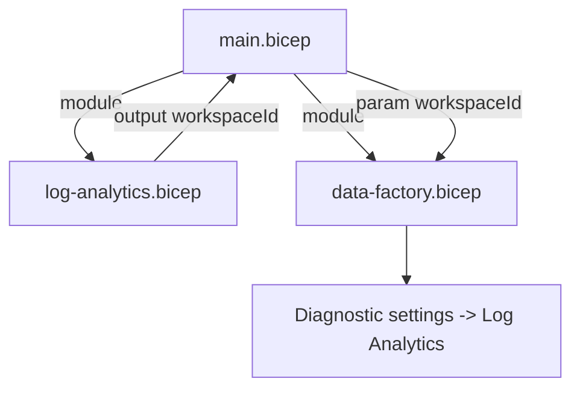
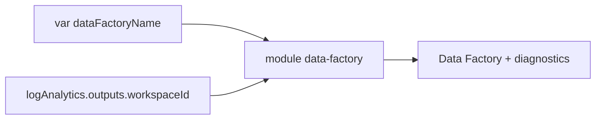

# The Data Factory Bicep Module

One module is a template; the power of Bicep shows when modules **depend on each other**. Here we add a second module — an **Azure Data Factory** — that sends its diagnostics to the Log Analytics workspace we built on page 4. This introduces the most important wiring concept in IaC: passing one module's **output** into another module's **input** so Bicep deploys them in the correct order automatically.

## The goal



The Data Factory must **not** be created before the workspace exists, because it references the workspace ID in its diagnostic settings. We never write `dependsOn` by hand for this — passing `logAnalytics.outputs.workspaceId` into the Data Factory module creates the dependency implicitly.

## Step 1 — Unpacking the module: what it contains

The Data Factory module declares two things:

| Resource | Purpose |
|---|---|
| `Microsoft.DataFactory/factories` | The Data Factory instance itself |
| `Microsoft.Insights/diagnosticSettings` | Routes the factory's logs/metrics to Log Analytics |

## Step 2 — Create the module's parameters and resource

**`bicep/modules/data-factory.bicep`**

```bicep
@description('Name of the Data Factory instance.')
param name string

@description('Azure region.')
param location string = resourceGroup().location

@description('Resource ID of the Log Analytics workspace for diagnostics.')
param logAnalyticsWorkspaceId string

@description('Tags applied to the factory.')
param tags object = {}

resource dataFactory 'Microsoft.DataFactory/factories@2018-06-01' = {
  name: name
  location: location
  tags: tags
  identity: {
    type: 'SystemAssigned'   // managed identity for secure linked services
  }
  properties: {}
}
```

`identity: SystemAssigned` gives the factory its own managed identity — the secret-free way for it to authenticate to other Azure resources later.

## Step 3 — Add the Log Analytics dependency

The diagnostic-settings resource is *scoped to* the factory and *points at* the workspace passed in. This single `workspaceId` reference is what links the two modules:

```bicep
resource diagnostics 'Microsoft.Insights/diagnosticSettings@2021-05-01-preview' = {
  name: 'send-to-log-analytics'
  scope: dataFactory
  properties: {
    workspaceId: logAnalyticsWorkspaceId
    logs: [
      {
        categoryGroup: 'allLogs'
        enabled: true
      }
    ]
    metrics: [
      {
        category: 'AllMetrics'
        enabled: true
      }
    ]
  }
}

@description('Resource ID of the created Data Factory.')
output dataFactoryId string = dataFactory.id

@description('Principal ID of the factory managed identity.')
output principalId string = dataFactory.identity.principalId
```

!!! note

    `scope: dataFactory` attaches the diagnostic setting **to** the factory — this is Bicep's *extension resource* pattern. The `workspaceId` property is where the cross-module wire actually lands.

## Step 4 — Update the main Bicep file to invoke both modules

Extend `bicep/main.bicep` (which already invokes Log Analytics from page 4) to add naming for the factory and call the new module, **feeding the workspace output into it**:

```bicep
// --- add to the naming vars ---
var dataFactoryName = 'adf-${workload}-${environment}'

// --- existing Log Analytics module (from page 4) ---
module logAnalytics 'modules/log-analytics.bicep' = {
  name: 'deploy-log-analytics'
  params: {
    name: logAnalyticsName
    location: location
    retentionInDays: 30
    tags: commonTags
  }
}

// --- new: Data Factory, wired to the workspace output ---
module dataFactory 'modules/data-factory.bicep' = {
  name: 'deploy-data-factory'
  params: {
    name: dataFactoryName
    location: location
    logAnalyticsWorkspaceId: logAnalytics.outputs.workspaceId   // <-- the dependency
    tags: commonTags
  }
}

output dataFactoryId string = dataFactory.outputs.dataFactoryId
```

Because `dataFactory` reads `logAnalytics.outputs.workspaceId`, Bicep computes the dependency graph itself: **Log Analytics deploys first, Data Factory second.** No manual `dependsOn`, no ordering bugs.



## Step 5 — Validate locally

```powershell
# Transpile to confirm both modules compile together
./scripts/Build-Bicep.ps1

# Preview the two new resources without deploying
az deployment group what-if `
  --resource-group rg-shopping-dev `
  --template-file bicep/main.bicep
```

The `what-if` output should show the Data Factory and its diagnostic setting as **+ Create**, with the existing workspace unchanged.

The Bicep now describes two interdependent resources. Next we update the **pipeline** to deploy this richer template and confirm both resources land in the portal.

!!! tip

    **References:**

    - [Data Factory Bicep reference (Microsoft)](https://learn.microsoft.com/en-us/azure/templates/microsoft.datafactory/factories)
    - [Diagnostic settings in Bicep (Microsoft)](https://learn.microsoft.com/en-us/azure/azure-monitor/essentials/diagnostic-settings)
    - [Define the order for deploying resources (Microsoft)](https://learn.microsoft.com/en-us/azure/azure-resource-manager/bicep/resource-dependencies)
