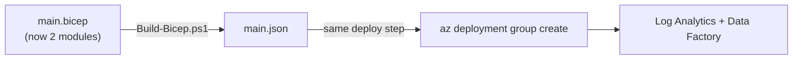
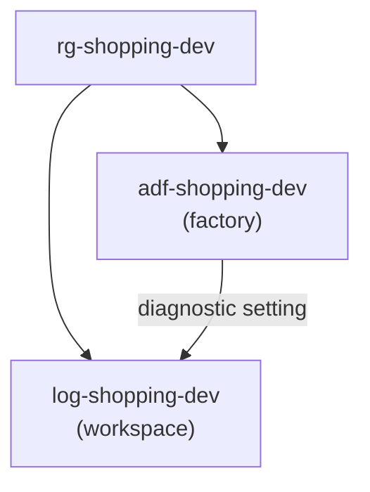

# Provisioning Data Factory and Log Analytics Together

The Bicep now describes two interdependent resources, but the pipeline from page 6 was built when there was only one. The good news: because the orchestrator (`main.bicep`) is the single deployment entry point, **the pipeline barely changes** — it already deploys "whatever `main.bicep` contains." This page confirms that, runs the richer deployment, and verifies both resources in the portal.

## Why almost nothing changes

This is the payoff of the orchestrator pattern. The pipeline's deploy step targets `main.json`; adding a module to `main.bicep` changes *what that template contains*, not *how it is deployed*.



| Pipeline element | Change needed? |
|---|---|
| Trigger / variable group | None |
| Build stage (transpile) | None — it builds `main.bicep` as before |
| Deploy stage | None — it deploys `main.json` as before |
| What gets created | **Now two resources instead of one** |

## Step 1 — Confirm the deploy step is generic

Re-read the deploy task from [the provisioning pipeline](6-YAML-Pipeline-to-Provision-Infrastructure.md). It references the *template*, never individual resources:

```yaml
          - task: AzureCLI@2
            displayName: Deploy ARM template
            inputs:
              azureSubscription: $(serviceConnection)
              scriptType: pscore
              scriptLocation: inlineScript
              inlineScript: |
                az deployment group create `
                  --resource-group $(resourceGroupName) `
                  --template-file $(Pipeline.Workspace)/arm-templates/main.json `
                  --parameters environment=$(environment) `
                  --name "deploy-$(Build.BuildId)"
```

Nothing here names Log Analytics or Data Factory. That generality is deliberate — it is why the pipeline scales as the infrastructure grows.

!!! note

    **This is the IaC equivalent of a well-factored function.** `main.bicep` is the interface; the pipeline calls it without caring about the implementation. Add a storage account module tomorrow and this pipeline deploys it too, untouched.

## Step 2 — Run the pipeline to provision both

Commit the page 8 Bicep changes and push to `main`:

```bash
git add bicep/
git commit -m "Add Data Factory module wired to Log Analytics"
git push
```

Watch the run. The Build stage transpiles the two-module template; the Provision stage deploys it. In the deploy log you will see Azure create the workspace first and the factory second — the order Bicep derived from the `workspaceId` wire on page 8.

## Step 3 — Confirm Log Analytics and Data Factory on the portal

**Command line:**

```powershell
# Both resources present in the group
az resource list --resource-group rg-shopping-dev `
  --query "[].{name:name, type:type}" -o table

# The deployment that created them
az deployment group show --resource-group rg-shopping-dev `
  --name deploy-<BuildId> `
  --query "properties.{state:provisioningState, outputs:outputs}"
```

You should see both `log-shopping-dev` (`Microsoft.OperationalInsights/workspaces`) and `adf-shopping-dev` (`Microsoft.DataFactory/factories`).

**Azure Portal — verify the dependency actually wired up:**

1. Open `rg-shopping-dev` and confirm both resources are listed with the `managedBy=iac` tag.
2. Open the Data Factory → **Diagnostic settings** → confirm `send-to-log-analytics` points at `log-shopping-dev`. This proves the cross-module reference produced a real, connected configuration — not just two isolated resources.



## Step 4 — Re-run to prove idempotency

Trigger the pipeline once more without changing anything. The deployment succeeds as a no-op — Azure compares desired vs actual state and makes no changes. Running IaC repeatedly is safe by design; that is what makes it trustworthy enough to run on every push.

Two modules, one pipeline, fully automated. The orchestrator and pipeline have stayed clean — but the **YAML** itself still has repetition (stages and jobs that other pipelines will want too). The final page factors that out into reusable YAML templates, mirroring what we did for the Bicep.

!!! tip

    **References:**

    - [Incremental vs complete deployment mode (Microsoft)](https://learn.microsoft.com/en-us/azure/azure-resource-manager/templates/deployment-modes)
    - [View deployment history (Microsoft)](https://learn.microsoft.com/en-us/azure/azure-resource-manager/templates/deployment-history)
    - [Monitor Data Factory with Azure Monitor (Microsoft)](https://learn.microsoft.com/en-us/azure/data-factory/monitor-using-azure-monitor)
