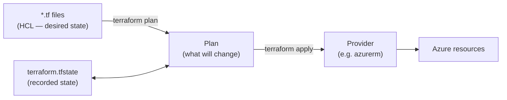

# What is Terraform?

The [previous module](../6-Infrastructure-as-Code-with-Bicep/1-What-is-IaC-and-Bicep.md) provisioned Azure infrastructure with **Bicep** — Azure's native IaC language. This module solves the same problem with **Terraform**, the most widely used *cloud-agnostic* IaC tool. We provision the same kind of footprint behind `shopping-frontend` — resource groups, Log Analytics, Key Vault, networking, a VM — but with HashiCorp's tooling, so you can choose the right tool per project and read either when you meet it in the wild.

!!! note

    New to Infrastructure as Code itself? Start with [What is Infrastructure as Code?](../6-Infrastructure-as-Code-with-Bicep/1-What-is-IaC-and-Bicep.md) — the *why* (versioned, reviewable, reproducible infrastructure) is identical for Bicep and Terraform. This page assumes you know the *why* and focuses on Terraform's model.

## What Terraform is

**Terraform** is an open-source tool by HashiCorp that lets you define infrastructure in a declarative language (**HCL** — HashiCorp Configuration Language), then creates, updates, and deletes that infrastructure through cloud **providers**. You describe the *desired end state*; Terraform figures out the API calls to get there.

Two ideas make Terraform distinct, and we return to both throughout this module:

- **Providers** — Terraform itself knows nothing about Azure. The **`azurerm`** provider (plus `azuread` and `azapi`, covered later) teaches it the Azure API. The same tool manages AWS, GCP, Kubernetes, GitHub, and hundreds more via their own providers.
- **State** — Terraform records what it created in a **state file**. On the next run it *diffs* desired config against recorded state to compute the minimal change. Managing that state safely (a remote backend) is the subject of [Azure Provider and Remote State](8-Azure-Provider-and-Remote-State.md).

## Terraform vs Bicep — when to reach for which

Both are excellent; the choice is about context, not quality.

| | **Bicep** | **Terraform** |
|---|---|---|
| **Scope** | Azure only | Multi-cloud + Azure + SaaS (one tool, many providers) |
| **Language** | Bicep DSL → ARM JSON | HCL |
| **State** | Stateless — reads live Azure state | Explicit **state file** (local or remote backend) |
| **Day-zero Azure features** | Immediate (native) | Fast via `azurerm`; instant via `azapi` |
| **Ecosystem** | Microsoft + Azure community | Huge cross-vendor module registry |
| **Best when** | All-in on Azure, want zero extra tooling | Multi-cloud, or standardising one IaC tool org-wide |

!!! tip

    This isn't either/or. Many teams use **Bicep for Azure-native** workloads and **Terraform where they span clouds or want one language everywhere**. Knowing both — and that they share the same *concepts* (idempotence, modules, declarative state) — is the real skill.

## The Terraform core workflow

Almost everything in Terraform is one short loop. You will run these four commands constantly:

| Command | What it does |
|---|---|
| `terraform init` | Download providers/modules, set up the backend |
| `terraform plan` | Show what will change — **no changes made** |
| `terraform apply` | Make the planned changes |
| `terraform destroy` | Tear everything down |

We unpack this on [Core Workflow and Your First Resource](4-Terraform-Core-Workflow-and-First-Resource.md).

## What this module builds

Provisioning the Azure environment behind `shopping-frontend`, the Terraform way:

1. **Concepts and setup** — the IaC vocabulary, then Terraform + Azure CLI installed.
2. **Fundamentals** — resources, the core workflow, variables, outputs, loops, conditionals, modules.
3. **Azure foundation** — the `azurerm` provider, a resource group, and **remote state** in an Azure Storage backend.
4. **Shared services** — Log Analytics, Key Vault with RBAC, diagnostic settings.
5. **Compute & networking** — a virtual network, a Linux VM, and a Bastion host.
6. **Identity** — Entra ID groups and users via the `azuread` provider.
7. **Day-zero** — the `azapi` provider for brand-new Azure features.

!!! note

    **Prerequisites** (covered earlier, not repeated): an [Azure account and the Azure CLI/Git/VS Code](../1-Introduction/9-Local-Tools-and-Environment-Setup.md). The next pages add the **Terraform-specific** tooling on top.

!!! tip

    **References:**

    - [What is Terraform? (HashiCorp)](https://developer.hashicorp.com/terraform/intro)
    - [Terraform on Azure documentation (Microsoft)](https://learn.microsoft.com/en-us/azure/developer/terraform/)
    - [azurerm provider (Terraform Registry)](https://registry.terraform.io/providers/hashicorp/azurerm/latest/docs)
