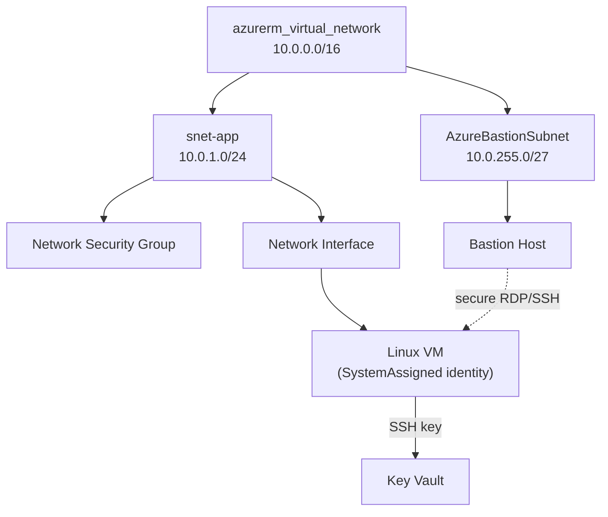

# Compute and Networking

This page provisions the foundational compute and networking layer with Terraform: a **virtual network** and subnets, a **network security group**, a **Linux virtual machine** reachable only through an **Azure Bastion** host, and a **managed identity** so the VM can authenticate to Azure without stored credentials. It ties together the resource, variable, loop, and module patterns from earlier pages on a realistic stack.

## Target architecture



## Step 1 — Virtual network and subnets

```hcl
resource "azurerm_virtual_network" "main" {
  name                = "vnet-shopping-${var.environment}"
  resource_group_name = azurerm_resource_group.main.name
  location            = var.location
  address_space       = ["10.0.0.0/16"]
  tags                = local.common_tags
}

resource "azurerm_subnet" "app" {
  name                 = "snet-app"
  resource_group_name  = azurerm_resource_group.main.name
  virtual_network_name = azurerm_virtual_network.main.name
  address_prefixes     = [cidrsubnet("10.0.0.0/16", 8, 1)]   # -> 10.0.1.0/24
}
```

!!! tip

    The **`cidrsubnet()`** function computes subnet ranges from a parent prefix, so you don't hand-calculate CIDRs. `cidrsubnet("10.0.0.0/16", 8, 1)` adds 8 bits (a /24) and takes the 2nd block → `10.0.1.0/24`. Try it in `terraform console`.

## Step 2 — Network Security Group

A NSG with a rule that allows SSH **only from your current IP** — discovered dynamically with an `http` data source:

```hcl
data "http" "my_ip" {
  url = "https://api.ipify.org"
}

resource "azurerm_network_security_group" "app" {
  name                = "nsg-app-${var.environment}"
  resource_group_name = azurerm_resource_group.main.name
  location            = var.location

  security_rule {
    name                       = "allow-ssh-from-me"
    priority                   = 100
    direction                  = "Inbound"
    access                     = "Allow"
    protocol                   = "Tcp"
    source_port_range          = "*"
    destination_port_range     = "22"
    source_address_prefix      = "${chomp(data.http.my_ip.response_body)}/32"
    destination_address_prefix = "*"
  }
}

resource "azurerm_subnet_network_security_group_association" "app" {
  subnet_id                 = azurerm_subnet.app.id
  network_security_group_id = azurerm_network_security_group.app.id
}
```

## Step 3 — SSH key, NIC, and the Linux VM

Generate an SSH key with Terraform's `tls` provider, store the private key in Key Vault, and use the public key on the VM:

```hcl
resource "tls_private_key" "vm" {
  algorithm = "RSA"
  rsa_bits  = 4096
}

resource "azurerm_key_vault_secret" "vm_ssh" {
  name         = "vm-ssh-private-key"
  value        = tls_private_key.vm.private_key_pem
  key_vault_id = azurerm_key_vault.main.id
}

resource "azurerm_network_interface" "vm" {
  name                = "nic-vm-${var.environment}"
  resource_group_name = azurerm_resource_group.main.name
  location            = var.location

  ip_configuration {
    name                          = "internal"
    subnet_id                     = azurerm_subnet.app.id
    private_ip_address_allocation = "Dynamic"
  }
}

resource "azurerm_linux_virtual_machine" "app" {
  name                  = "vm-shopping-${var.environment}"
  resource_group_name   = azurerm_resource_group.main.name
  location              = var.location
  size                  = "Standard_B2s"
  admin_username        = "azureuser"
  network_interface_ids = [azurerm_network_interface.vm.id]

  admin_ssh_key {
    username   = "azureuser"
    public_key = tls_private_key.vm.public_key_openssh
  }

  os_disk {
    caching              = "ReadWrite"
    storage_account_type = "Standard_LRS"
  }

  source_image_reference {
    publisher = "Canonical"
    offer     = "0001-com-ubuntu-server-jammy"
    sku       = "22_04-lts-gen2"
    version   = "latest"
  }

  identity {
    type = "SystemAssigned"     # managed identity — no stored credentials
  }

  tags = local.common_tags
}
```

!!! note

    `identity { type = "SystemAssigned" }` gives the VM a **managed identity** — an Entra ID identity Azure manages for it. The VM can then authenticate to Key Vault, Storage, etc. with *no secrets on disk*. Grant it access with a role assignment (the pattern from [page 9](9-Shared-Services-Log-Analytics-and-KeyVault.md)).

## Step 4 — Azure Bastion for secure access

Rather than exposing the VM with a public IP, reach it through **Azure Bastion** — browser-based RDP/SSH with no inbound internet exposure. Bastion needs a dedicated subnet named exactly `AzureBastionSubnet`:

```hcl
resource "azurerm_subnet" "bastion" {
  name                 = "AzureBastionSubnet"        # name is mandatory
  resource_group_name  = azurerm_resource_group.main.name
  virtual_network_name = azurerm_virtual_network.main.name
  address_prefixes     = [cidrsubnet("10.0.0.0/16", 11, 504)]  # 10.0.252.0/27
}

resource "azurerm_public_ip" "bastion" {
  name                = "pip-bastion-${var.environment}"
  resource_group_name = azurerm_resource_group.main.name
  location            = var.location
  allocation_method   = "Static"
  sku                 = "Standard"
}

resource "azurerm_bastion_host" "main" {
  name                = "bas-shopping-${var.environment}"
  resource_group_name = azurerm_resource_group.main.name
  location            = var.location

  ip_configuration {
    name                 = "configuration"
    subnet_id            = azurerm_subnet.bastion.id
    public_ip_address_id = azurerm_public_ip.bastion.id
  }
}
```

!!! warning

    The Bastion subnet **must** be named `AzureBastionSubnet` and be at least a `/26`. Azure rejects any other name. This is one of several "magic name" requirements — the [Registry docs](https://registry.terraform.io/providers/hashicorp/azurerm/latest/docs/resources/bastion_host) call them out.

## Step 5 — Connect and verify

```powershell
terraform apply -var-file="dev.tfvars"

# Connect via Bastion (browser) from the portal, or tunnel:
az network bastion ssh --name bas-shopping-dev `
  --resource-group rg-shopping-dev `
  --target-resource-id $(terraform output -raw vm_id) `
  --auth-type ssh-key --username azureuser --ssh-key ./vm_key
```

| Connection option | When |
|---|---|
| **Bastion** (recommended) | No public IP on the VM; secure by default |
| Public IP + NSG rule | Simpler labs; larger attack surface |
| Private endpoint / VPN | Fully private corporate networks |

The compute layer is done — securely, with identity and secrets handled as code. Next we manage **Entra ID** itself (groups and users) with the `azuread` provider.

!!! tip

    **References:**

    - [azurerm_linux_virtual_machine (Registry)](https://registry.terraform.io/providers/hashicorp/azurerm/latest/docs/resources/linux_virtual_machine)
    - [azurerm_bastion_host (Registry)](https://registry.terraform.io/providers/hashicorp/azurerm/latest/docs/resources/bastion_host)
    - [Managed identities for Azure resources (Microsoft)](https://learn.microsoft.com/en-us/entra/identity/managed-identities-azure-resources/overview)
