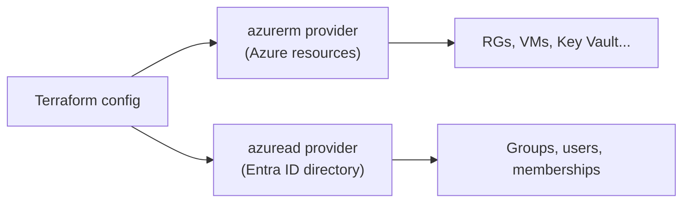

# Identity and Access with the `azuread` Provider

Terraform isn't limited to Azure *resources* — with the **`azuread`** provider it also manages **Microsoft Entra ID** (formerly Azure AD): groups, users, app registrations, and group memberships. This page introduces a *second provider* alongside `azurerm` and uses it to manage access for the `shopping-frontend` team as code, then ends with a clean `terraform destroy`.

## Two providers, one configuration

`azurerm` manages Azure resources; `azuread` manages the Entra directory. A single config can declare both — this is the multi-provider strength of Terraform.



## Step 1 — Declare and configure the `azuread` provider

Add it to `required_providers` and run `terraform init` to download it:

```hcl
terraform {
  required_providers {
    azurerm = { source = "hashicorp/azurerm", version = "~> 4.0" }
    azuread = { source = "hashicorp/azuread", version = "~> 3.0" }
  }
}

provider "azuread" {
  # Uses the same Azure CLI login as azurerm by default.
}
```

```powershell
terraform init     # downloads the azuread provider
```

!!! note

    Managing Entra ID needs **directory permissions** (e.g. *Groups Administrator* or appropriate Graph permissions), which are distinct from the *subscription* RBAC that `azurerm` uses. Creating groups/users may require elevated directory roles your subscription-Contributor identity doesn't have.

## Step 2 — Create an Entra ID group

```hcl
resource "azuread_group" "app_admins" {
  display_name     = "shopping-frontend-admins"
  security_enabled = true
  description      = "Admins for the shopping-frontend workload."
}
```

## Step 3 — Reference existing users with a data source

You usually *assign existing* users rather than create them. The `azuread_user` **data source** looks one up by UPN:

```hcl
data "azuread_user" "lead" {
  user_principal_name = "lead@example.com"
}

resource "azuread_group_member" "lead" {
  group_object_id  = azuread_group.app_admins.object_id
  member_object_id = data.azuread_user.lead.object_id
}
```

## Step 4 — Assign many users with an iterator

Adding members one block at a time isn't **DRY**. Use `for_each` (from [page 6](6-Loops-Conditionals-and-Workspaces.md)) to assign a whole list — combining the `azuread_users` data source with a `for_each` membership resource:

```hcl
variable "admin_upns" {
  type    = list(string)
  default = ["lead@example.com", "dev1@example.com", "dev2@example.com"]
}

data "azuread_users" "admins" {
  user_principal_names = var.admin_upns
}

resource "azuread_group_member" "admins" {
  for_each         = { for u in data.azuread_users.admins.users : u.user_principal_name => u.object_id }
  group_object_id  = azuread_group.app_admins.object_id
  member_object_id = each.value
}
```

The `for` expression turns the user list into a **map keyed by UPN**, so `for_each` assigns each member with a stable key — add or remove a UPN from `admin_upns` and only that one membership changes.

!!! tip

    This is the iterator pattern in miniature: a **data source** fetches existing objects, a `for` expression **reshapes** them into a map, and `for_each` **fans out** one resource per item. You'll reuse it constantly — role assignments per principal, secrets per name, subnets per CIDR.

## Step 5 — Tie identity back to Azure resources

Entra groups become useful when you grant them Azure RBAC — e.g. give the admins group access to the Key Vault from [page 9](9-Shared-Services-Log-Analytics-and-KeyVault.md):

```hcl
resource "azurerm_role_assignment" "admins_kv" {
  scope                = azurerm_key_vault.main.id
  role_definition_name = "Key Vault Administrator"
  principal_id         = azuread_group.app_admins.object_id   # the whole group
}
```

Assigning roles to a **group** (not individuals) is best practice — membership changes don't require touching role assignments.

## Step 6 — Tear it all down

When the lab is finished, `destroy` removes everything across **both** providers in dependency order:

```powershell
terraform plan -destroy -var-file="dev.tfvars"    # preview the teardown
terraform destroy -var-file="dev.tfvars"
```

!!! warning

    `destroy` deletes **all** resources in the state — Azure resources *and* Entra groups. Review the `-destroy` plan carefully, and never run it against shared/production state. Resources with `purge_protection_enabled` (like the [Key Vault](9-Shared-Services-Log-Analytics-and-KeyVault.md)) may enter a soft-deleted state that needs a separate purge.

The final page covers the **`azapi`** provider — how to provision Azure features so new that `azurerm` doesn't support them yet.

!!! tip

    **References:**

    - [azuread provider (Registry)](https://registry.terraform.io/providers/hashicorp/azuread/latest/docs)
    - [azuread_group (Registry)](https://registry.terraform.io/providers/hashicorp/azuread/latest/docs/resources/group)
    - [Manage Azure AD with Terraform (Microsoft)](https://learn.microsoft.com/en-us/azure/developer/terraform/)
