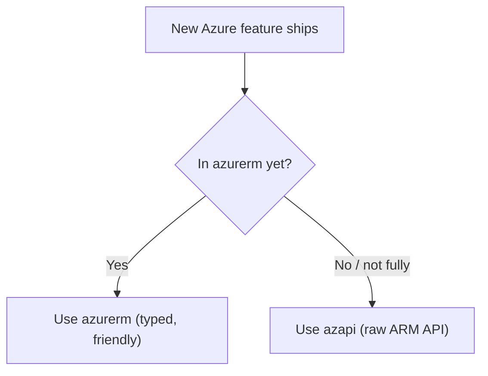

# Day-Zero Support with the `azapi` Provider

The `azurerm` provider is excellent, but it lags Azure by design — when Microsoft ships a brand-new resource or property, someone must add it to `azurerm` before you can use it in Terraform. The **`azapi`** provider closes that gap: it talks to the **Azure Resource Manager REST API directly**, so you get **day-zero** access to any Azure feature the moment it exists. This final page introduces `azapi`, compares it with `azurerm`, and shows the pragmatic "best of both worlds" pattern.

## Why a second Azure provider?



| | `azurerm` | `azapi` |
|---|---|---|
| Talks to | Curated, typed Azure resources | Raw ARM REST API |
| Feature coverage | Most GA features (some lag) | **Everything**, immediately |
| Schema | Strongly typed, validated | You supply the API `body` (JSON-ish) |
| Best for | Day-to-day, well-supported resources | New/preview features, missing properties |

## Step 1 — Set up the `azapi` provider

Add it alongside `azurerm`:

```hcl
terraform {
  required_providers {
    azurerm = { source = "hashicorp/azurerm", version = "~> 4.0" }
    azapi   = { source = "Azure/azapi",       version = "~> 2.0" }
  }
}

provider "azapi" {
  # Reuses the Azure CLI / environment auth, same as azurerm.
}
```

```powershell
terraform init
```

## Step 2 — The `azapi_resource` shape

Every `azapi` resource follows the ARM API: a **type** (with API version), a **parent_id** (scope), a **name**, and a **body** of properties. Here is a resource group via `azapi`:

```hcl
resource "azapi_resource" "rg" {
  type      = "Microsoft.Resources/resourceGroups@2024-03-01"
  name      = "rg-shopping-${var.environment}"
  location  = var.location
  parent_id = "/subscriptions/${var.subscription_id}"

  body = {
    tags = local.common_tags
  }
}
```

| Argument | Meaning |
|---|---|
| `type` | ARM resource type **plus API version** (`@2024-03-01`) |
| `parent_id` | The scope it's created under (subscription, RG, or parent resource) |
| `name` | The Azure resource name |
| `body` | The `properties`/`tags` payload, exactly as the ARM API expects |

!!! tip

    **Finding the schema:** because `azapi` mirrors the REST API, the [ARM template / REST reference](https://learn.microsoft.com/en-us/azure/templates/) *is* the documentation. Look up the resource type and API version there; whatever the API accepts in `properties`, you put in `body`.

## Step 3 — A property that `azurerm` doesn't expose yet

The real use case: set a brand-new property on a resource. `azapi` can target a **child property** of an existing `azurerm` resource via `azapi_update_resource`, leaving the parent under `azurerm` management:

```hcl
# Parent managed by azurerm...
resource "azurerm_storage_account" "data" {
  name                     = "stshoppingdata${var.environment}"
  resource_group_name      = azurerm_resource_group.main.name
  location                 = var.location
  account_tier             = "Standard"
  account_replication_type = "LRS"
}

# ...a not-yet-in-azurerm property patched in via azapi.
resource "azapi_update_resource" "sa_new_feature" {
  type        = "Microsoft.Storage/storageAccounts@2024-01-01"
  resource_id = azurerm_storage_account.data.id

  body = {
    properties = {
      # a preview/new property azurerm hasn't surfaced yet
      allowedCopyScope = "AAD"
    }
  }
}
```

## Step 4 — `azapi` vs `azurerm` side by side

The same public IP, both ways:

=== "azurerm (typed)"

    ```hcl
    resource "azurerm_public_ip" "pip" {
      name                = "pip-shopping-dev"
      resource_group_name = azurerm_resource_group.main.name
      location            = var.location
      allocation_method   = "Static"
      sku                 = "Standard"
    }
    ```

=== "azapi (raw API)"

    ```hcl
    resource "azapi_resource" "pip" {
      type      = "Microsoft.Network/publicIPAddresses@2024-01-01"
      name      = "pip-shopping-dev"
      location  = var.location
      parent_id = azurerm_resource_group.main.id

      body = {
        sku        = { name = "Standard" }
        properties = { publicIPAllocationMethod = "Static" }
      }
    }
    ```

`azurerm` is friendlier and validated; `azapi` is more verbose but works for *anything*. Same result, different trade-offs.

## Step 5 — Best of both worlds

The recommended real-world strategy: **use `azurerm` by default, reach for `azapi` only where you must** — a new property, a preview resource, a service `azurerm` hasn't caught up to. Both providers share the same state and dependency graph, so they interoperate seamlessly: an `azapi` resource can reference an `azurerm` resource's `id` and vice versa.

| Strategy | Use when |
|---|---|
| `azurerm` only | Everything it already supports (the default) |
| `azapi_update_resource` on an `azurerm` resource | One missing property on an otherwise-supported resource |
| `azapi_resource` | A whole resource type `azurerm` lacks (preview/day-zero) |

!!! tip

    Don't rewrite your whole stack in `azapi`. Mixing is the point — keep the readable `azurerm` for 95% and surgically apply `azapi` for the 5% that's too new. As `azurerm` catches up, migrate those bits back.

## Module wrap-up

You've now provisioned the full Azure footprint behind `shopping-frontend` with Terraform — concepts, setup, the core workflow, variables, loops, modules, remote state, shared services, compute, networking, identity, and day-zero features. Combined with the [Bicep module](../6-Infrastructure-as-Code-with-Bicep/1-What-is-IaC-and-Bicep.md), you can now read and write **both** of Azure's leading IaC tools and choose the right one per project — and run either from an [Azure DevOps pipeline](8-Azure-Provider-and-Remote-State.md#step-5-running-terraform-from-azure-pipelines-tie-in).

!!! tip

    **References:**

    - [azapi provider (Registry)](https://registry.terraform.io/providers/Azure/azapi/latest/docs)
    - [Overview of the AzAPI provider (Microsoft)](https://learn.microsoft.com/en-us/azure/developer/terraform/overview-azapi-provider)
    - [Azure REST API / template reference (Microsoft)](https://learn.microsoft.com/en-us/azure/templates/)
