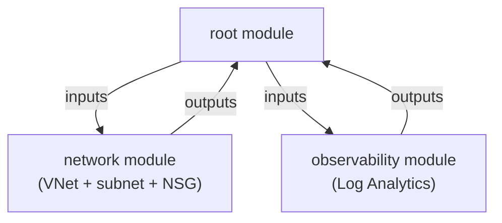

# Key Infrastructure-as-Code Concepts

Before writing Terraform, it pays to name the handful of ideas that make IaC *work*. These concepts are **tool-agnostic** — they apply equally to the [Bicep module](../6-Infrastructure-as-Code-with-Bicep/1-What-is-IaC-and-Bicep.md) — but Terraform leans on them so heavily that understanding them up front makes its behaviour obvious instead of surprising.

## The six ideas at a glance

| Concept | One-line meaning | Why it matters in Terraform |
|---|---|---|
| **Idempotence** | Running the same config repeatedly yields the same result | `apply` twice = no extra changes the second time |
| **Immutability** | Change by replacing, not by editing in place | Some attribute changes force resource *recreation* |
| **Declarative** | Describe the *what*, not the *how* | You write desired state; Terraform plans the steps |
| **Encapsulation** | Hide internals behind a clean interface | Modules expose inputs/outputs, hide resources |
| **Cohesion** | Group things that change together | One module per logical unit of infrastructure |
| **DRY** | Don't Repeat Yourself | Variables, locals, modules, loops remove copy-paste |

## Idempotence

An operation is **idempotent** if doing it once and doing it many times have the same effect. Terraform's whole model depends on this: `terraform apply` compares your config to recorded state and only changes what differs. Run it again with no config change and the plan is **"No changes."**

```text
$ terraform apply     # creates the resource group
$ terraform apply     # "No changes. Your infrastructure matches the configuration."
```

This is what makes IaC safe to run on every commit — exactly the property we relied on for the Bicep [resource-group script](../6-Infrastructure-as-Code-with-Bicep/3-Provisioning-a-Resource-Group.md).

## Immutability

**Mutable** infrastructure is changed in place (SSH in, edit a config). **Immutable** infrastructure is changed by *replacing* the resource with a new one. Terraform favours immutability: some attributes can be updated live, but others are **force-new** — changing them makes Terraform destroy and recreate the resource.

!!! warning

    Watch the plan output. `# forces replacement` next to an attribute means Terraform will **destroy and recreate** — potentially deleting data. Changing a storage account's `name` or a VM's `size` family are classic force-new examples.

## Declarative vs. Imperative

| Imperative (a script) | Declarative (Terraform) |
|---|---|
| "Create RG **if** it doesn't exist, **then** create the VNet, **then**..." | "Here are an RG, a VNet, and a subnet." |
| You order the steps | Terraform derives order from dependencies |
| Re-running needs guard logic | Re-running is idempotent by design |

You declare resources and *references between them*; Terraform builds a dependency graph and decides the order. You almost never write "do this, then that."

```hcl
# Declarative: the subnet references the VNet, so Terraform knows the order.
resource "azurerm_virtual_network" "main" { /* ... */ }

resource "azurerm_subnet" "app" {
  virtual_network_name = azurerm_virtual_network.main.name  # <-- creates the dependency
  # ...
}
```

## Encapsulation and Cohesion

These two govern how you split infrastructure into **modules**.

- **Encapsulation** — a module exposes a small set of **input variables** and **outputs**, hiding the resources inside. Callers depend on the interface, not the internals — the same principle as the Bicep [Log Analytics module](../6-Infrastructure-as-Code-with-Bicep/4-Log-Analytics-Bicep-Template-and-Module.md).
- **Cohesion** — put things that *change together* in the same module. A "networking" module (VNet + subnets + NSG) is cohesive; bolting an unrelated Key Vault into it is not.



## DRY — Don't Repeat Yourself

Copy-pasted infrastructure drifts and rots. Terraform gives you four tools to stay DRY, each covered later:

| Tool | Removes repetition in... | Page |
|---|---|---|
| **Input variables** | Hard-coded values | [Variables & Outputs](5-Variables-Locals-and-Outputs.md) |
| **Locals** | Repeated expressions | [Variables & Outputs](5-Variables-Locals-and-Outputs.md) |
| **`count` / `for_each`** | Near-identical resources | [Loops & Conditionals](6-Loops-Conditionals-and-Workspaces.md) |
| **Modules** | Whole repeated stacks | [Modules & the Registry](7-Modules-and-the-Registry.md) |

!!! tip

    Keep these six words in mind as you read the rest of the module. Almost every Terraform feature exists to serve one of them — when a feature seems odd, ask *which concept is this protecting?*

!!! tip

    **References:**

    - [Terraform language overview (HashiCorp)](https://developer.hashicorp.com/terraform/language)
    - [Infrastructure as Code patterns (HashiCorp)](https://developer.hashicorp.com/well-architected-framework)
