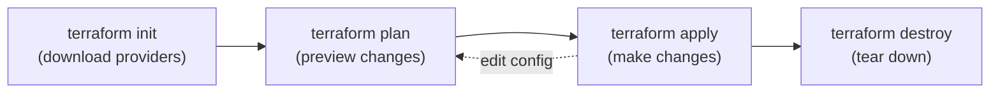

# Core Workflow and Your First Resource

Time to write Terraform. This page creates a single resource — a resource group for `shopping-frontend` — and uses it to learn the **core workflow** (`init → plan → apply → destroy`) you will repeat for the rest of the module. Everything else builds on this loop.

## Step 1 — Authenticate to Azure

Terraform's `azurerm` provider uses the Azure CLI login for local development. Sign in and select your subscription:

```powershell
az login
az account set --subscription "<your-subscription-id>"
az account show --query "{name:name, id:id}" -o table
```

!!! note

    Using the Azure CLI login is the simplest auth for local runs. In a pipeline you'd use a service principal or workload identity instead — exactly like the Bicep [service connection](../6-Infrastructure-as-Code-with-Bicep/2-Setup-Service-Connection-and-Structure.md). We cover automated auth on [Azure Provider and Remote State](8-Azure-Provider-and-Remote-State.md).

## Step 2 — Declare the provider

Every Terraform project starts by declaring **which providers it needs**. Create **`main.tf`**:

```hcl
terraform {
  required_version = ">= 1.6"

  required_providers {
    azurerm = {
      source  = "hashicorp/azurerm"
      version = "~> 4.0"
    }
  }
}

provider "azurerm" {
  features {}        # required block, even when empty
  subscription_id = var.subscription_id
}
```

| Block | Purpose |
|---|---|
| `required_version` | Minimum Terraform CLI version |
| `required_providers` | Which providers + version constraints (`~> 4.0` = "4.x, not 5") |
| `provider "azurerm"` | Configures the Azure provider; `features {}` is mandatory |

## Step 3 — Create your first resource

A **resource** block has the form `resource "<type>" "<local name>" { ... }`. Add a resource group:

```hcl
variable "subscription_id" {
  type        = string
  description = "Target Azure subscription ID."
}

resource "azurerm_resource_group" "main" {
  name     = "rg-shopping-dev"
  location = "westeurope"

  tags = {
    application = "shopping-frontend"
    environment = "dev"
    managedBy   = "terraform"
  }
}
```

- `"azurerm_resource_group"` is the **resource type** (from the provider).
- `"main"` is the **local name** — how *you* refer to it elsewhere in the config (e.g. `azurerm_resource_group.main.id`). It is not the Azure name.
- `name` is the actual Azure resource-group name.

!!! tip

    **RTFM** — every resource's arguments and attributes are documented in the [Terraform Registry](https://registry.terraform.io/providers/hashicorp/azurerm/latest/docs). When you don't know an argument, look up the resource there; it lists required/optional inputs and the attributes you can reference.

## Step 4 — The core workflow



**Initialise** — downloads the `azurerm` provider into `.terraform/` and creates the lock file:

```powershell
terraform init
```

**Plan** — shows exactly what will happen. Nothing is changed yet:

```powershell
terraform plan
```

```text
Terraform will perform the following actions:

  # azurerm_resource_group.main will be created
  + resource "azurerm_resource_group" "main" {
      + location = "westeurope"
      + name     = "rg-shopping-dev"
      ...
    }

Plan: 1 to add, 0 to change, 0 to destroy.
```

**Apply** — executes the plan (prompts for confirmation; type `yes`):

```powershell
terraform apply
```

**Verify** it exists, then prove **idempotence** by running apply again:

```powershell
az group show --name rg-shopping-dev -o table
terraform apply        # "No changes. Your infrastructure matches the configuration."
```

## Step 5 — Understand what Terraform wrote

After `apply`, look at the folder:

| File / folder | What it is | Commit to Git? |
|---|---|---|
| `main.tf` | Your config | ✅ Yes |
| `.terraform/` | Downloaded providers | ❌ No (git-ignored) |
| `.terraform.lock.hcl` | Pinned provider versions | ✅ **Yes** — reproducible installs |
| `terraform.tfstate` | Recorded state of real resources | ❌ No — move to remote backend |

!!! warning

    `terraform.tfstate` now records your resource group. It can contain secrets and is the source of truth — it is git-ignored for now and moved to a secure Azure backend on [page 8](8-Azure-Provider-and-Remote-State.md).

## Step 6 — Tear down

`destroy` removes everything in the state — useful for labs so you don't leave resources running:

```powershell
terraform destroy
```

!!! tip

    Use `terraform plan -destroy` first to preview a teardown, and **never** run `destroy` against shared/production state casually. For everyday lab cleanup it's exactly the right tool.

You now know the loop that drives every later page. Next we make the config flexible with **variables and outputs** instead of hard-coded names.

!!! tip

    **References:**

    - [Terraform core workflow (HashiCorp)](https://developer.hashicorp.com/terraform/intro/core-workflow)
    - [azurerm_resource_group (Registry)](https://registry.terraform.io/providers/hashicorp/azurerm/latest/docs/resources/resource_group)
    - [Authenticate Terraform to Azure (Microsoft)](https://learn.microsoft.com/en-us/azure/developer/terraform/authenticate-to-azure)
