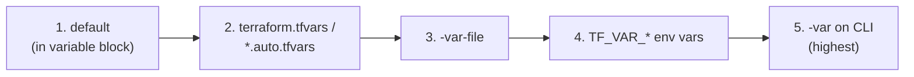

# Variables, Locals, and Outputs

Hard-coded names like `rg-shopping-dev` and `westeurope` don't scale past one environment. This page makes the config flexible and **DRY** with the three values-handling tools you'll use everywhere: **input variables** (parameters), **locals** (computed values), and **outputs** (returned values). It also covers how Terraform decides which variable value wins when several are supplied.

## The three building blocks

| Block | Role | Analogy |
|---|---|---|
| `variable` | Input — supplied by the caller | A function parameter |
| `locals` | Computed/derived values used internally | A local helper variable |
| `output` | Value returned after apply | A function return value |

## Step 1 — Input variables

Declare inputs in **`variables.tf`**:

```hcl
variable "subscription_id" {
  type        = string
  description = "Target Azure subscription ID."
}

variable "environment" {
  type        = string
  description = "Deployment environment."
  default     = "dev"

  validation {
    condition     = contains(["dev", "test", "prod"], var.environment)
    error_message = "environment must be dev, test, or prod."
  }
}

variable "location" {
  type        = string
  description = "Azure region."
  default     = "westeurope"
}

variable "tags" {
  type        = map(string)
  description = "Tags applied to all resources."
  default     = {}
}
```

Two things to notice:

- **Types** (`string`, `number`, `bool`, `list()`, `map()`, `object()`) document and enforce shape.
- **Validation** blocks reject bad input at plan time — the Terraform equivalent of Bicep's `@allowed`.

## Step 2 — Locals for naming and tags

**Locals** compute values once and reuse them — perfect for a naming convention and a merged tag set. In **`main.tf`**:

```hcl
locals {
  # Naming convention: <type>-<workload>-<env>
  workload = "shopping"

  resource_group_name = "rg-${local.workload}-${var.environment}"

  common_tags = merge(var.tags, {
    application = "shopping-frontend"
    environment = var.environment
    managedBy   = "terraform"
  })
}

resource "azurerm_resource_group" "main" {
  name     = local.resource_group_name
  location = var.location
  tags     = local.common_tags
}
```

`merge()` combines caller-supplied tags with our defaults — **string interpolation** (`"rg-${local.workload}-..."`) builds names from parts. Reference a variable with `var.<name>` and a local with `local.<name>`.

## Step 3 — Outputs

Outputs surface values after apply — for humans, for other configs, or for a pipeline. **`outputs.tf`**:

```hcl
output "resource_group_name" {
  value       = azurerm_resource_group.main.name
  description = "Name of the created resource group."
}

output "resource_group_id" {
  value       = azurerm_resource_group.main.id
  description = "Resource ID — consumed by other modules/configs."
}
```

After `terraform apply`, see them with `terraform output` (or `terraform output -json` for scripts).

## Step 4 — Variable files (`.tfvars`) per environment

Instead of passing `-var` on every command, put values in **`.tfvars`** files — one per environment. This is how you run the *same config* against dev/test/prod.

**`dev.tfvars`**
```hcl
subscription_id = "00000000-0000-0000-0000-000000000000"
environment     = "dev"
location        = "westeurope"
```

**`prod.tfvars`**
```hcl
subscription_id = "11111111-1111-1111-1111-111111111111"
environment     = "prod"
location        = "westeurope"
```

Select one at plan/apply time:

```powershell
terraform plan  -var-file="dev.tfvars"
terraform apply -var-file="prod.tfvars"
```

!!! note

    A file named `terraform.tfvars` or `*.auto.tfvars` is loaded **automatically** without `-var-file`. Explicit per-environment files (`dev.tfvars`) are clearer for multi-environment work — you can *see* which environment you're targeting in the command.

## Step 5 — Sensitive inputs and outputs

Mark secrets `sensitive` so Terraform redacts them in plan/apply output:

```hcl
variable "admin_password" {
  type      = string
  sensitive = true
}

output "connection_string" {
  value     = azurerm_storage_account.state.primary_connection_string
  sensitive = true   # printed as <sensitive> instead of the real value
}
```

!!! warning

    `sensitive = true` only hides values from **console output** — they are still stored in the **state file** in plain text. This is the core reason state must live in a secure, access-controlled [remote backend](8-Azure-Provider-and-Remote-State.md). Prefer pulling secrets from Key Vault over passing them as variables.

## Step 6 — Where a variable's value comes from

When the same variable is set in several places, Terraform picks by a fixed **precedence** (later wins):



| Source | Example |
|---|---|
| `default` in the `variable` block | `default = "dev"` |
| `terraform.tfvars` / `*.auto.tfvars` | auto-loaded |
| `-var-file` | `terraform apply -var-file=prod.tfvars` |
| **Environment variables** `TF_VAR_<name>` | see below |
| `-var` on the command line | `terraform apply -var="environment=prod"` |

**Environment variables** are handy for secrets in CI — Terraform reads any `TF_VAR_<name>`:

=== "PowerShell"

    ```powershell
    $env:TF_VAR_subscription_id = "00000000-0000-0000-0000-000000000000"
    terraform plan
    ```

=== "Bash"

    ```bash
    export TF_VAR_subscription_id="00000000-0000-0000-0000-000000000000"
    terraform plan
    ```

!!! tip

    Use the **`terraform console`** to experiment with expressions, interpolation, and functions interactively without an apply:

    ```text
    $ terraform console
    > local.resource_group_name
    "rg-shopping-dev"
    > merge({a=1}, {b=2})
    { "a" = 1, "b" = 2 }
    ```

With flexible inputs and outputs in hand, the next page removes repetition across *many* resources using `count`, `for_each`, and conditionals.

!!! tip

    **References:**

    - [Input variables (HashiCorp)](https://developer.hashicorp.com/terraform/language/values/variables)
    - [Local values (HashiCorp)](https://developer.hashicorp.com/terraform/language/values/locals)
    - [Variable definition precedence (HashiCorp)](https://developer.hashicorp.com/terraform/language/values/variables#variable-definition-precedence)
