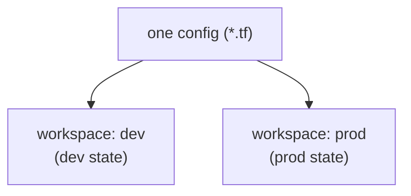

# Loops, Conditionals, and Workspaces

Real infrastructure has repetition — three subnets, a VM per region, a resource that only exists in production. Writing each by hand violates **DRY** and invites drift. This page covers Terraform's **meta-arguments** for repetition (`count`, `for_each`), **conditional** creation, the collection types behind them (lists and maps), and **workspaces** for managing parallel state.

## `count` — repeat by number

`count` creates N copies of a resource, indexed `0..N-1`. Reference each via `count.index`:

```hcl
variable "subnet_prefixes" {
  type    = list(string)
  default = ["10.0.1.0/24", "10.0.2.0/24", "10.0.3.0/24"]
}

resource "azurerm_subnet" "app" {
  count                = length(var.subnet_prefixes)
  name                 = "snet-app-${count.index}"
  resource_group_name  = azurerm_resource_group.main.name
  virtual_network_name = azurerm_virtual_network.main.name
  address_prefixes     = [var.subnet_prefixes[count.index]]
}
```

!!! warning

    `count` resources are tracked by **index**. Remove the *middle* item from the list and Terraform re-indexes everything after it — causing needless destroy/recreate. Use `count` for **identical, order-independent** copies; use `for_each` (below) when items have stable identities.

## `for_each` — repeat by map or set

`for_each` iterates a map or set, keying each instance by a **stable name** instead of a fragile index. This is the preferred loop for most cases:

```hcl
variable "subnets" {
  type = map(string)
  default = {
    app  = "10.0.1.0/24"
    data = "10.0.2.0/24"
    apim = "10.0.3.0/24"
  }
}

resource "azurerm_subnet" "this" {
  for_each             = var.subnets
  name                 = "snet-${each.key}"          # each.key  = "app", "data", ...
  address_prefixes     = [each.value]                # each.value = the CIDR
  resource_group_name  = azurerm_resource_group.main.name
  virtual_network_name = azurerm_virtual_network.main.name
}
```

Now removing `data` only destroys the `data` subnet — `app` and `apim` are untouched, because they're keyed by name, not position.

| | `count` | `for_each` |
|---|---|---|
| Iterates | a number | a map or set |
| Instance key | integer index | the map key / set value |
| Stable when items change? | ❌ re-indexes | ✅ keyed by name |
| Use for | identical copies | named, distinct items |

## Maps, lists, and the region pattern

A common real-world pattern is "one resource per region." With `count` and `count.index` into a region list:

```hcl
variable "regions" {
  type    = list(string)
  default = ["westeurope", "northeurope"]
}

resource "azurerm_resource_group" "regional" {
  count    = length(var.regions)
  name     = "rg-shopping-${var.regions[count.index]}"
  location = var.regions[count.index]
}
```

Or, more robustly, with `for_each` over a set so each region is keyed by name:

```hcl
resource "azurerm_resource_group" "regional" {
  for_each = toset(var.regions)
  name     = "rg-shopping-${each.value}"
  location = each.value          # each.value = "westeurope", "northeurope"
}
```

## Booleans and conditionals

There is no `if` statement, but the **ternary** `condition ? true_val : false_val` plus `count` gives conditional creation — "make this resource only in prod":

```hcl
variable "enable_bastion" {
  type    = bool
  default = false
}

resource "azurerm_bastion_host" "main" {
  count = var.enable_bastion ? 1 : 0    # 1 instance when true, 0 when false
  name  = "bas-shopping-${var.environment}"
  # ...
}
```

`count = var.enable_bastion ? 1 : 0` is the canonical Terraform idiom for an optional resource. Reference it as `azurerm_bastion_host.main[0]` (guarding for the zero case).

## Workspaces — parallel state from one config

A **workspace** is a named, independent **state** for the same configuration — a lightweight way to keep `dev` and `prod` state separate without copying code:

```powershell
terraform workspace new dev
terraform workspace new prod
terraform workspace select dev
terraform workspace list      # * marks the current one
```

Branch on the current workspace with `terraform.workspace`:

```hcl
locals {
  environment = terraform.workspace          # "dev" or "prod"
  instance_count = terraform.workspace == "prod" ? 3 : 1
}
```



!!! note

    Workspaces are great for **ephemeral or lightly-differing** environments. For environments that differ a lot — or need separate access control and backends — many teams prefer **separate state files / directories** with `-var-file` (page 5) instead. Both are valid; workspaces trade isolation for convenience.

!!! tip

    Test loop and conditional expressions in the **`terraform console`** before applying — e.g. `> toset(["a","b"])` or `> var.enable_bastion ? 1 : 0`. It's the fastest way to confirm an expression does what you think.

With repetition under control, the next page packages resources into reusable **modules** — the biggest DRY win of all.

!!! tip

    **References:**

    - [The `count` meta-argument (HashiCorp)](https://developer.hashicorp.com/terraform/language/meta-arguments/count)
    - [The `for_each` meta-argument (HashiCorp)](https://developer.hashicorp.com/terraform/language/meta-arguments/for_each)
    - [Workspaces (HashiCorp)](https://developer.hashicorp.com/terraform/language/state/workspaces)
