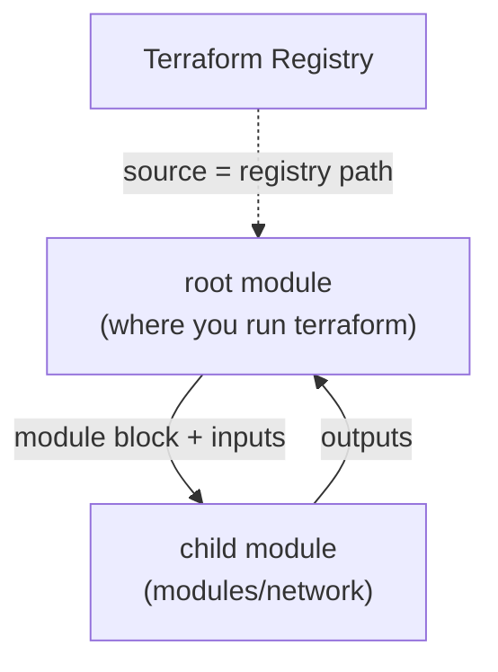

# Modules and the Registry

A **module** is a reusable, encapsulated bundle of Terraform — the same idea as a [Bicep module](../6-Infrastructure-as-Code-with-Bicep/4-Log-Analytics-Bicep-Template-and-Module.md), and the biggest **DRY** and **encapsulation** win in the toolbox. This page consumes a ready-made module from the public **Registry**, then builds your own and wires it into a **root module**.

## Root module vs child module

Every Terraform configuration is already a module — the **root module** (the directory where you run `terraform`). A **child module** is one the root calls with the `module` block.



## Step 1 — Use a module from the Registry

The [Terraform Registry](https://registry.terraform.io/) hosts thousands of community/vendor modules. Reference one by its `source` and `version`:

```hcl
module "naming" {
  source  = "Azure/naming/azurerm"
  version = "~> 0.4"
  suffix  = ["shopping", var.environment]
}

resource "azurerm_resource_group" "main" {
  name     = module.naming.resource_group.name   # standardised, valid Azure name
  location = var.location
}
```

After adding a module block, **re-run `terraform init`** so Terraform downloads it:

```powershell
terraform init      # downloads the module into .terraform/modules/
terraform plan
```

!!! warning

    Pin module **versions** (`version = "~> 0.4"`) just like providers. An unpinned `source` can pull breaking changes on the next `init`. Treat registry modules as dependencies — review what they create before applying.

## Step 2 — Create your own module

Build a small **network module** so the pattern is clear. Lay out a subdirectory:

```text
shopping-terraform/
├── main.tf                 # root module
├── variables.tf
├── outputs.tf
└── modules/
    └── network/
        ├── main.tf         # the VNet + subnet resources
        ├── variables.tf    # the module's inputs
        └── outputs.tf      # the module's outputs
```

**`modules/network/variables.tf`** — the module's interface (inputs):

```hcl
variable "resource_group_name" { type = string }
variable "location"            { type = string }
variable "vnet_name"           { type = string }
variable "address_space"       { type = list(string) }
variable "subnets" {
  type = map(string)            # name -> CIDR
}
variable "tags" {
  type    = map(string)
  default = {}
}
```

**`modules/network/main.tf`** — the encapsulated resources:

```hcl
resource "azurerm_virtual_network" "this" {
  name                = var.vnet_name
  resource_group_name = var.resource_group_name
  location            = var.location
  address_space       = var.address_space
  tags                = var.tags
}

resource "azurerm_subnet" "this" {
  for_each             = var.subnets
  name                 = "snet-${each.key}"
  resource_group_name  = var.resource_group_name
  virtual_network_name = azurerm_virtual_network.this.name
  address_prefixes     = [each.value]
}
```

**`modules/network/outputs.tf`** — the module's public surface (outputs):

```hcl
output "vnet_id" {
  value = azurerm_virtual_network.this.id
}

output "subnet_ids" {
  value = { for k, s in azurerm_subnet.this : k => s.id }   # map: name -> subnet id
}
```

## Step 3 — Call your module from the root

The root passes inputs and consumes outputs — internals stay hidden (**encapsulation**):

```hcl
module "network" {
  source = "./modules/network"

  resource_group_name = azurerm_resource_group.main.name
  location            = var.location
  vnet_name           = "vnet-shopping-${var.environment}"
  address_space       = ["10.0.0.0/16"]
  subnets = {
    app  = "10.0.1.0/24"
    data = "10.0.2.0/24"
  }
  tags = local.common_tags
}

output "app_subnet_id" {
  value = module.network.subnet_ids["app"]    # reach into a module output
}
```

Reference a module output as `module.<name>.<output>` — exactly how the Bicep orchestrator consumed `logAnalytics.outputs.workspaceId`. Run `terraform init` (to register the local module) then `plan`.

## Step 4 — Module encapsulation in practice

A well-designed module is a **black box**: callers see only inputs and outputs.

| Good module hygiene | Why |
|---|---|
| Small, focused input set | Easy to call, hard to misuse |
| Meaningful outputs | Lets other modules wire to it |
| No hard-coded names/regions inside | Reusable across environments |
| One cohesive concern per module | High **cohesion** — see [Key Concepts](2-Key-IaC-Concepts.md) |

!!! tip

    A module shouldn't reach *out* to global config — it should receive everything via variables. If a module references `var.environment` to build names internally, pass `environment` in; don't assume a root variable exists. That keeps it portable to any root.

You can now compose infrastructure from reusable parts. The remaining pages put all of this to work on real Azure: first the provider and **remote state**, then shared services, compute, identity, and the `azapi` provider.

!!! tip

    **References:**

    - [Modules overview (HashiCorp)](https://developer.hashicorp.com/terraform/language/modules)
    - [Creating modules (HashiCorp)](https://developer.hashicorp.com/terraform/language/modules/develop)
    - [Terraform Registry](https://registry.terraform.io/)
